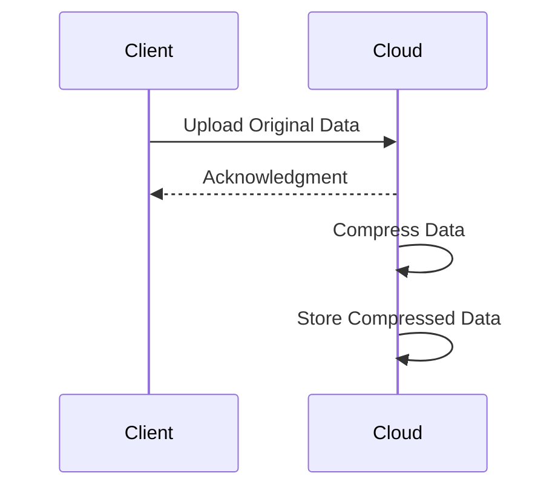
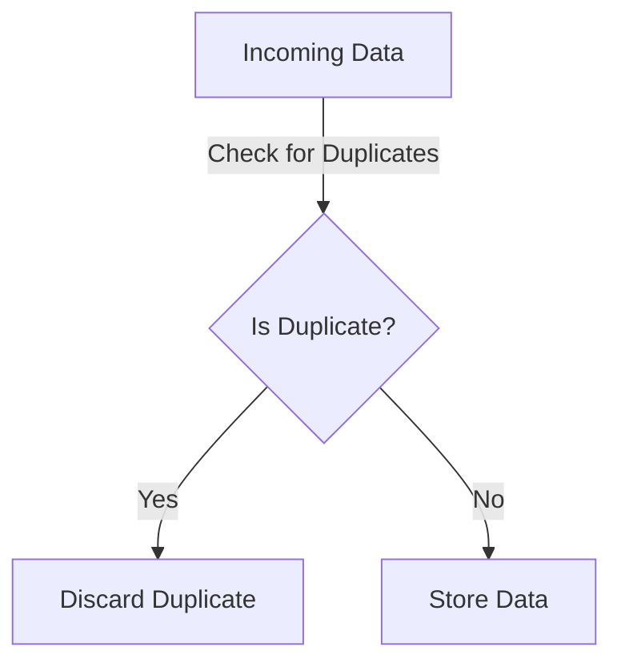

Compression and deduplication are fundamental techniques utilized in cloud computing to optimize storage utilization and manage costs effectively. These techniques aim to reduce the amount of data physically stored in cloud environments, thereby lowering storage expenses and improving data handling efficiency.

## Design Pattern Overview

### Compression

Compression involves encoding information using fewer bits than the original representation. It reduces the storage space required, which directly translates into cost savings in cloud environments where storage expenses can add up quickly. Compression can be either lossless or lossy:

- **Lossless Compression**: This method compresses data without any loss of information, ensuring exact reconstruction of the original data. It is widely used for compressing text or binary files where accuracy is paramount.
- **Lossy Compression**: Accepts some loss of information to achieve more significant compression. Commonly used in multimedia files (e.g., audio, video, and images), where minor data loss is tolerable for human perception.

### Deduplication

Deduplication involves removing duplicate copies of repeating data. By storing only unique data segments, deduplication significantly reduces the amount of storage required. This technique is effective in scenarios with large datasets having repetitive patterns, such as backup systems or collaborative platforms with multiple copies of the same object.

## Architectural Approaches

1. **Client-side Compression and Deduplication**: Performing these operations on the client side before data is uploaded to the cloud reduces bandwidth usage and storage costs. However, this increases client-side computation.
   
2. **Server-side Compression and Deduplication**: Conducted after data reaches the server. This centralized approach simplifies client-side applications and makes use of the cloud's computational resources.

### Paradigms

- **Inline Deduplication**: Processes data in real-time during the write operation, ensuring storage savings right from the start.
- **Post-process Deduplication**: Delays deduplication, applying techniques at scheduled intervals, balancing the load on storage and processing.

## Best Practices

- **Select Appropriate Techniques**: Determine the need for lossless vs. lossy compression based on the nature of the data.
  
- **Balance Compression Ratio and Performance**: Optimal compression should strike a balance between size reduction and the cost of decompression in terms of time and resources.

- **Leverage Cloud-native Tools**: Use built-in cloud provider tools and libraries for compression and deduplication to avoid performance bottlenecks.

## Example Code

### Compression in Java

```java
import java.util.zip.Deflater;
import java.util.zip.Inflater;

public class CompressionExample {

    public static byte[] compress(byte[] data) throws Exception {
        Deflater deflater = new Deflater();
        deflater.setInput(data);
        deflater.finish();
        byte[] buffer = new byte[1024];
        int compressedDataLength;
        try (ByteArrayOutputStream outputStream = new ByteArrayOutputStream()) {
            while (!deflater.finished()) {
                compressedDataLength = deflater.deflate(buffer);
                outputStream.write(buffer, 0, compressedDataLength);
            }
            return outputStream.toByteArray();
        }
    }

    public static byte[] decompress(byte[] compressedData) throws Exception {
        Inflater inflater = new Inflater();
        inflater.setInput(compressedData);
        byte[] buffer = new byte[1024];
        int decompressedDataLength;
        try (ByteArrayOutputStream outputStream = new ByteArrayOutputStream()) {
            while (!inflater.finished()) {
                decompressedDataLength = inflater.inflate(buffer);
                outputStream.write(buffer, 0, decompressedDataLength);
            }
            return outputStream.toByteArray();
        }
    }
}
```

## Diagrams

### Compression Workflow



### Deduplication Workflow



## Related Patterns

- **Data Archiving**: Techniques for storing infrequently accessed data cost-effectively.
- **Backup and Restore**: Efficient mechanisms for reliable data backup while minimizing storage use.

## Additional Resources

- [AWS Storage Optimization](https://aws.amazon.com/solutions/storage-optimization/)
- [Understanding Deduplication](https://www.veeam.com/deduplication.html)

## Summary

Implementing compression and deduplication in cloud environments enables organizations to efficiently manage storage space and costs. By selectively applying these techniques, based on data types and business needs, one can achieve substantial cost savings and optimize storage utilization without compromising data integrity or accessibility.
