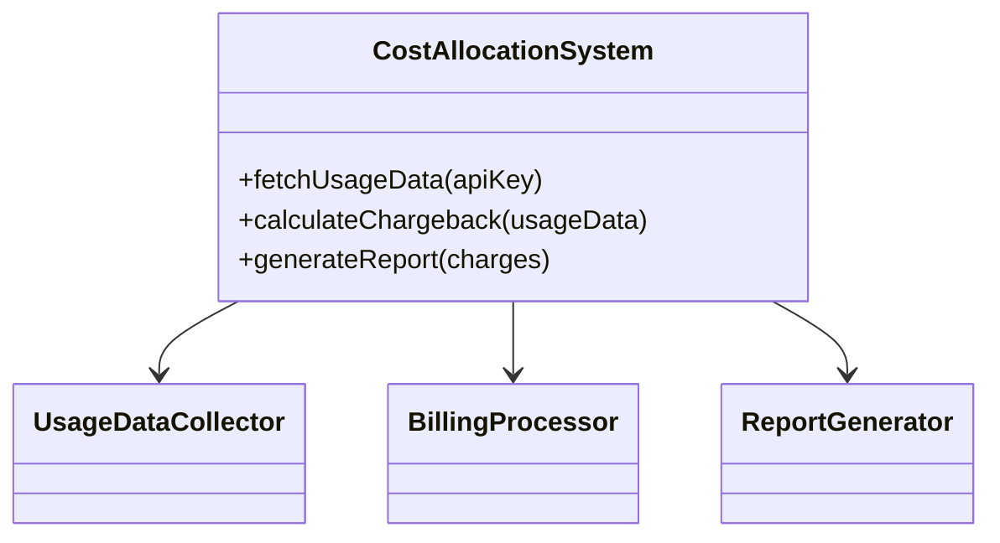

## Introduction

In cloud computing, managing costs is crucial for optimizing resource usage and ensuring financial accountability within organizations. Two effective systems for cost management are **Chargeback** and **Showback**. These systems help in allocating cloud costs back to individual departments or users, facilitating better budget management and resource optimization.

## Design Pattern Explanation

### Chargeback System
A chargeback system involves directly charging the cloud resource costs back to the departments or users who consume these resources. This is akin to a billing system where departments are financially accountable for their cloud usage.

#### Key Components:
- **Cost Tracking:** Continuous monitoring of resource usage and costs.
- **Billing Mechanism:** A methodology to compute the cost allocation based on usage data.
- **Reporting:** Generating detailed cost reports for each department or user.

### Showback System
A showback system, unlike chargeback, does not enforce financial accountability but provides visibility. It shows departments or users their respective cloud usage costs without directly billing them.

#### Key Components:
- **Usage Monitoring:** Collecting data on the usage of cloud resources.
- **Cost Allocation:** Mapping usage data to generate a cost overview.
- **Transparency Report:** Reports that reflect usage and costs without financial penalties.

## Architectural Approach

1. **Data Collection Layer:**
   - Use cloud-native tools or third-party solutions to continuously collect usage metrics and cost data.
   - Integrate with cloud provider APIs such as AWS Cost Explorer, Azure Cost Management, or GCP Cloud Billing.

2. **Data Processing and Analysis:**
   - Leverage big data tools like Apache Spark or cloud-native analytics services to process this data.
   - Implement logical rules to aggregate and tag costs based on departments, projects, or user activities.

3. **Cost Allocation Engine:**
   - Develop algorithms to distribute the costs accurately among different departments or business units.
   - Utilize machine learning models to predict future usage patterns and adjust costs dynamically.

4. **Visualization and Reporting:**
   - Use visualization tools like Power BI, Tableau, or Grafana to create comprehensive dashboards.
   - Generate periodic reports that offer insights into usage patterns and associated costs.

## Example Code

Below is a simplistic example of how to implement a cost allocation mechanism using Python and a fictional cloud billing API.

```python
import requests

def fetch_usage_data(api_key):
    response = requests.get("https://api.cloudservice.com/usage", headers={"Authorization": f"Bearer {api_key}"})
    return response.json()

def calculate_chargeback(usage_data):
    charges = {}
    for entry in usage_data:
        department = entry.get('department')
        cost = entry.get('cost')
        if department in charges:
            charges[department] += cost
        else:
            charges[department] = cost
    return charges

def generate_report(charges):
    for department, cost in charges.items():
        print(f"Department: {department}, Cost: {cost}")

api_key = 'your_api_key'
usage_data = fetch_usage_data(api_key)
charges = calculate_chargeback(usage_data)
generate_report(charges)
```

## Diagrams

### Class Diagram



## Related Patterns

- **Tagging for Resource Management:** Efficiently tag resources to aid in better allocation and tracking of costs.
- **Cloud Budget Management:** Establishing budgets and keeping track of cloud spending.

## Additional Resources

- AWS Cost Management: [AWS Cost Explorer](https://aws.amazon.com/aws-cost-management/)
- Azure Billing: [Azure Cost Management + Billing](https://azure.microsoft.com/en-us/services/cost-management/)
- Google Cloud Billing: [GCP Cloud Billing](https://cloud.google.com/billing)

## Summary

Chargeback and Showback systems are critical for managing cloud costs effectively within organizations. By providing financial accountability and visibility, these systems enable departments to analyze their cloud spending and optimize resource utilization. Implementing these systems requires careful integration of data collection, analysis, cost allocation, and reporting layers, tailored to the organization's needs.
