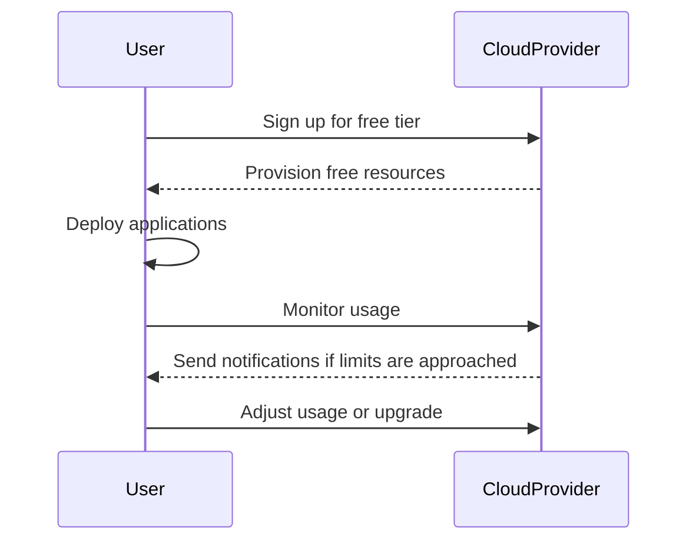

---

linkTitle: "Utilizing Free Tiers and Trials"
title: "Utilizing Free Tiers and Trials: Leveraging Available Free Services to Minimize Costs"
category: "Cost Optimization and Management in Cloud"
series: "Cloud Computing: Essential Patterns & Practices"
description: "Explore the strategies to effectively utilize free tiers and trial offers in cloud services to optimize costs, maximize resource utilization, and minimize expenditure."
categories:
- Cloud Computing
- Cost Optimization
- Cloud Management
tags:
- Free Tiers
- Cloud Trials
- Cost Management
- Resource Optimization
- Cloud Services
date: 2024-07-07
type: docs

canonical: "https://softwarepatternslexicon.com/18/13/22"
license: "© 2024 Tokenizer Inc. CC BY-NC-SA 4.0"
---

## Introduction

In the vast expanse of cloud computing, managing costs efficiently is crucial for both startups and enterprises. One effective strategy is leveraging free tiers and trial offers provided by cloud service providers. These offerings allow businesses to experiment with services, develop prototypes, and test applications without incurring additional costs.

## Design Pattern Explanation

**Utilizing Free Tiers and Trials** involves strategically making use of no-cost resources available from cloud providers during their promotional periods or built-in free usage policy. This pattern is not just about saving money but also about learning and experimenting in a controlled, cost-effective manner.

### Key Characteristics

- **Cost Efficiency**: Reduces overall cloud expenses by replacing paid services with their free counterparts where applicable.
- **Flexibility and Agility**: Allows rapid prototyping and testing of new applications without financial commitments.
- **Breadth of Access**: Provides access to a wide range of services and resources, facilitating broad learning and capability building.
- **Risk Management**: Reduces financial risk when experimenting with new technologies or architectures.

## Architectural Approaches

- **Resource Planning**: Define clear usage plans to ensure that resource utilization stays within the free tier limits.
- **Service Selection**: Choose services and configurations that maximize the benefits of free tiers, such as selecting storage options with sufficient free capacity.
- **Usage Monitoring**: Implement robust monitoring to track resource consumption and receive alerts if nearing the free tier limits.
- **Phased Adoption**: Introduce new services gradually to ensure each fits within free limits before full deployment.

## Best Practices

- **Thorough Evaluation**: Always read the fine print of free tier and trial agreements to understand limitations and billing processes.
- **Automation for Cost Control**: Set up automated scripts or tools to stop services when they near or exceed free limits.
- **Regular Reviews**: Periodically reassess your cloud strategy to adjust based on usage patterns and new offers.
- **Documentation and Training**: Maintain comprehensive documentation and train team members on how to effectively use free services.

## Example Code

Consider a scenario where you use AWS's free tier options. Here's a setup for an Amazon EC2 instance using Terraform:

```hcl
provider "aws" {
  region  = "us-west-2"
}

resource "aws_instance" "free_tier" {
  ami           = "ami-0c55b159cbfafe1f0" # Free tier eligibility
  instance_type = "t2.micro"               # Free tier eligible instance type

  tags = {
    Name = "FreeTierInstance"
  }
}
```

## Diagrams

Here’s Sequence diagram illustrating the lifecycle of using free trials:



## Related Patterns

- **Pay-as-you-go Model**: Complementary to free tiers, as both focus on flexible spending.
- **Dynamic Scaling**: Ensure applications can scale in response to usage, avoiding unnecessary costs.
- **Cost Monitoring**: In-depth tracking of expenditures supports free tier maximization.

## Additional Resources

- [AWS Free Tier](https://aws.amazon.com/free)
- [Google Cloud Free Program](https://cloud.google.com/free)
- [Azure Free Account](https://azure.microsoft.com/free)
- [IBM Cloud Lite Account](https://www.ibm.com/cloud/free)

## Summary

Utilizing free tiers and trials is a powerful pattern for managing cloud costs without compromising on the ability to experiment and innovate. By carefully evaluating and strategically employing these offerings, businesses can optimize their cloud spending, gain insights into service usage, and enhance their agility. This approach not only ensures financial prudence but also allows companies to derive maximum value from their cloud investments.

---
