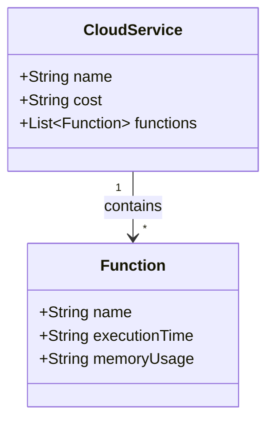

## Introduction

Function-Level Cost Analysis is a crucial pattern in managing and optimizing costs within cloud environments, especially relevant in serverless and microservices architectures where cost granularity can significantly impact financial outcomes. This pattern involves breaking down the costs associated with cloud usage to individual functions or services, enabling precise identification of cost drivers and more effective cost optimizations.

## Detailed Explanation

### Key Concepts

- **Granularity**: At the core of function-level cost analysis is granularity, which refers to the level of detail with which costs are attributed to specific components or services. This allows organizations to pinpoint and analyze the cost of each function independently.

- **Cost Attribution**: Accurately attributing cloud costs to specific functions or services is essential. This involves tracking usage metrics of various cloud services used by the function and mapping these to associated costs. Tools such as AWS Cost Explorer, Azure Cost Management, and Google Cloud’s cost management tools are commonly used.

- **Real-time Monitoring**: Implementing real-time monitoring to track cost metrics dynamically can help in making more informed decisions on scaling, resource allocation, and identifying high-cost services promptly.

### Benefits

- **Increased Transparency**: Provides a transparent view of where and how cloud spending is allocated across different functions, aiding in budgeting and forecasting.
- **Effective Budgeting and Forecasting**: Offers detailed insights that aid in accurate budgeting and forecasting, critical for financial planning and maintaining cloud cost efficiency.
- **Optimization Opportunities**: Enables identification of inefficiencies or redundant services, providing opportunities to optimize and potentially reduce costs.
- **Improved Resource Allocation**: Facilitates better resource allocation decisions by understanding cost implications at a granular level.

## Architectural Approaches

- **Tagging and Labels**: Use consistent tagging and labeling mechanisms for resources to facilitate tracking and costing of individual services.
- **Integration with Billing Systems**: Leverage API-based integrations with cloud billing systems to automate data retrieval and analysis processes.
- **Use of Serverless Architectures**: Emphasize serverless architectures where possible, as these inherently provide function-level cost granularity.

### Example Code

Using AWS Lambda as an example, here's how you might set up cost tracking for specific functions:

```json
{
  "FunctionName": "processData",
  "MemorySize": "512",
  "Tags": {
    "Environment": "Production",
    "Project": "DataPipeline",
    "Owner": "AnalyticsTeam"
  }
}
```

By tagging Lambda functions with details specific to the environment, project, and owner, AWS Cost Explorer can more easily segment costs.

## Diagram



This diagram illustrates the relationship between a Cloud Service and its associated functions, highlighting how costs are managed per function.

## Related Patterns

- **Resource Tagging**: Provides the foundational approach for applying metadata to resources, pivotal for effective cost attribution.
- **Dynamic Scaling**: Works hand-in-hand with cost analysis to automatically adjust resources based on actual demand to avoid over-provisioning costs.
- **Billing Alerts**: Proactively monitors cost thresholds and sends alerts when anomalies are detected.

## Additional Resources

- [AWS Cost Management](https://aws.amazon.com/aws-cost-management/)
- [Azure Cost Management](https://azure.microsoft.com/en-us/services/cost-management/)
- [Google Cloud Billing](https://cloud.google.com/billing)
- [Serverless Cost Management Suggestions](https://serverless.com/framework/docs/providers/aws/guide/monitoring)

## Summary

Function-Level Cost Analysis is imperative for organizations looking to manage and optimize their cloud spending effectively. By dissecting costs down to granular service or function levels, companies can achieve greater cost transparency, optimize resource utilization, and make strategic financial decisions. This pattern, combined with proper tagging strategies and integration with billing systems, can contribute significantly to an organization's financial health and cloud cost efficiency.
