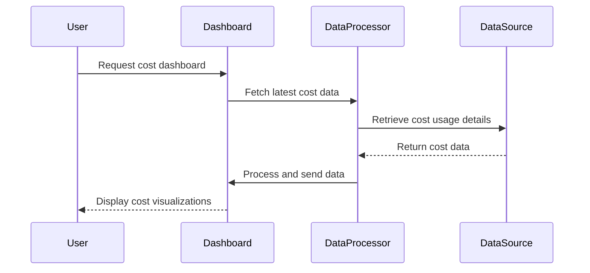

Cost dashboards play a crucial role in managing and optimizing cloud expenses. Through visual representation of cost data, organizations can gain insights into their spending patterns, identify areas for potential cost savings, and make strategic decisions to optimize resource allocation.

## Design Pattern Overview

The cost dashboard pattern involves creating a centralized view of cloud expenditures, often incorporating various visual elements such as graphs, charts, and tables. These dashboards are typically used by financial analysts, IT managers, and decision-makers to track costs across different services, departments, or projects. 

## Architectural Approach

1. **Data Aggregation**: Collect cost data from multiple sources, including billing accounts, usage reports, and resource metrics.
2. **Data Processing**: Normalize and classify the data according to various dimensions like service type, resource group, and time.
3. **Storage**: Store the processed data in a suitable database or data warehouse that supports analytical querying and reporting.
4. **Visualization**: Use a business intelligence (BI) tool or custom application to create interactive dashboards featuring cost visualizations.
5. **Access Control**: Implement role-based access to ensure that sensitive financial information is only available to authorized personnel.

## Key Components

- **Data Source Integration**: APIs or connectors to import cost and usage data from cloud providers.
- **Data Model Design**: Schema for organizing and storing cost data efficiently.
- **Visualization Tool**: Dashboard software like Tableau, Power BI, or custom-developed solutions.
- **Alerts and Notifications**: Set up automated alerts for cost anomalies or overspending trends.

## Best Practices

- Regularly update the cost data to reflect recent changes and maintain accuracy.
- Customize dashboards to fit specific business needs and use cases.
- Use predictive analytics to forecast future costs based on historical data trends.
- Implement cost allocation tagging for detailed tracking and reporting.
- Educate stakeholders on interpreting dashboard insights for effective decision-making.

## Example Code

Below is an example of a simple data processing script in Python that aggregates cost data from multiple services:

```python
import pandas as pd

def aggregate_cost_data(service_data):
    # Assuming service_data is a list of dictionaries containing cost data
    df = pd.DataFrame(service_data)
    grouped_data = df.groupby(['service_type', 'month']).sum()['cost']
    return grouped_data

service_data = [
    {'service_type': 'Compute', 'month': '2024-06', 'cost': 1500},
    {'service_type': 'Storage', 'month': '2024-06', 'cost': 500},
    {'service_type': 'Compute', 'month': '2024-07', 'cost': 2000}
]

aggregated_data = aggregate_cost_data(service_data)
print(aggregated_data)
```

## Diagram

Here is a simplified sequence diagram illustrating the flow of cost data processing and visualization:



## Related Patterns

- **Cost Allocation Management**: Enhance cost dashboards with functionality to allocate costs across projects or departments.
- **Anomaly Detection**: Use machine learning models to identify unusual spending patterns.

## Additional Resources

- [AWS Cost Explorer](https://aws.amazon.com/aws-cost-management/aws-cost-explorer/)
- [Google Cloud Billing Reports](https://cloud.google.com/billing/docs/how-to/reports)
- [Microsoft Azure Cost Management](https://azure.microsoft.com/en-us/services/cost-management/)

## Summary

Cost dashboards provide a powerful means of visualizing cloud expenses, enabling organizations to assess their spending patterns and identify opportunities for cost savings. By leveraging this pattern, companies can achieve greater financial control over their cloud environments, ensuring resources are utilized efficiently and cost-effectively.
