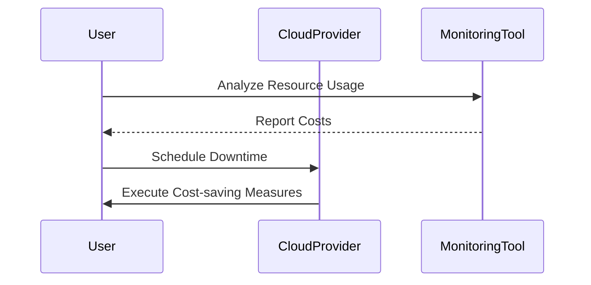

In the realm of cloud computing, effective cost management is crucial for businesses to maintain profitability and operational efficiency. Cloud waste reduction aims to identify and eliminate unnecessary cloud spending while optimizing resource utilization and operational costs.

## Design Pattern Overview

The Cloud Waste Reduction pattern provides a structured approach for enterprises to critically evaluate their cloud usage and expenses. The objective is to pinpoint inefficiencies and implement strategies that reduce costs while maintaining or improving performance and agility.

### Key Concepts

- **Resource Utilization**: Ensuring that resources are being used effectively and efficiently.
- **Cost Optimization**: Implementing methods and tools to reduce unnecessary expenditures.
- **Monitoring and Metrics**: Using analytics to track and control resource consumption.

## Architectural Approaches

### Right-Sizing

Right-sizing involves assessing and adjusting resources to ensure they match the actual workload requirements. This process can involve scaling down over-provisioned instances or optimizing instance types.

### Automation and Scheduling

Leverage automation tools to manage resource allocation dynamically. Implement schedules to turn off non-critical resources during off-peak times to save costs.

### Spot Instances and Reserved Instances

Utilize spot instances for non-critical, flexible workloads to take advantage of cost reductions. Consider reserved instances for predictable workloads to achieve lower pricing.

## Best Practices

1. **Continuous Monitoring**: Implement monitoring tools like AWS CloudWatch, Azure Monitor, or Google Cloud Operations Suite to regularly review usage patterns and costs.
  
2. **Budget Alerts**: Set up alerts to notify when spending limits are about to be exceeded.
  
3. **Tagging and Tracking**: Use tagging to allocate costs to departments or projects for more detailed reporting and accountability.

4. **Policy Enforcement**: Establish policies for resource provisioning, and enforce them using cloud-native governance tools like AWS Config, Azure Policy, or Google Cloud Asset Inventory.

## Example Code

Here's an example of an AWS Lambda function to automatically shut down instances during non-business hours to save costs:

```python
import boto3
import datetime

ec2 = boto3.client('ec2')

def handler(event, context):
    now = datetime.datetime.now()
    if now.hour >= 18 or now.hour < 8:  # Assuming business hours are 8am-6pm
        ec2.stop_instances(InstanceIds=['instance_id_1', 'instance_id_2'])
```

## Diagram



## Related Patterns

- **Auto-Scaling**: Dynamically adjust resources based on demand.
- **Infrastructure as Code**: Automate and manage cloud resources using code.
- **Chargeback**: Allocate costs back to departments or projects.

## Additional Resources

- [AWS Cost Management](https://aws.amazon.com/aws-cost-management/)
- [Azure Cost Management](https://azure.microsoft.com/en-us/services/cost-management/)
- [Google Cloud Billing](https://cloud.google.com/billing/docs/how-to/billing-reports)

## Summary

The Cloud Waste Reduction pattern is vital for businesses aiming to optimize their cloud expenditures without sacrificing performance. By right-sizing resources, implementing automated schedules, and leveraging cost-effective instance types, organizations can significantly reduce unnecessary spending. Continuous monitoring and cost-tracking further empower teams to make informed financial decisions and foster a culture of responsibility and efficiency in cloud environments.
