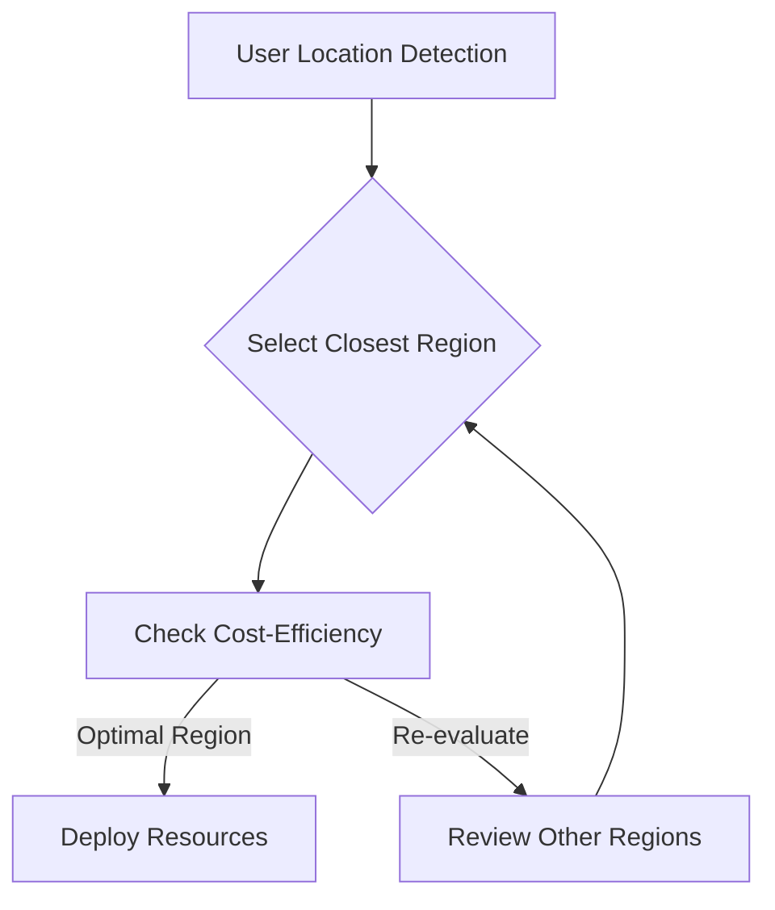

## Introduction

In the landscape of cloud computing, selecting appropriate regions for deploying applications is pivotal to achieving cost efficiency and optimal performance. The decision impacts latency, cost, and compliance, among other factors. Understanding the nuances of region selection is crucial for businesses aiming to leverage cloud resources effectively.

## Design Pattern Overview

The "Selecting Appropriate Regions" pattern emphasizes the strategic choice of cloud regions based on a combination of factors such as cost, latency requirements, data sovereignty, and availability needs. The goal is to ensure that the deployment aligns with business goals while optimizing for both financial and performance objectives.

### Key Considerations:

1. **Cost Factors:**
   - Evaluate pricing differences across regions.
   - Assess data transfer costs both within and between cloud regions.

2. **Latency and Performance:**
   - Choose regions closer to end-users to minimize latency.
   - Consider regional infrastructure capabilities and limits.

3. **Regulatory Requirements:**
   - Ensure compliance with local data protection laws.
   - Adhere to industry-specific regulations that may dictate data location.

4. **Disaster Recovery and Availability:**
   - Select regions that enable robust disaster recovery plans.
   - Leverage multiple availability zones to ensure high availability.

5. **Resource Availability:**
   - Confirm availability of required services and features in selected regions.

## Architectural Approaches

### Multi-Region Deployment

Deploying applications across multiple cloud regions can enhance both performance and availability. This approach involves:

- **Load Balancing:** Distributing traffic across regional instances to optimize response times and resource utilization.
- **Data Replication:** Employing data replication strategies to synchronize data across regions, ensuring consistency and availability.
  
### Cost-Effective Strategies

- **Spot and Reserved Instances:** Utilize cost-effective instance types with region-specific pricing to manage costs.
- **Auto Scaling:** Implement auto-scaling to adjust resources dynamically based on demand, varying by region.

## Example Code

Below is a pseudo-code example illustrating region-specific deployment using an Infrastructure as Code approach, such as Terraform:

```hcl
provider "aws" {
  region = "us-west-2"
}

resource "aws_instance" "web" {
  ami           = "ami-830c94e3"
  instance_type = "t2.micro"

  provider = "aws.us-west-2"
}

provider "aws" {
  alias  = "us-east-1"
  region = "us-east-1"
}

resource "aws_instance" "web_east" {
  ami           = "ami-0dc2d3e4c0f9ebd18"
  instance_type = "t2.micro"

  provider = "aws.us-east-1"
}
```

## Diagrams

### Region Selection Strategy Diagram



## Related Patterns

- **Multi-Region Application Pattern:** Focuses on redundancy and latency optimization across geographically distributed users.
- **Edge Computing Pattern:** Brings computational power closer to the user, often outside the central cloud region, reducing latency.

## Additional Resources

- [AWS Global Infrastructure](https://aws.amazon.com/about-aws/global-infrastructure/)
- [GCP Regions and Zones](https://cloud.google.com/about/locations)
- [Azure Regions and Availability Zones](https://azure.microsoft.com/en-us/global-infrastructure/geographies/)

## Summary

The "Selecting Appropriate Regions" pattern is integral to optimizing cloud deployments for cost and performance. By carefully evaluating regions based on multiple criteria, organizations can achieve a balance between high performance and cost efficiency, while ensuring compliance and availability. Deploying in the right regions reduces latency, manages costs effectively, and improves overall resource management. Implementing this pattern requires ongoing assessment and adaptation to align with evolving business objectives and technology landscapes.
