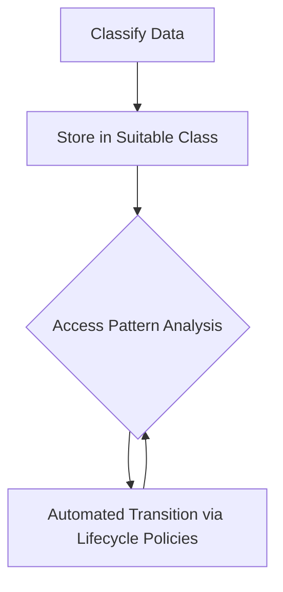

## Overview

Storage Class Optimization is a critical design pattern within cloud computing that focuses on using the most cost-effective storage options for different types of data. This pattern enables organizations to efficiently manage cloud costs by selecting storage classes based on parameters such as data access frequency, durability, availability, and retrieval times. Proper application of this pattern ensures optimal storage expenditure without sacrificing data integrity or accessibility.

## Architectural Approach

### Key Concepts

1. **Data Classification**:
   - Identify and categorize data based on usage patterns such as hot, warm, and cold data.
   - Hot data requires frequent access and should reside in high-performance storage classes.
   - Cold data, which is rarely accessed, should be stored in more cost-efficient and slower tiers.

2. **Storage Classes**:
   - Utilize cloud service provider offerings for storage classes based on cost and performance:
     - **Standard Storage**: High durability and availability for frequently accessed data.
     - **Nearline Storage**: Cost-effective for data accessed less than monthly.
     - **Coldline Storage**: For data that is rarely accessed, such as archival data.
     - **Archival Storage**: Lowest cost option, best for long-term storage with minimal access.

3. **Lifecycle Policies**:
   - Automated rules to transition data between storage classes as it ages or its access pattern changes, optimizing costs over time.

### Best Practices

1. **Analyze Access Patterns**:
   - Continuously analyze data access logs to adjust storage classes dynamically.

2. **Leverage Automation**:
   - Utilize automated lifecycle management tools to enforce data transitions based on predefined policies.

3. **Implement Data Governance**:
   - Ensure storage strategy aligns with regulatory requirements for data retention and security.

4. **Cost Monitoring**:
   - Regularly review storage costs and usage to identify optimization opportunities.

## Example Code

Consider a scenario using AWS S3 where lifecycle policies are deployed to optimize storage:

```json
{
  "Rules": [
    {
      "ID": "MoveToColdline",
      "Prefix": "project_data/",
      "Status": "Enabled",
      "Transitions": [
        {
          "Days": 30,
          "StorageClass": "GLACIER"
        }
      ],
      "NoncurrentVersionTransitions": [
        {
          "NoncurrentDays": 60,
          "StorageClass": "DEEP_ARCHIVE"
        }
      ],
      "Expiration": {
        "Days": 365,
        "ExpiredObjectDeleteMarker": true
      }
    }
  ]
}
```

## Diagrams

### Data Flow Diagram



## Related Patterns

- **Data Tiering**: Enhances Storage Class Optimization by further stratifying data tiers based on additional metrics like latency and retrieval times.
- **Dynamic Scaling**: Automatically scales storage resources up or down in response to data load changes, further optimizing costs.
- **Cache-Aside Pattern**: Complements storage optimization by caching frequently accessed data for reduced latency and cost.

## Additional Resources

- [AWS Storage Classes](https://aws.amazon.com/s3/storage-classes/)
- [Google Cloud Storage Classes](https://cloud.google.com/storage/docs/storage-classes)
- [Azure Storage Pricing](https://azure.microsoft.com/en-us/pricing/details/storage/)
- [IBM Cloud Object Storage](https://www.ibm.com/cloud/object-storage)

## Summary

Storage Class Optimization is pivotal for organizations employing cloud services and looking to minimize costs without compromising on performance or compliance. By leveraging different storage classes based on data characteristics and implementing lifecycle policies, businesses can achieve significant savings. Continuous monitoring and analysis of access patterns automate the process, allowing dynamic adaptation to evolving data needs.
