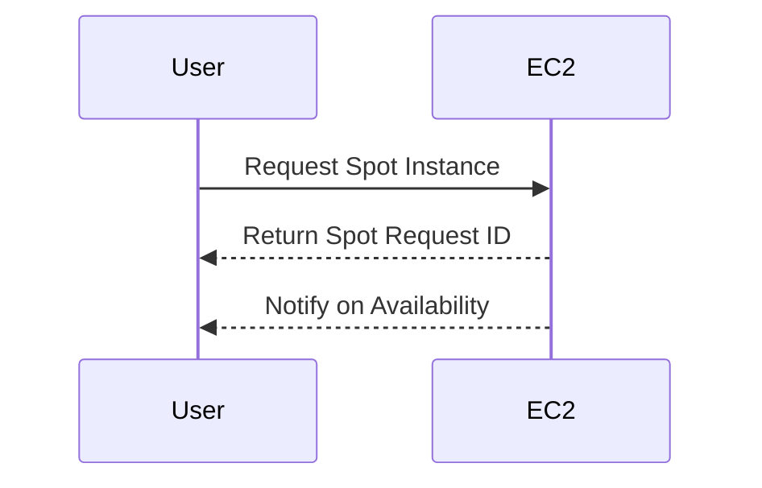

Spot Instances offer a strategic cost management approach in cloud computing by utilizing spare capacity at much lower prices compared to on-demand instances. This pattern is especially suitable for non-critical workloads that can tolerate interruptions, allowing businesses to maximize cloud resources without incurring significant costs.

## Detailed Explanation

Spot Instances can drastically reduce the compute costs in cloud environments. They operate on an auction-based system where cloud service providers sell their unused resources at discounted rates. However, these resources can be reclaimed by the provider with a notice when demand increases, making them ideal for scalable and fault-tolerant applications. The primary benefits include:

- **Cost Savings**: Significant reductions in compute costs due to the discounted nature of spot pricing.
- **Scalability**: A flexible and scalable option to add capacity during peak load times without permanent investments.
- **Risk Management**: Ideal for batch processing, big data analytics, CI/CD pipelines, and other non-critical applications where interruptions do not have severe consequences.

## Architectural Approaches

When integrating spot instances into your cloud architecture, it is vital to incorporate strategies that accommodate potential interruptions. Consider the following approaches:

1. **Checkpointing and State Management**: Regularly save the state of applications so they can resume after interruption.
2. **Auto Scaling Groups**: Utilize auto scaling to automatically adjust the number of running instances based on demand and instance availability.
3. **Hybrid Deployments**: Combine spot instances with on-demand instances to ensure critical workloads remain uninterrupted.
4. **Spot Fleet or Instance Groups**: Use managed services to maintain instance health and availability across multiple resource pools.

## Paradigms and Best Practices

- **Design for Resilience**: Architect solutions with fault-tolerance in mind, ensuring instances can handle interruptions.
- **Continuous Monitoring**: Implement robust monitoring and alert systems to manage spot instance availability and pricing trends.
- **Adaptive Bidding Strategies**: Set maximum price bids based on acceptable performance/cost metrics to gain control over cost fluctuation.

## Example Code

Here is a hypothetical example using AWS SDK in Java to launch a spot instance:

```java
import com.amazonaws.services.ec2.AmazonEC2;
import com.amazonaws.services.ec2.AmazonEC2ClientBuilder;
import com.amazonaws.services.ec2.model.RequestSpotInstancesRequest;
import com.amazonaws.services.ec2.model.SpotInstanceRequest;

public class SpotInstanceExample {

    public static void main(String[] args) {
        AmazonEC2 ec2 = AmazonEC2ClientBuilder.standard().build();

        RequestSpotInstancesRequest requestRequest = new RequestSpotInstancesRequest()
                .withSpotPrice("0.03")
                .withInstanceCount(1)
                .withType("persistent");

        List<SpotInstanceRequest> requestResponses = ec2.requestSpotInstances(requestRequest).getSpotInstanceRequests();
        for (SpotInstanceRequest requestResponse : requestResponses) {
            System.out.println("Created Spot Request: " + requestResponse.getSpotInstanceRequestId());
        }
    }
}
```

## Diagrams

Below is UML sequence diagram illustrating the flow of requesting a spot instance:



## Related Patterns

- **Auto Scaling**: Automatically adjust resources based on the current load.
- **Batch Processing**: Use for executing batch jobs which is particularly suitable with spot instances due to its tolerance for downtime and interruption.
- **Disaster Recovery**: Ensures planned downtime strategies can accommodate sudden instance interruption.

## Additional Resources

- [AWS Spot Instances](https://aws.amazon.com/ec2/spot/)
- [Azure Spot Virtual Machines](https://azure.microsoft.com/en-us/pricing/spot/)

## Summary

The use of Spot Instances is an effective cost optimization strategy for non-critical workloads in cloud environments. By designing applications with tolerance to interruptions, companies can leverage the cost benefits of spot pricing. Proper architectural strategies, combined with continuous monitoring and hybrid deployment models, can further enhance their efficacy and reliability.
