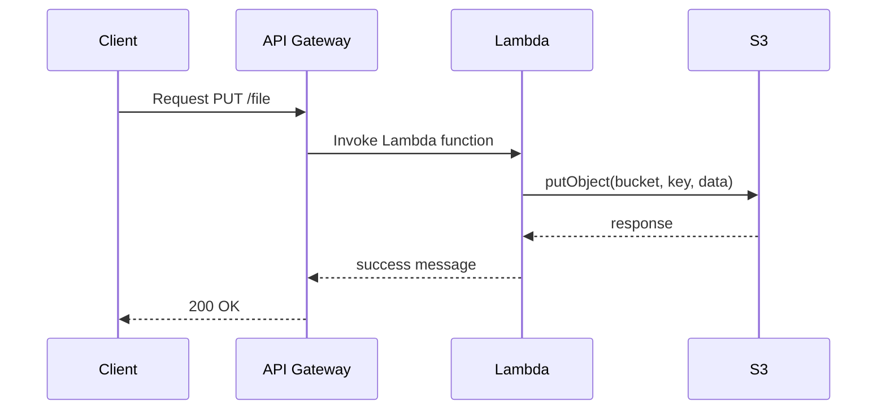

## Introduction

In cloud computing, resource optimization is crucial for reducing costs and improving performance. Traditional infrastructure models often pair compute and storage resources together, limiting flexibility and potentially leading to underutilization or overprovisioning. The "Scaling Compute vs. Storage Independently" pattern addresses this challenge by decoupling compute and storage resources, allowing them to scale independently according to specific demands.

## Detailed Explanation

### Problem Statement

In many cloud architectures, compute and storage resources are tightly coupled. Scaling up compute resources automatically increases storage capacities and vice versa. This coupling can lead to inefficiencies where an application may need more processing power but not additional storage, or it may require more storage capacity without necessitating increased processing power. Such a situation often results in increased operational costs and underutilization of resources.

### Solution

The "Scaling Compute vs. Storage Independently" design pattern allows organizations to manage compute and storage resources separately. This approach ensures that each resource category scales according to its unique usage patterns, maintaining cost-effectiveness and operational efficiency.

1. **Decoupling Resources**: By leveraging modern cloud services and architectures, applications can separate compute and storage functionalities, often utilizing service-oriented or microservices architectures.

2. **Independent Scaling**: Enable independent scaling of compute and storage nodes. Storage services such as AWS S3, Google Cloud Storage, and Azure Blob storage can be used independently from compute resources like AWS EC2, Google Compute Engine, or Azure Virtual Machines.

3. **Cost Optimization**: Align investments with actual consumption. Scale compute resources for CPU and RAM-intensive workloads, and adjust storage resources based on data retention and access requirements.

4. **Fault Tolerance**: Enhance fault tolerance by selectively scaling and redundant resource allocation based on workload demands.

### Architectural Approaches

To implement this pattern effectively, several architectural considerations come into play:

- **Microservices Architecture**: Disaggregate application components to microservices, enabling flexible scaling of individual services along with their specific compute and storage needs.

- **Containerization**: Use containers to encapsulate application components, providing abstraction and ease of scaling.

- **Serverless Architectures**: Employ serverless computing models which inherently separate compute from storage and scale automatically with demand.

### Best Practices

- **Monitoring and Analytics**: Regularly monitor resource utilization metrics to dynamically adjust resource scaling.
- **Use Managed Services**: Leverage cloud-managed services for storage (e.g., AWS S3) and compute (e.g., AWS Lambda) to simplify management and optimize costs.
- **Implement Auto-Scaling**: Configure auto-scaling capabilities to respond to real-time demand variations swiftly.
- **Effective Storage Tiering**: Use storage tiering solutions to optimize storage costs based on the frequency of data access.

## Example Code

Here’s a simple snippet that demonstrates serverless storage using AWS Lambda and S3:

```javascript
const AWS = require('aws-sdk');
const s3 = new AWS.S3();

exports.handler = async (event) => {
    const fileContent = Buffer.from('Hello World', 'utf-8');
    const params = {
        Bucket: 'my-bucket',
        Key: 'hello.txt',
        Body: fileContent
    };

    try {
        const data = await s3.putObject(params).promise();
        console.log(`File uploaded successfully. ${data.Location}`);
    } catch (err) {
        console.error(`Failed to upload file: ${err}`);
    }
};
```

## Diagrams

### Example Sequence Diagram



## Related Patterns

- **Auto-Scaling Pattern**: Automatically adjusting compute resources in response to traffic loads.
- **Storage Tiering Pattern**: Distributing data across different storage types according to access frequency.
- **Decouple Resource Pattern**: A broader pattern focusing on decoupling various types of resources beyond compute and storage.

## Additional Resources

- [AWS Well-Architected Framework](https://aws.amazon.com/architecture/well-architected/)
- [Google Cloud Best Practices for Compute and Storage](https://cloud.google.com/docs/best-practices)
- [Azure Scalability Patterns](https://docs.microsoft.com/en-us/azure/architecture/patterns/)

## Summary

The pattern of scaling compute vs. storage independently offers a significant advantage in terms of cost optimization and resource efficiency in the cloud. By decoupling these resources, organizations can better align their resource allocations with actual usage, reduce overspending, and improve system performance. Adopting this pattern is a step toward a more disciplined and economical cloud resource management strategy, accommodating dynamic workloads while remaining flexible and resilient.
