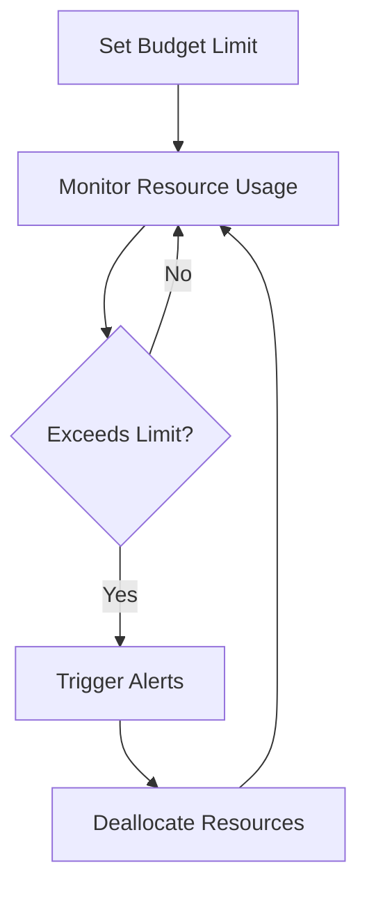

## Policy Enforcement for Cost Control: Implementing Policies to Prevent Overspending

Modern cloud platforms offer extensive computing power and resources that can rapidly scale to meet demands. However, this can also result in unexpected and often excessive costs if not managed carefully. The **Policy Enforcement for Cost Control** pattern helps organizations establish structured mechanisms to control and optimize expenditures on cloud services.

### Problem

Organizations leveraging cloud services face the challenge of unpredictable costs due to rapid scaling and resource allocation. Without proper controls, overspending can occur, impacting financial viability. Thus, a mechanism to enforce cost controls and maintain budgets is essential.

### Solution

The Policy Enforcement for Cost Control pattern enables organizations to manage cloud costs effectively by implementing automated policies that monitor and control cloud resource usage. This involves setting predefined spending limits, automated alerts for budget thresholds, and usage caps to enforce cost discipline.

### Architectural Approach

1. **Define Budget Limits**: Establish organizational budget limits for departments, projects, or services.
2. **Automate Policies**: Implement policy-based automation to enforce these budgets. Common examples include automatically deallocating resources when a budget threshold is reached.
3. **Monitor Resource Usage**: Leverage cloud provider tools to track and monitor real-time usage against budget allocations.
4. **Generate Alerts**: Set up alerts and notifications when spending nears predefined limits or unexpected spikes occur.
5. **Cost Anomaly Detection**: Use machine learning to identify anomalies in spending patterns and predict future costs.
6. **Scheduled Reports**: Generate regular reports on cloud spending to provide visibility and insights into cost trends.

### Example Code

Here is an example of setting up a simple budget alert system using a cloud provider SDK:

```python
import boto3

client = boto3.client('budgets')

budget_response = client.create_budget(
    AccountId='123456789012',
    Budget={
        'BudgetName': 'Monthly Budget',
        'BudgetLimit': {
            'Amount': '1000',
            'Unit': 'USD'
        },
        'TimeUnit': 'MONTHLY',
        'CostFilters': {},
        'CostTypes': {
            'IncludeTax': True,
            'IncludeSubscription': True
        },
        'TimePeriod': {
            'Start': '2024-01-01T00:00:00Z',
            'End': '2024-12-31T23:59:59Z'
        }
    },
    NotificationsWithSubscribers=[
        {
            'Notification': {
                'NotificationType': 'ACTUAL',
                'ComparisonOperator': 'GREATER_THAN',
                'Threshold': 80.0,  # 80% of the budget
                'ThresholdType': 'PERCENTAGE'
            },
            'Subscribers': [
                {
                    'SubscriptionType': 'EMAIL',
                    'Address': 'admin@example.com'
                }
            ]
        }
    ]
)
```

### Diagram

Below is a basic flowchart representing the cost control process:



### Related Patterns

- **Cost Allocation**: This pattern focuses on distributing cloud costs accurately across departments or projects.
- **Right-Sizing Resources**: Helps in analyzing and resizing cloud resources to meet workloads efficiently without over-provisioning.
- **Auto-Scaling**: Adjusts the number of resources dynamically, mitigating cost by scaling only when needed.

### Additional Resources

- [AWS Budgets](https://aws.amazon.com/aws-cost-management/aws-budgets/)
- [Azure Cost Management](https://azure.microsoft.com/en-us/services/cost-management/)
- [GCP Billing Budget Alerts](https://cloud.google.com/billing/docs/how-to/budgets)

### Summary

The Policy Enforcement for Cost Control pattern is essential for organizations aiming to manage their cloud expenditures effectively. By automating policies and monitoring usage, organizations can prevent overspending, align with their financial strategies, and use cloud resources sustainably. Implementing such a pattern ensures operational efficiency and fiscal responsibility in the cloud.
