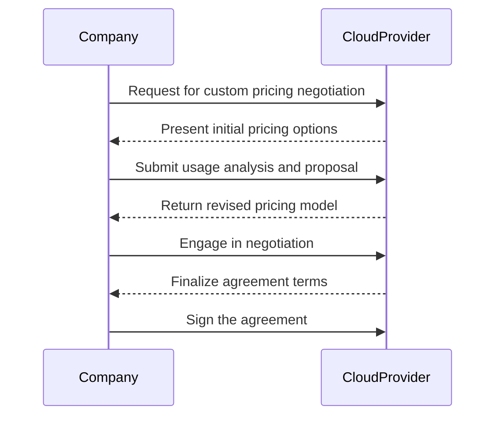

## Introduction

As organizations migrate to the cloud, a significant challenge is managing costs effectively. The **Custom Pricing Negotiation** pattern enables businesses to work directly with cloud providers to establish tailored pricing models that align with their actual resource use and cost objectives. This allows companies to leverage their purchasing power and optimize their expenditures, potentially leading to substantial savings.

## Problem Statement

Traditional cloud pricing models, based on pay-as-you-go, reserved instances, or predefined packages, may not always reflect a company's specific usage patterns or financial goals. Contracts that do not adapt to these patterns can lead to either overpayment or under-utilization of resources, unnecessarily inflating costs or stifling operations.

## Solution

The solution lies in negotiating customized agreements with cloud service providers. This involves:

- **Understanding Usage Patterns**: Analyzing historical usage data to predict future resource needs accurately.
  
- **Leveraging Volume and Commitment**: Committing to minimum usage levels or long-term contracts in exchange for discounts.
  
- **Collaborating with Providers**: Engaging in dialogues with cloud vendors to explore bespoke pricing options.

- **Incorporating Flexibility**: Building flexibility into contracts to adjust for changing business needs.

## Implementation Steps

1. **Data Analysis**: Conduct a thorough analysis of past usage data to identify patterns and peaks.

2. **Engagement with Providers**: Initiate discussions with account managers or sales representatives of the cloud service provider to understand available options.

3. **Proposal Development**: Draft a proposal highlighting the desired pricing model, anticipated usage, and potential commitment level.

4. **Negotiation**: Engage in negotiation rounds to finalize the pricing terms. Leverage historical data to support your case.

5. **Contract Signing**: Formalize the agreed-upon pricing with a contract that outlines terms, conditions, and flexibility clauses.

## Example

Consider a SaaS company with predictable spikes in resource usage at the end of each quarter. By negotiating a custom pricing agreement with its cloud provider, it secures discounts during these peak periods, mitigating the impact on overall operational costs.

```plaintext
{
  "CustomPricingAgreement": [{
    "Provider": "CloudProviderA",
    "BaseDiscount": "20%",
    "PeakUsageDiscount": "30%",
    "CommitmentTerm": "3 years"
  }]
}
```

## Diagram

Here's a sequence diagram illustrating the process of engaging in Custom Pricing Negotiation with a cloud provider:



## Related Patterns

- **Cost-Aware Microservices**: Designing microservices with cost optimization as a primary concern.
- **Resource Optimization**: Strategies for optimizing resource allocation to reduce costs.
- **Auto-Scaling and Scheduling**: Dynamically adjusting resources according to demand.

## Additional Resources

- [AWS Enterprise Discount Program](https://aws.amazon.com/enterprise/)
- [Azure Enterprise Agreement Enrollment](https://azure.microsoft.com/en-us/offers/enterprise-agreement/)
- [GCP Committed Use Contracts](https://cloud.google.com/compute/docs/instances/signing-up-committed-use-contracts)

## Summary

The **Custom Pricing Negotiation** pattern empowers businesses to establish granular and flexible pricing models with their cloud providers, optimizing expenditures while aligning with their operational needs. By understanding their unique consumption patterns and leveraging their purchasing power, organizations can achieve significant cost reductions and better cloud cost management. This proactive financial strategy supports sustained cloud growth and operational efficiency.
