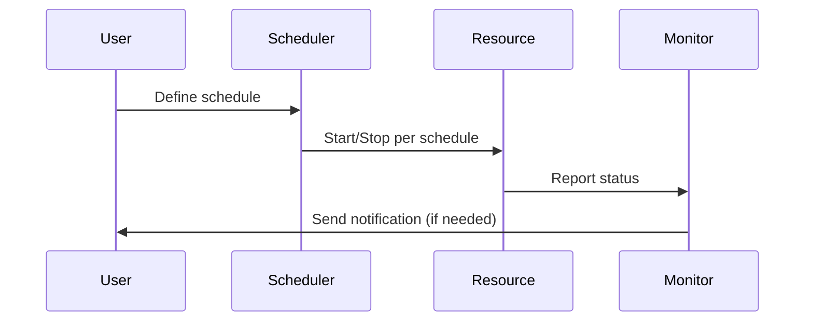

## Introduction

In the ever-evolving world of cloud computing, managing operational costs is a priority for businesses leveraging cloud infrastructure. One effective cost optimization strategy involves implementing **Resource Scheduling**, which refers to the process of shutting down non-essential resources during off-hours. This approach maximizes efficiency, reduces unnecessary expenditure, and ensures that resources are available as needed.

## Design Pattern Description

**Resource Scheduling** is a design pattern that focuses on the deliberate management and scheduling of cloud resources. By automating the start and stop operations of cloud services based on predefined schedules, organizations can avoid incurring costs for resources during periods of inactivity.

### Key Components

1. **Scheduler**: Automates the start and stop operations of resources based on a pre-configured schedule.
2. **Resource Monitor**: Tracks the current state and usage statistics of each resource.
3. **Notification System**: Alerts stakeholders about the current status and any anomalies in the scheduling process.
4. **Dashboard**: Provides a centralized view of scheduled resources, enabling quick adjustments and management.

## Architectural Approach

Implementing **Resource Scheduling** involves several architectural considerations:

- **Automation Tools**: Utilize cloud-native or third-party automation tools (like AWS Lambda, Azure Automation, or Google Cloud Scheduler) to automate resource operations.
- **Resource Tagging**: Tag resources with metadata to specify which should be affected by the scheduling.
- **Granular Scheduling**: Employ fine-grained scheduling to accommodate different operational requirements and time zones.
- **Monitoring and Alerts**: Implement monitoring tools to ensure resources are being scheduled correctly and provide alerts for any deviations.

## Example Code

Here's an example of a simple AWS Lambda function that stops EC2 instances based on a specific schedule:

```python
import boto3
import os

def lambda_handler(event, context):
    ec2 = boto3.client('ec2', region_name='your-region')
    instance_ids = os.environ['INSTANCE_IDS'].split(',')

    # Stop instances
    response = ec2.stop_instances(InstanceIds=instance_ids)
    print(f'Stopped instances: {instance_ids}')
    
    return response
```

## Diagram



## Related Patterns

- **Resource Autoscaling**: Dynamically adjusts resource capacity based on workload requirements to enhance performance and cost efficiency.
- **Cloud Cost Monitoring**: Involves tracking resource usage and expenditure to identify savings opportunities.
- **Spot Instances**: Utilizes surplus cloud capacity at reduced rates to handle non-critical tasks.

## Additional Resources

- [AWS Instance Scheduler](https://aws.amazon.com/solutions/implementations/instance-scheduler/)
- [Azure Automation](https://azure.microsoft.com/en-us/services/automation/)
- [Google Cloud Scheduler](https://cloud.google.com/scheduler/)

## Summary

**Resource Scheduling** is an indispensable design pattern in cloud cost management. By leveraging automated scheduling mechanisms, businesses can achieve significant cost reductions while maintaining optimal operational efficiency. Incorporating this pattern into an organization's cloud strategy ensures that resources are running only when necessary, paving the way for smarter and more sustainable cloud service usage.
