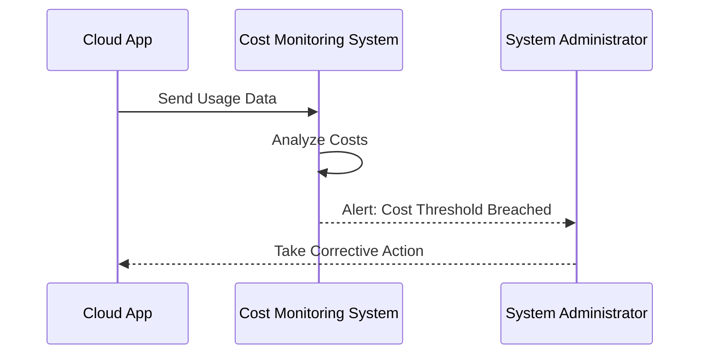

## Introduction

In the dynamic, pay-as-you-go world of cloud computing, keeping tabs on your spending is essential to optimizing expenses and preventing unexpected cost overruns. The **Cost Monitoring and Alerts** design pattern provides guidance on implementing mechanisms to monitor cloud usage and costs, set up alerts for unusual spending, and make informed decisions to achieve financial efficiency.

## Detailed Explanation

### Design Pattern Overview

The Cost Monitoring and Alerts pattern involves monitoring cloud infrastructure and application usage for potential financial anomalies and setting up automated alerts. This ensures rapid response to cost overruns and unexpected expenditure, enabling proactive cost management.

### Key Concepts

- **Usage Monitoring**: Continuously tracking resource consumption and expenditure across cloud services.
- **Cost Thresholds**: Defining acceptable cost limits based on historical usage and budgeting targets.
- **Alerts and Notifications**: Configuring automated alerts to notify stakeholders when costs exceed predefined thresholds.
- **Analysis and Optimization**: Analyzing cost trends to identify opportunities for optimization.

### Architectural Approaches

1. **Centralized Monitoring Systems**: Use of cloud-native solutions like AWS CloudWatch, Azure Monitor, or Google Cloud's Operations suite to aggregate and visualize cost data.
2. **Automated Alerting**: Implementing automated systems that send notifications via email, SMS, or integration with ticketing systems like Jira or ServiceNow when thresholds are breached.
3. **Cost Anomaly Detection**: Leveraging machine learning to detect unusual spending patterns that could indicate inefficient resource usage or security breaches.
4. **Role-based Access Control**: Tailoring access to cost data and alerts based on roles to ensure that relevant stakeholders are informed.

### Best Practices

- **Set Comprehensive Budgets**: Define budgets not only for overall expenditure but also for individual resources or projects.
- **Fine-tune Alerts**: Adjust alert parameters and thresholds for different services and environments to prevent alert fatigue.
- **Regularly Review Patterns**: Conduct regular audits of cost patterns and adjust thresholds accordingly.
- **Leverage Automation**: Use automation to implement immediate corrective actions, such as shutting down unused resources.

## Example Code

```javascript
// Example: Using AWS CloudWatch to Set Up Cost Alerts

const AWS = require('aws-sdk');
const cloudwatch = new AWS.CloudWatch();

// Define a metric filter to track spending
const params = {
  MetricName: 'EstimatedCharges',
  Namespace: 'AWS/Billing',
  AlarmName: 'CloudCostAlert',
  Threshold: 1000, // Dollars
  ComparisonOperator: 'GreaterThanThreshold',
  EvaluationPeriods: 1,
  AlarmActions: ['arn:aws:sns:us-west-2:123456789012:NotifyMe']
};

// Create an alarm in CloudWatch
cloudwatch.putMetricAlarm(params, (err, data) => {
  if (err) console.log(err, err.stack);
  else console.log(data);
});
```

## Diagrams



## Related Patterns

- **Automated Scaling**: Adjusts resource allocation automatically based on observed system loads.
- **Savings Plan & Reservations**: Utilize long-term resource commitments to lower costs.
- **Service Quotas**: Set limits on resource usage to avoid unexpected costs.

## Additional Resources

- [AWS Cost Management](https://aws.amazon.com/aws-cost-management/)
- [Azure Cost Management & Billing](https://azure.microsoft.com/services/cost-management/)
- [Google Cloud Billing Reports](https://cloud.google.com/billing/reports)

## Summary

The Cost Monitoring and Alerts pattern empowers organizations to maintain financial discipline in the cloud. By actively tracking usage and costs, setting proactive alerts, and quickly addressing anomalies, businesses can optimize their cloud spending and ensure they stay within budgetary constraints.
