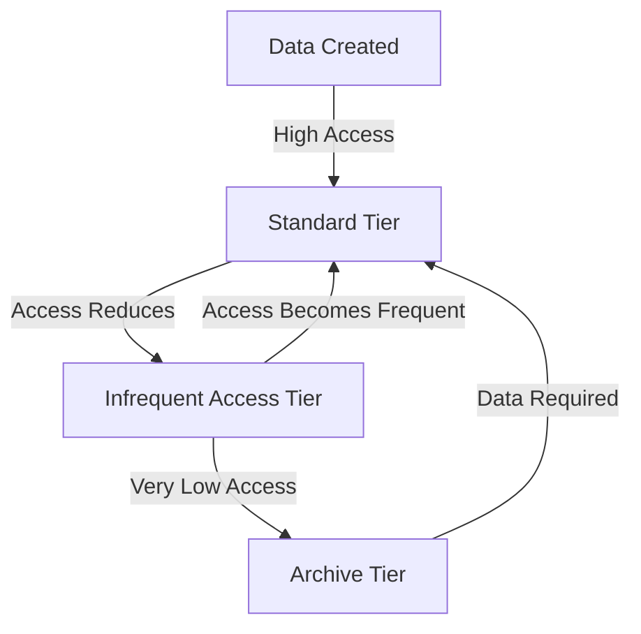

## Introduction
Storage Lifecycle Policies are a key element of cost optimization strategies in cloud environments, enabling automated management of data storage costs by transitioning data through different storage classes as its access patterns change over time. This pattern is instrumental for enterprises looking to reduce storage costs while still meeting their data retrieval requirements.

## Detailed Explanation
With cloud storage, data is often initially stored in readily accessible high-performance storage. As it ages or becomes less frequently accessed, the cost-effectiveness of this strategy diminishes. Storage Lifecycle Policies address this by facilitating automated data transition between multiple storage tiers—like from high-cost, high-access speed tiers to low-cost, archival tiers—thus optimizing cost without manual intervention.

### Key Concepts:
1. **Data Lifecycle Management**: Understanding the lifecycle of data from creation to archiving helps in setting appropriate policies for data transition.
2. **Automated Data Movement**: Rules-based automation for migrating data between storage types.
3. **Access Patterns**: Policies must consider how data access patterns change over time to effectively move data without impacting business operations.
4. **Cost vs. Performance**: Balancing between reduced costs and acceptable levels of data retrieval performance.

## Architectural Approach
Implementing Storage Lifecycle Policies involves defining lifecycle rules specifying conditions under which data should move between classes such as:
- **From Standard to Infrequent Access**: For data that is accessed less frequently but requires rapid access.
- **From Infrequent Access to Archive**: For rarely accessed data that may still need retrieval but can afford slower access speeds.



## Best Practices
- **Analytics on Access Patterns**: Utilize analytics tools to gain insights into how data is accessed over time.
- **Performance Baselines**: Establish baseline performance metrics for each storage tier to choose the best-fit option.
- **Testing and Simulation**: Validate lifecycle policies in a non-production environment to ensure they meet business requirements without unplanned data unavailability.
- **Policy Review and Update**: Regularly review and adjust policies to align with changing business needs and cloud service capabilities.

## Example Code
Below is a conceptual example using AWS S3's lifecycle configuration in JSON:

```json
{
  "Rules": [
    {
      "ID": "Transition to IA",
      "Status": "Enabled",
      "Filter": {},
      "Transitions": [
        {
          "Days": 30,
          "StorageClass": "STANDARD_IA"
        }
      ]
    },
    {
      "ID": "Transition to Glacier",
      "Status": "Enabled",
      "Filter": {},
      "Transitions": [
        {
          "Days": 365,
          "StorageClass": "GLACIER"
        }
      ]
    }
  ]
}
```

## Related Patterns
- **Data Archival Strategies**: Focused on long-term data storage while maintaining accessibility for regulatory and compliance reasons.
- **Caching Strategies**: For frequently accessed data, to improve performance without high storage costs.
- **Data Compression**: Reducing data size before transition to minimize costs.

## Additional Resources
- AWS S3 Storage Classes: [AWS Documentation](https://aws.amazon.com/s3/storage-classes/)
- Google Cloud Storage Lifecycle Management: [Google Cloud](https://cloud.google.com/storage/docs/lifecycle)
- Azure Storage Lifecycle Management: [Azure Docs](https://docs.microsoft.com/en-us/azure/storage/blobs/storage-lifecycle-management-concepts)

## Summary
Storage Lifecycle Policies enable cloud users to automate the management of data across different storage classes, significantly optimizing storage costs while maintaining the required data retrieval times based on access patterns. By implementing these policies, businesses can ensure efficient use of resources, aligning closely with operational objectives and financial constraints.
