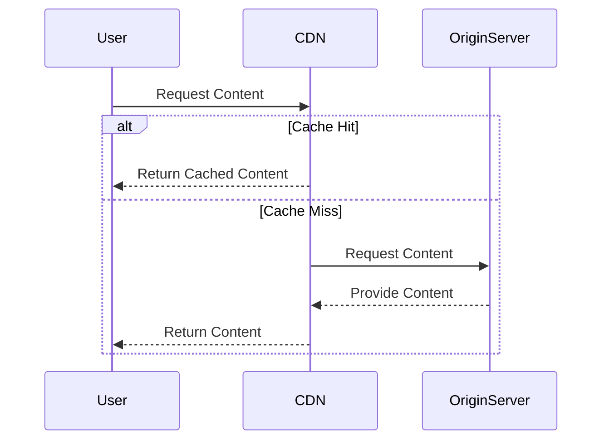

In the realm of cloud computing, data transfer optimization is a critical design pattern that focuses on minimizing the costs associated with moving data across networks. Given the extensive use of cloud services, optimizing the way data is transferred can lead to significant cost savings and improved application performance.

## Detailed Explanation

Data transfer costs can spiral quickly, especially for businesses that handle large volumes of data or operate globally. The Data Transfer Optimization pattern employs techniques to minimize these costs, primarily through specific strategies:

1. **Network Usage Optimization**: Efficient routing and the use of peering arrangements can significantly reduce costs. By selecting optimal paths for data transfer and avoiding congested nodes, latency is minimized, and data can move more efficiently.

2. **Content Delivery Networks (CDNs)**: CDNs help in caching data closer to end-users. By distributing content across geographically dispersed servers, the amount of data transferred over long distances is reduced, considerably lowering latency and bandwidth costs.

3. **Compression and Data Deduplication**: Applying compression algorithms to data before transfer and using deduplication to avoid redundant data transfers can reduce the amount of data moved, thus cutting costs.

4. **Efficient Data Storage**: Aligning data storage strategies to optimize data transfer paths, such as utilizing regional data centers strategically, helps reduce costs.

5. **Scheduled Transfer**: Transferring data during off-peak hours can minimize the cost as many cloud providers offer reduced pricing for off-peak data transfers.

## Example Code

Here's a sample strategy using Java to compress data before transfer:

```java
import java.io.ByteArrayOutputStream;
import java.io.IOException;
import java.util.zip.GZIPOutputStream;

public class DataTransferOptimizer {
    public byte[] compressData(byte[] data) throws IOException {
        ByteArrayOutputStream byteArrayOutputStream = new ByteArrayOutputStream(data.length);
        try (GZIPOutputStream gzipOutputStream = new GZIPOutputStream(byteArrayOutputStream)) {
            gzipOutputStream.write(data);
        }
        return byteArrayOutputStream.toByteArray();
    }
}
```

This code snippet leverages the `GZIPOutputStream` to compress data, an effective way to reduce the payload size before transfer.

## Diagram

Here's a simple sequence diagram demonstrating data transfer optimization using a CDN:



## Related Patterns

- **Caching Pattern**: Focuses on optimizing performance and cost by storing frequently accessed data closer to the point of use.
- **Regional Data Storage**: A strategy to place data in regions closer to the largest pool of users to optimize access latency and cost.

## Additional Resources

- [AWS Cost Optimization](https://aws.amazon.com/pricing/cost-optimization/)
- [Google Cloud Platform CDN Documentation](https://cloud.google.com/cdn/docs)
- [Azure Bandwidth Pricing](https://azure.microsoft.com/en-us/pricing/details/bandwidth/)

## Summary

The Data Transfer Optimization pattern underscores the importance of reducing data transfer costs in cloud environments. By utilizing techniques such as network optimization, content delivery networks, data compression, and intelligent scheduling, organizations can effectively manage expenses while maintaining optimal performance. This pattern is crucial for businesses of all sizes that are looking to leverage cloud resources efficiently and cost-effectively.
