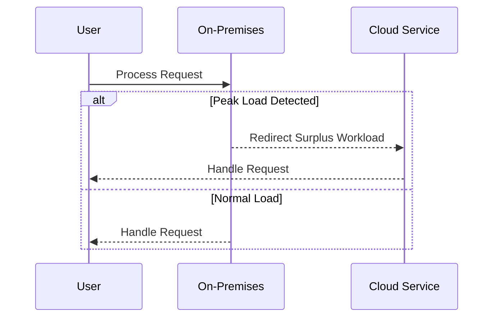

## Overview

Cloud Bursting is a dynamic approach primarily used in hybrid cloud architectures to manage workload fluctuations without sacrificing performance or incurring excessive costs. This pattern enables businesses to efficiently utilize on-premises infrastructure for routine workloads while leveraging cloud resources for unanticipated spikes in demand.

## Detailed Explanation

### How Cloud Bursting Works

In a traditional IT setup, organizations maintain on-premises resources to manage baseline workloads. However, these infrastructures often struggle to handle unexpected peaks due to limited capacity. Cloud Bursting addresses this by routing surplus workloads to external cloud service providers when internal resources are insufficient. The key components include:

1. **On-Premises Infrastructure**: Retains control over critical and routine workloads with predictable demand.
2. **Public Cloud Resources**: Provides the elasticity required during peak times, scaling on demand and offering a pay-as-you-go model.
3. **Monitoring and Management Tools**: Essential for identifying threshold breaches and automating the transfer of excess workloads to the cloud.

### Advantages

- **Cost Efficiency**: Pay for additional compute resources only when needed.
- **Scalability**: Leverage virtually infinite cloud resources to manage peak load periods.
- **Reliability**: Ensure application availability and performance during demand surges.

### Challenges

- **Data Security**: Transferring sensitive data to the cloud poses potential risks.
- **Latency**: Network delays may impact responsiveness during bursting.
- **Complexity in Integration**: Seamless integration between on-premises systems and cloud services requires sophisticated tooling and management.

## Example Code

Here is a hypothetical example using AWS services for cloud bursting:

```javascript
// Pseudo-code for cloud bursting using AWS

const AWS = require('aws-sdk');
const cloudWatch = new AWS.CloudWatch();
const EC2 = new AWS.EC2();

// Monitor on-premises server load
cloudWatch.getMetricStatistics(params, function(err, data) {
  if (err) console.log(err, err.stack); 
  else     manageResources(data);
});

// Function to manage resources based on metrics
function manageResources(data) {
  const threshold = 80; // Percentage threshold for bursting
  if (data.AverageLoad > threshold) {
    // Launch additional instances in AWS
    const instanceParams = {
      ImageId: 'ami-1234567890abcdef0',
      InstanceType: 't2.micro',
      MinCount: 1,
      MaxCount: 5
    };
    EC2.runInstances(instanceParams, function(err, instanceData) {
      if (err) console.log("Could not create instance", err);
      else console.log("Created instance", instanceData.Instances[0].InstanceId);
    });
  }
}
```

## Diagrams

### Cloud Bursting Sequence Diagram



## Related Patterns

- **Auto-Scaling**: Automatically adjusts the number of active servers based on current demand.
- **Load Balancing**: Distributes incoming application traffic across multiple servers.
- **Multi-Cloud Deployment**: Uses services from multiple cloud vendors for flexibility and redundancy.

## Additional Resources

- [AWS Cloud Bursting Strategy](https://aws.amazon.com/architecture/cloud-bursting/)
- [Google Cloud Hybrid Connectivity](https://cloud.google.com/hybrid-connectivity)
- [Azure Hybrid Cloud Solutions](https://azure.microsoft.com/services/hybrid-cloud/)

## Summary

Cloud Bursting optimizes hybrid cloud architecture by dynamically using cloud resources to handle demand peaks without requiring substantial on-premises infrastructure investment. While it offers significant benefits in scale and cost management, careful planning around security, latency, and integration complexity is necessary for effective implementation. This pattern is essential for organizations seeking flexibility and robustness in their IT operations.
