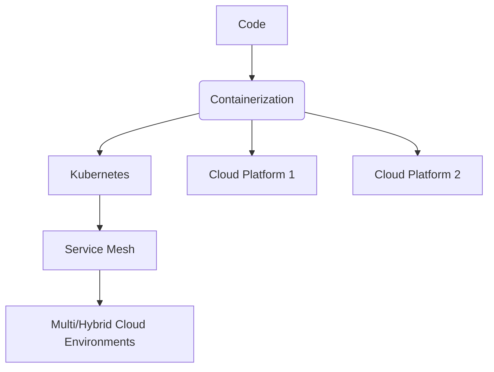

## Overview

Portable Application Architectures focus on constructing software systems that can transition seamlessly between different cloud environments, be it public cloud, private cloud, or on-premises infrastructure. This architectural pattern is vital in today's multi-cloud and hybrid cloud strategies, as it allows businesses to avoid vendor lock-in, optimize for cost and performance, and ensure business continuity.

## Key Concepts

1. **Abstraction Layers**: Use of containerization (e.g., Docker), virtual machines, or platform abstractions like Kubernetes to abstract away specific infrastructure details.
2. **Configuration Management**: Tools like Terraform or Ansible to manage infrastructure as code, supporting the repeatability of environments across clouds.
3. **API-First Development**: Building applications around well-defined APIs to ensure interaction consistency regardless of deployment environment.
4. **Service Mesh**: Implementing a service mesh like Istio for handling communication, security, and monitoring across microservices, irrespective of the deployment platform.

## Architectural Approaches

### 1. **Containerization**

- **Containers**: Use Docker or similar technologies to encapsulate application dependencies and configurations, making them portable across platforms.
- **Orchestration**: Use Kubernetes for managing containerized applications, ensuring that workloads are balanced and can scale appropriately regardless of the cloud provider.

### 2. **Infrastructure as Code (IaC)**

- **Terraform**: Employ Terraform to define infrastructure components in a declarative manner, ensuring environments are consistent and replicable across different clouds.
- **Configuration Tools**: Use tools like Ansible for provisioning and maintaining infrastructure configurations, promoting portability and minimizing manual intervention.

### 3. **Cross-Platform Frameworks**

- **Languages and Frameworks**: Choose languages (e.g., Java, Go) and frameworks (e.g., Spring Boot, Node.js) that are designed or have libraries for cross-platform compatibility.
- **Cloud Agnostic Libraries**: Opt for libraries and tools that do not rely on cloud-specific features unless absolutely necessary.

## Best Practices

- **Decouple Dependencies**: Avoid hardcoding dependencies that are specific to a cloud provider; instead, use configuration files or environment variables.
- **Adopt DevOps Practices**: Utilize CI/CD pipelines that are cloud-agnostic to facilitate continuous delivery and integration across environments.
- **Abstract Networking Requirements**: Use service discovery and centralized configuration management to handle network configurations dynamically.

## Example Implementation

```yaml
apiVersion: apps/v1
kind: Deployment
metadata:
  name: sample-app
spec:
  replicas: 2
  selector:
    matchLabels:
      app: sample-app
  template:
    metadata:
      labels:
        app: sample-app
    spec:
      containers:
      - name: sample-app
        image: sample-app:1.0
        ports:
        - containerPort: 8080
```

This Kubernetes YAML snippet defines a deployment for a containerized application, illustrating the use of containerization to achieve portability.

## Diagram



## Related Patterns

- **Microservices Architecture**: Promotes building smaller, independent services that are easier to port across environments.
- **Service Discovery**: Essential for dynamically locating services in a multi-cloud environment.
- **Circuit Breaker**: Increases resilience by providing fallbacks if external services become unavailable.

## Additional Resources

- [Cloud Native Computing Foundation](https://www.cncf.io/)
- [Docker Documentation](https://docs.docker.com/)
- [Kubernetes Documentation](https://kubernetes.io/docs/home/)

## Summary

Portable Application Architectures offer a strategic advantage in the cloud computing landscape by enabling applications to run in any environment. Through effective use of abstraction layers, containerization, IaC, and cross-platform frameworks, businesses can achieve greater flexibility and resilience. This pattern reduces dependence on single cloud providers, optimizes costs, and facilitates seamless scaling and migration across clouds, aligning with modern multi-cloud and hybrid cloud strategies.
