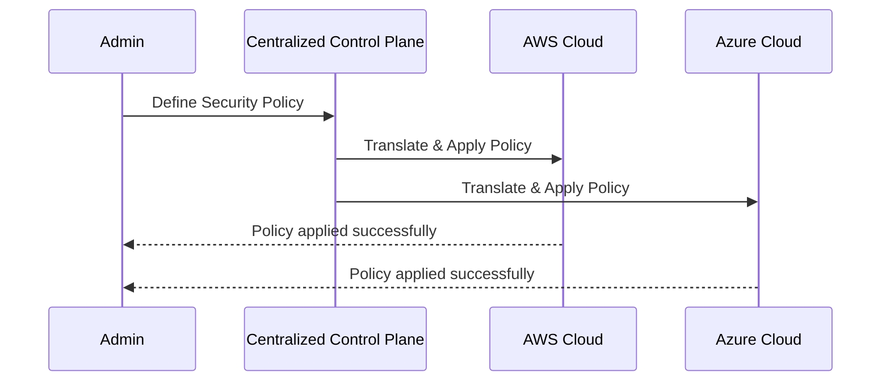

## Introduction

As enterprises increasingly adopt hybrid and multi-cloud strategies, maintaining policy consistency across diverse environments becomes crucial. Each cloud provider offers unique features, configurations, and security models, creating potential disparities in security and governance. The **Policy Consistency Across Clouds** pattern addresses these challenges by implementing uniform policies to ensure seamless operations and minimize security risks.

## Detailed Explanation of Design Pattern

### Problem

In hybrid and multi-cloud setups, different cloud providers have various security and governance models. This divergence can lead to inconsistent policies, increasing the complexity of managing these environments and potentially exposing the organization to security threats and compliance issues.

### Solution

Implement a centralized control plane or use tools that allow for defining, managing, and enforcing security and governance policies across all cloud environments. These tools should support interoperability and integration with various cloud platforms to ensure that a consistent set of policies can be maintained regardless of where workloads are deployed.

### Components

- **Centralized Policy Management**: A management portal or platform where policies are defined. It ensures that these policies are uniformly applied across cloud environments.
- **Policy Translation Layer**: Interprets the centralized policies and converts them into platform-specific rules for different cloud providers.
- **Monitoring and Logging**: Systems for tracking policy application and effectiveness, helping identify compliance issues or deviations.
- **Policy Enforcement Agents**: Deployed on each cloud platform, these agents ensure that the defined policies are executed consistently.

## Example Code

For demonstration purposes, consider the following pseudo-code that illustrates how a centralized policy might be defined and then applied across multiple cloud providers:

```javascript
// Define centralized policy
const securityPolicy = {
  "encryption": {
    "at-rest": true,
    "in-transit": true
  },
  "accessControl": {
    "multiFactorAuth": true,
    "roleBasedAccess": true
  }
};

// Function to apply policy to AWS
function applyPolicyToAWS(policy) {
  // Translate and apply policy to AWS
  console.log("Applying policy to AWS: ", policy);
  // AWS SDK code to enforce security controls
}

// Function to apply policy to Azure
function applyPolicyToAzure(policy) {
  // Translate and apply policy to Azure
  console.log("Applying policy to Azure: ", policy);
  // Azure SDK code to enforce security controls
}

// Apply policy to multiple clouds
applyPolicyToAWS(securityPolicy);
applyPolicyToAzure(securityPolicy);
```

## Diagrams

Here is sequence diagram illustrating the process of implementing policy consistency across clouds:



## Related Patterns

- **Cloud Native Security**: Enhancing security within cloud-native applications.
- **Data Residency and Sovereignty**: Ensuring data governance according to local laws.
- **Cross-Cloud Identity Management**: Coordinating identity solutions across clouds.

## Additional Resources

- [Multi-Cloud Security Best Practices](https://www.example.com/multi-cloud-security)
- [Hybrid Cloud Governance](https://www.example.com/hybrid-cloud-governance)
- [Centralized Policy Management Tools](https://www.example.com/centralized-policy-tools)

## Summary

The **Policy Consistency Across Clouds** pattern is essential for organizations managing complex hybrid and multi-cloud strategies. By centralizing policy definitions, translating them for different platforms, and ensuring their enforcement, organizations can maintain uniform security and governance, thus reducing operational complexity and mitigating risks.
