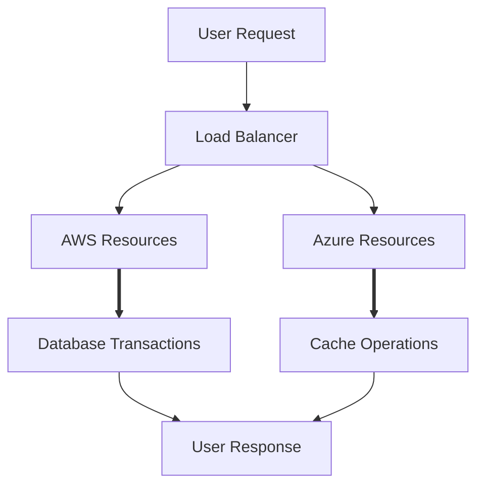

## Introduction

The **Workload Distribution** design pattern is a pivotal strategy in hybrid and multi-cloud architectures. This pattern involves distributing workloads across multiple cloud environments to enhance performance, resilience, cost-effectiveness, and user experience. By intelligently routing requests and balancing the load, organizations can leverage the strengths of various cloud providers, optimize resources, and ensure seamless service delivery.

## Detailed Explanation

### Key Concepts

1. **Load Balancing:** Software-defined solutions that manage and distribute incoming network traffic across multiple servers or instances, ensuring no single resource is overwhelmed.

2. **Elasticity:** The ability of a system to dynamically adjust resources and workloads based on current demand.

3. **Redundancy and Failover:** Techniques to ensure continuity and reliability by duplicating workloads and services across multiple cloud platforms, enabling automatic switching in case of failure.

4. **Latency Optimization:** Distributing workloads to minimize latency by deploying resources closer to end-users, leading to faster data processing and retrieval.

### Architectural Approaches

- **Geographical Distribution:** Deploy workloads in geographically disparate cloud data centers to reduce latency and increase redundancy.
- **Data and Compute Separation:** Decouple compute resources from data storage, enabling independent scaling and optimized resource allocation across different clouds.
- **AI-driven Load Balancing:** Utilize artificial intelligence and machine learning algorithms to predict traffic spikes and intelligently allocate resources.

### Best Practices

- **Define Clear Workload Requirements:** Understand the specific needs of each workload, such as performance, compliance, and availability requirements, to determine the best distribution strategy.
- **Continuous Monitoring:** Implement robust monitoring and analytics to gain insights into workload performance, allowing for timely adjustments.
- **Security Considerations:** Ensure data protection and compliance by adhering to security best practices when distributing workloads across different cloud environments.

## Example Code

Below is a basic example of using Terraform to distribute workloads across AWS and Azure:

```hcl
provider "aws" {
  region = "us-west-1"
}

provider "azurerm" {
  features {}
}

resource "aws_instance" "web" {
  ami           = "ami-12345678"
  instance_type = "t2.micro"
}

resource "azurerm_virtual_machine" "web" {
  name                  = "example-machine"
  location              = "West US"
  resource_group_name   = azurerm_resource_group.rg.name
  network_interface_ids = [azurerm_network_interface.example.id]
  vm_size               = "Standard_DS1_v2"
  ...
}
```

## Diagrams



## Related Patterns

- **Cloud Bursting:** Temporarily leveraging additional cloud resources when local resources reach capacity.
- **Service Orchestration:** Automating the deployment, scaling, and management of applications in cloud environments.
- **Multi-Cloud Connectivity:** Establishing secure and reliable connections between services and resources across cloud platforms.

## Additional Resources

- [NIST Cloud Computing Reference Architecture](https://www.nist.gov/publications/nist-cloud-computing-reference-architecture)
- [AWS Multi-Region Application Architecture](https://aws.amazon.com/architecture/multi-region-application-architecture/)
- [Azure Traffic Manager Overview](https://learn.microsoft.com/en-us/azure/traffic-manager/traffic-manager-overview)

## Summary

The **Workload Distribution** pattern is an essential element of modern cloud strategies, providing the agility, flexibility, and resilience required in today's digital landscape. By strategically distributing workloads across various cloud platforms, organizations can optimize performance while balancing costs and risk, ensuring that they deliver exceptional service to end-users no matter the conditions. This pattern supports businesses in achieving a robust, scalable, and efficient cloud infrastructure.
