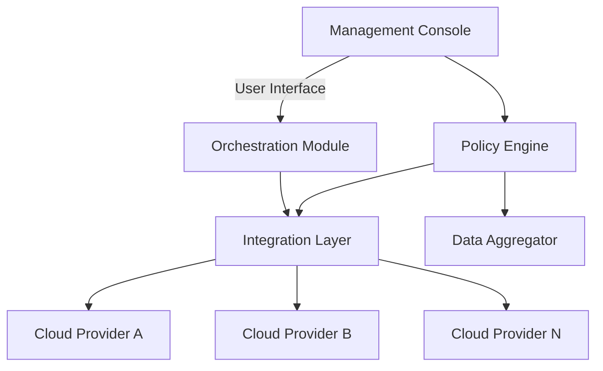

## Introduction

As organizations adopt hybrid and multi-cloud environments, they face challenges in managing disparate cloud resources. **Cloud Management Gateways** (CMGs) serve as a centralized control layer, streamlining the management of resources scattered across multiple cloud platforms. This pattern addresses key issues such as operational complexity, inconsistent security policies, and fragmented visibility across clouds.

## Architectural Overview

### Components

1. **Management Console**: A unified interface providing administrators with an overview of all cloud resources and operations.

2. **Policy Engine**: Enforces security, compliance, and cost-management policies across all connected cloud services.

3. **Integration Layer**: Connects to various cloud APIs to facilitate communication and data exchange between cloud platforms.

4. **Data Aggregator**: Collects and aggregates data from different cloud services to provide insights and reporting features.

5. **Orchestration Module**: Automates deployment, scaling, and management tasks across cloud environments.

### Diagram



## Example Code

Here is a basic example in Kotlin that demonstrates how to connect cloud services through a management gateway API:

```kotlin
class CloudServiceConnector(val apiKey: String, val apiSecret: String) {

    fun connectToService(serviceName: String): Boolean {
        // Mock connection logic
        println("Connecting to $serviceName with API Key: $apiKey")
        return true
    }

    fun executeCommand(serviceName: String, command: String): String {
        // Mock command execution
        println("Executing '$command' on $serviceName")
        return "Command execution result"
    }
}

fun main() {
    val connector = CloudServiceConnector("API_KEY", "API_SECRET")
    connector.connectToService("AWS")
    connector.executeCommand("AWS", "List Instances")
}
```

## Benefits

- **Centralized Management**: Provides a single pane of glass for managing resources across multiple clouds.
- **Improved Security**: Ensures uniform policy enforcement across all cloud services.
- **Cost Efficiency**: Helps in monitoring and optimizing cloud spend across different environments.
- **Operational Efficiency**: Simplifies the management of complex cloud workflows through automation.

## Related Patterns

- **Service Abstraction**: Abstracting cloud services to provide a uniform interface irrespective of the provider.
- **Cloud Service Broker**: Acts as an intermediary to negotiate and optimize cloud service offerings for clients.

## Additional Resources

- [NIST Cloud Computing Reference Architecture](https://www.nist.gov/programs-projects/cloud-computing)
- [Cloud Management Platforms: A Comparison](https://www.gartner.com/en/information-technology/insights/cloud-computing)

## Summary

Cloud Management Gateways play a crucial role in the efficient management of hybrid and multi-cloud environments. By centralizing control, they provide improved security, streamline operations, and help in achieving cost efficiency across different cloud platforms. As organizations continue to expand their cloud strategy, implementing such gateways will be pivotal in managing the complexity of diverse cloud ecosystems.
