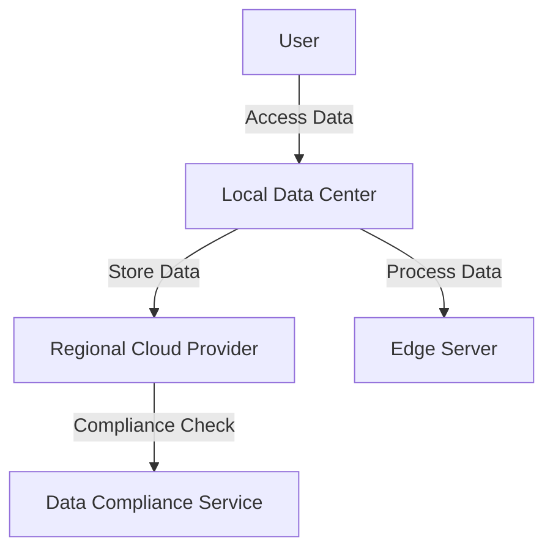

## Introduction to Data Localization

Data Localization refers to the practice of ensuring that data resides within geographically specific locations due to legal, compliance, or business requirements. As cloud computing becomes ubiquitous, companies often face regulatory pressures to store and process data within certain jurisdictions. This pattern is crucial for maintaining compliance with data protection laws, such as GDPR in Europe or CCPA in California, which often have specific data residency requirements.

## Problem Statement

The primary challenge with Data Localization is ensuring that data does not inadvertently leave specified geographical boundaries, which might lead to non-compliance with legal obligations and risk of significant penalties. Managing data across multiple jurisdictions, especially in a hybrid or multi-cloud environment, complicates this matter further due to the complexities of data flows and storage regulations.

## Architectural Approaches

1. **Region-Specific Deployment**: Utilize cloud service providers that offer data centers in required regions, enabling you to deploy applications and data storage solutions within these localized zones.

2. **Edge Computing**: Implement edge computing strategies to process and store data closer to where it is generated and consumed, ensuring regional data processing and compliance with local data laws.

3. **Data Residency Controls**: Leverage built-in cloud functionalities that enforce data residency restrictions. Many cloud providers offer tools that restrict where data can be stored and processed based on identified requirements.

4. **Federated Cloud Management**: Use federated cloud approaches that manage data sovereignty across multiple cloud environments, ensuring consistent compliance across jurisdictions.

## Best Practices

- **Understand Legal Requirements**: Thoroughly understand and regularly review applicable data protection regulations to ensure compliance.
  
- **Data Classification**: Clearly classify data based on sensitivity and compliance requirements to determine where it should reside.
  
- **Regular Auditing**: Conduct audits to verify that data storage and processing meet localized compliance requirements.
  
- **Network Segmentation**: Implement network segmentation to prevent cross-border data flows while maintaining efficient data accessibility.

- **Monitoring and Alerts**: Set up monitoring tools and alert systems to notify administrators of any cross-border data movements.

## Example Code

While code example for this pattern can often be specific to the cloud provider, here's a generic sample in a hybrid cloud setup:

```sql
-- Example of a SQL constraint to ensure data remains within a certain region
CREATE TABLE customer_data (
    id SERIAL PRIMARY KEY,
    name VARCHAR(255),
    region VARCHAR(50) CHECK (region = 'EU' OR region = 'US'),
    data JSONB
);
```

## Diagrams

### Data Localization Architecture Diagram


## Related Patterns

- **Data Residency**: Focuses on broader data storage locations for compliance.
- **Edge Computing Pattern**: Processing data closer to the source to meet local legal requirements.
- **Multi-Cloud Strategy**: Spreads workloads across different cloud providers to take advantage of regional infrastructure.

## Additional Resources

- [GDPR Compliance Guidelines](https://gdpr-info.eu/)
- [CCPA Overview](https://oag.ca.gov/privacy/ccpa)
- [Cloud Provider Data Localization Features](https://cloud.google.com/learn/data-localization)

## Summary

Data Localization is an essential pattern for organizations operating in multiple jurisdictions with varying legal standards. By strategically managing data residency through region-specific deployments, edge computing, and robust compliance controls, businesses can effectively navigate the complexities of global data regulation while leveraging cloud technologies. Implementing these practices not only ensures legal compliance but also enhances trust and reliability with users concerned about data privacy and sovereignty.
