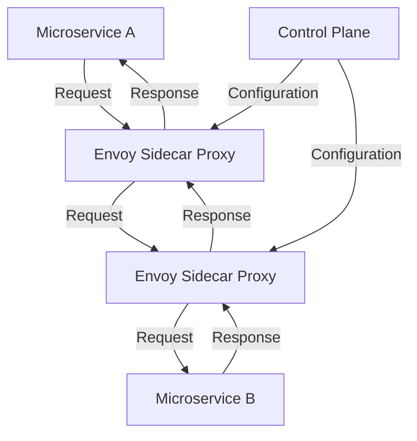

## Introduction

The **Service Mesh for Multi-Cloud** pattern addresses the challenge of managing microservices communication across multiple cloud environments. As enterprises adopt hybrid and multi-cloud strategies, they encounter complexity in securing, managing, and observing service-to-service communications. The service mesh abstractions provide a unified, cloud-agnostic solution to these challenges, ensuring service resilience, security, observability, and traffic management.

## Design Pattern Overview

A service mesh is a dedicated infrastructure layer that manages communication between microservices, typically implemented using lightweight network proxies deployed alongside application instances (sidecar pattern). In a multi-cloud environment, a service mesh enables consistent operational practices across different cloud service providers (CSPs).

### Key Benefits

- **Traffic Management**: Flexible routing, load balancing, canary releases, and fault injection.
- **Security**: Mutual TLS, secure service-to-service communication, and identity-based policy enforcement.
- **Observability**: Distributed tracing, metrics collection, and centralized logging.
- **Resiliency**: Automatic retries, circuit breakers, and failover strategies.

### Architectural Approach

1. **Sidecar Proxies**: Deploy sidecar proxies (e.g., Envoy) alongside microservices to intercept and manage all inbound and outbound traffic.
2. **Control Plane**: Utilize a control plane (e.g., Istio, Linkerd) to configure and manage the service mesh components.
3. **Data Plane**: The sidecar proxies comprise the data plane, handling the actual network traffic.
4. **Policy and Configuration Management**: Define rules for traffic routing, security policies, and access control centrally.

```yaml
apiVersion: apps/v1
kind: Deployment
metadata:
  name: example-service
spec:
  template:
    metadata:
      labels:
        app: example-service
    spec:
      containers:
        - name: example-service
          image: example-service:latest
        - name: istio-proxy
          image: istio/proxyv2
          args:
            - proxy
            - sidecar
            - --configPath
            - "/etc/istio/proxy"
            - --binaryPath
            - "/usr/local/bin/envoy"
```

### Diagram



## Best Practices

- **Unified Namespace Management**: Ensure consistent namespace management across different cloud providers to minimize configuration conflicts.
- **Centralized Observability**: Implement centralized logging and monitoring systems that integrate with the service mesh for comprehensive insights.
- **Secure Service Communication**: Default to mutual TLS for all service-to-service communications to enhance security.
- **Progressive Deployment Models**: Use canary and blue-green deployments to verify changes safely across environments.

## Related Patterns

- **Sidecar Pattern**: Utilized for proxying service communication in a microservices architecture.
- **API Gateway**: Often used in conjunction with service meshes for managing traffic entering from outside the cluster.
- **Circuit Breaker Pattern**: Provides resilience recommendations for handling service failures gracefully.

## Additional Resources

- [Istio Documentation](https://istio.io/latest/docs/)
- [Linkerd Website](https://linkerd.io/)
- [Envoy Proxy Documentation](https://www.envoyproxy.io/docs)
- [Kubernetes Networking](https://kubernetes.io/docs/concepts/services-networking/)

## Summary

The **Service Mesh for Multi-Cloud** pattern provides a comprehensive solution for managing microservices communication in multi-cloud environments, offering capabilities in secure communication, traffic management, observability, and resilience. Leveraging popular service mesh technologies such as Istio, Linkerd, and Envoy, organizations can implement robust multi-cloud architectures that are consistent and resilient across hybrid infrastructure.
