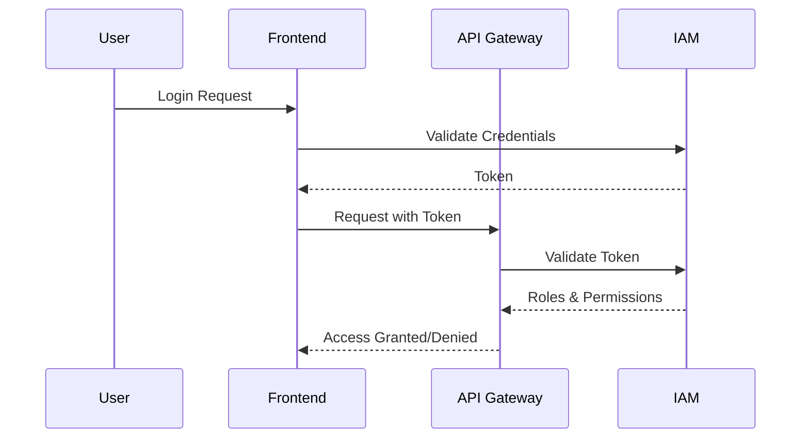

---

linkTitle: "Federated Security Policies"
title: "Federated Security Policies: Extending Security Measures Across Different Platforms"
category: "Hybrid Cloud and Multi-Cloud Strategies"
series: "Cloud Computing: Essential Patterns & Practices"
description: "A comprehensive approach to implementing security policies uniformly across diverse cloud environments and on-premises infrastructure."
categories:
- Hybrid Cloud
- Multi-Cloud
- Security
tags:
- security
- hybrid-cloud
- multi-cloud
- policy-management
- identity-management
date: 2024-07-07
type: docs

canonical: "https://softwarepatternslexicon.com/18/14/18"
license: "© 2024 Tokenizer Inc. CC BY-NC-SA 4.0"
---

## Introduction

Federated Security Policies are critical in ensuring consistent security governance across a hybrid or multi-cloud environment. As enterprises leverage various cloud providers alongside on-premises solutions, maintaining coherent security practices becomes a complex task. Federated Security Policies offer a strategy for extending uniform security measures and governance across these diverse platforms, enhancing overall security posture and simplifying compliance efforts.

## Detailed Explanation

### Understanding Federated Security Policies

**Federated Security Policies** allow organizations to centralize the management and enforcement of security rules and practices across disparate IT environments. This entails synchronizing authentication, authorization, and auditing practices, often facilitated by integrating identity and access management (IAM) systems.

### Key Components

1. **Identity Federation**: Centralizing identity management using standards such as SAML, OAuth, or OpenID Connect to enable Single Sign-On (SSO) and consistent user management across platforms.
  
2. **Policy Centralization**: Using tools and platforms that allow security policies to be defined once and applied universally. This can involve cloud security posture management (CSPM) tools that operate across multi-cloud environments.
  
3. **Compliance Monitoring**: Implementing continuous monitoring and logging across all environments to ensure security practices are adhered to and compliance requirements are met.
  
4. **Data Governance**: Ensuring data protection and privacy by regulating data policies across cloud service providers and on-premises systems, using encryption, access controls, and data classification.

### Architectural Approach

The architecture of Federated Security Policies typically involves:

- **Centralized IAM Solutions**: Solutions like AWS IAM, Azure AD, or Google Cloud's IAM can be extended and integrated.
  
- **Policy Frameworks**: Use of frameworks like Open Policy Agent (OPA) for defining and enforcing security policies across diverse platforms.
  
- **Security Information and Event Management (SIEM)**: Tools for aggregating and analyzing security data from multiple sources to detect and respond to threats.

## Example Code

Below is a simplified example using Open Policy Agent (OPA) to enforce a policy that restricts users from accessing certain endpoints unless they have specific roles:

```rego
package example.authz

default allow = false

allow {
    input.user.role == "admin"
}

allow {
    input.user.role == "manager"
    input.verb == "GET"
    input.path = data.example.paths[_]
}

paths = ["/admin", "/manage"]
```

## Diagrams



## Related Patterns

- **Identity Federation**: Establishing a common identity platform across services.
- **Policy-Based Access Control**: Defining and controlling user access to resources based on organizational policies.
- **Cloud Access Security Broker (CASB)**: Tools for enforcing security policies across cloud-based services.

## Additional Resources

1. [NIST - Cloud Computing Security Reference Architecture](https://www.nist.gov/publications/cloud-computing-security-reference-architecture)
2. [Azure Security Documentation](https://docs.microsoft.com/en-us/security/)
3. [AWS Identity and Access Management (IAM)](https://aws.amazon.com/iam/)

## Summary

Federated Security Policies are essential for organizations operating in hybrid or multi-cloud environments. By centralizing and standardizing security governance, organizations can improve their security posture, ensure compliance, and reduce complexity in policy management. This pattern leverages identity federation, centralized policy management, and continuous monitoring to achieve these goals, employing industry-standard practices and tools.
