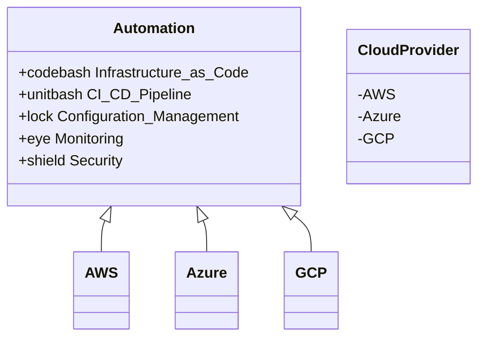

In the modern cloud landscape, organizations often adopt a multi-cloud strategy to leverage the best services from different cloud providers. However, this approach can lead to complexities in managing deployments across different environments. The **Common Tooling and Automation** pattern addresses this challenge by advocating for the use of standardized tools and automated processes that can operate uniformly across various cloud platforms.

## Architectural Approach

The Common Tooling and Automation pattern involves selecting tools and automation scripts that are cloud-agnostic or have capabilities to integrate with multiple clouds. This strategy facilitates streamlined operations, consistent environments, and efficient management, while also reducing the risk of cloud vendor lock-in.

### Key Components

1. **Infrastructure as Code (IaC):** Tools like Terraform or Pulumi allow you to define and manage infrastructure using code. These tools typically support multiple cloud providers, enabling consistent infrastructure management across AWS, Azure, and GCP, among others.

2. **Continuous Integration/Continuous Deployment (CI/CD):** Use CI/CD pipelines with tools like Jenkins, GitLab CI, or GitHub Actions which offer plugins and integrations for multi-cloud deployments.

3. **Configuration Management:** Tools such as Ansible, Chef, or Puppet can help manage and automate configurations across different cloud platforms.

4. **Monitoring and Logging:** Centralized monitoring tools like Prometheus, Grafana, or ELK stack should have the ability to aggregate data from multiple clouds to provide a unified view of system health and performance.

5. **Security and Compliance:** Tools that enforce security policies and compliance checks across environments such as HashiCorp Vault or AWS IAM roles adapted for multi-cloud policies.

## Best Practices

- **Leverage Open Standards:** Opt for tools that support open standards to ensure portability and interoperability across cloud providers.
  
- **Automate Everything:** From infrastructure provisioning to application deployment and monitoring, automation reduces error and increases speed.

- **Keep Configurations Centralized:** Define and store configurations centrally to ensure consistency across deployments.

- **Use Version Control:** Treat your tooling scripts and configurations as code, using version control systems like Git to manage changes and collaborate effectively.

- **Regular Audits and Updates:** Continuously audit your tools and processes to incorporate updates and best practices for evolving cloud environments.

## Example Code

Here is a basic example of a Terraform configuration that can be used to provision similar resources in both AWS and Azure:

```hcl
provider "aws" {
  region = "us-east-1"
}

provider "azurerm" {
  features {}
}

resource "aws_instance" "example" {
  ami           = "ami-0c55b159cbfafe1f0"
  instance_type = "t2.micro"
}

resource "azurerm_linux_virtual_machine" "example" {
  name                = "example-machine"
  resource_group_name = azurerm_resource_group.example.name
  location            = "West Europe"
  size                = "Standard_F2"

  admin_username = "adminuser"
  network_interface_ids = [
    azurerm_network_interface.example.id,
  ]
}

resource "azurerm_resource_group" "example" {
  name     = "example-resources"
  location = "West Europe"
}
```

## Diagrams



## Related Patterns

- **Service Orchestration:** Integrating multiple services through workflows to automate complex processes across cloud ecosystems.
- **Immutable Infrastructure:** Emphasizing the automation part by creating immutable servers or containers to ensure consistency.

## Additional Resources

- [Terraform by HashiCorp](https://www.terraform.io/)
- [AWS Multi-Cloud Architecture](https://aws.amazon.com/architecture/multi-cloud/)
- [Google Cloud Multi-Cloud Solutions](https://cloud.google.com/solutions/multicloud)

## Summary

The Common Tooling and Automation pattern plays a crucial role in easing the complexities associated with multi-cloud deployments. By utilizing standardized, cloud-agnostic tools and automating repetitive tasks, organizations can achieve consistency, scalability, and efficiency while maintaining the flexibility to choose the best services offered by multiple cloud providers. Embracing this pattern not only reduces operational overhead but also provides a solid foundation for adapting to the continuously evolving cloud technology landscape.
