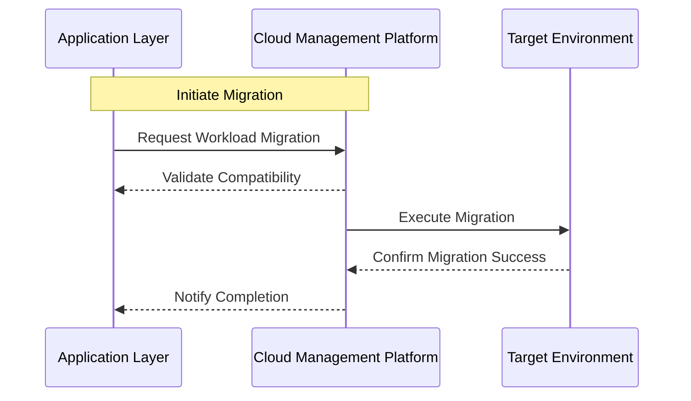

## Introduction

Workload Mobility is a pivotal pattern in modern cloud computing strategies, particularly within hybrid and multi-cloud architectures. The pattern involves transferring workloads seamlessly across various environments to achieve optimal resource utilization, cost-effectiveness, and performance enhancement. This approach empowers organizations to adapt dynamically to fluctuating resource demands and varying cloud provider offerings.

## Detailed Explanation

### Key Concepts

1. **Dynamic Scaling**: Automatically adjusting resources to match workload demands, leading to efficient resource usage.
2. **Flexibility and Agility**: Quickly moving workloads between on-premise and cloud environments or between different cloud providers.
3. **Interoperability**: Ensuring compatibility and seamless integration across diverse platforms.
4. **Cost Optimization**: Leveraging price differences between environments to minimize operational costs.

### Architectural Approaches

1. **Virtualized Environments**:
   - Use of virtual machines or containers to package and migrate workloads efficiently.
   
2. **Cloud Management Platforms (CMPs)**:
   - Utilize CMP tools to orchestrate and automate the workload migration process, ensuring minimal downtime and disruption.

3. **Network Considerations**:
   - Employing reliable and low-latency networks for transferring workloads, ensuring data integrity and minimum performance loss during migrations.

## Best Practices

- **Compatibility Assessment**: Regularly assess the compatibility of workloads with target environments to avoid migration issues.
- **Automated Monitoring and Alerts**: Use monitoring tools to trigger automated alerts and responses when workloads become suboptimal in their current location.
- **Data Synchronization**: Ensure data consistency and replication across environments to avoid data loss or corruption during migration.
- **Security and Compliance**: Evaluate and enforce security configurations and compliance requirements specific to each environment.

## Example Code

```javascript
// Pseudo-code for triggering workload migration
function triggerMigration(workload, targetEnvironment) {
    checkCompatibility(workload, targetEnvironment);
    evaluatePerformance(workload);
    if (needsMigration(workload)) {
        migrate(workload, targetEnvironment);
        updateMonitoring(workload, targetEnvironment);
    }
}
```

## Diagrams

### UML Sequence Diagram



## Related Patterns

- **Auto-Scaling**: Complementary pattern for handling dynamic resource allocation within specific cloud environments.
- **Cloud Bursting**: Enabling applications to overflow to additional cloud resources when local capacities are exceeded.

## Additional Resources

- [Understanding Multi-Cloud Strategies](https://example.com/multi-cloud-strategies)
- [The Role of Cloud Management Platforms](https://example.com/cloud-management-platforms)
- [Optimizing Cost with Workload Mobility](https://example.com/cost-optimization)

## Summary

The Workload Mobility design pattern is essential for leveraging the full potential of hybrid and multi-cloud environments. By enabling dynamic movement of workloads based on resource availability, organizations can achieve unparalleled levels of flexibility, cost efficiency, and performance scalability. Implementing this pattern involves strategic considerations around interoperability, network infrastructure, and automation to ensure seamless and effective migrations with minimal downtime.

Implementing workload mobility can significantly enhance an organization's cloud strategy, providing robust solutions for modern computational demands.
