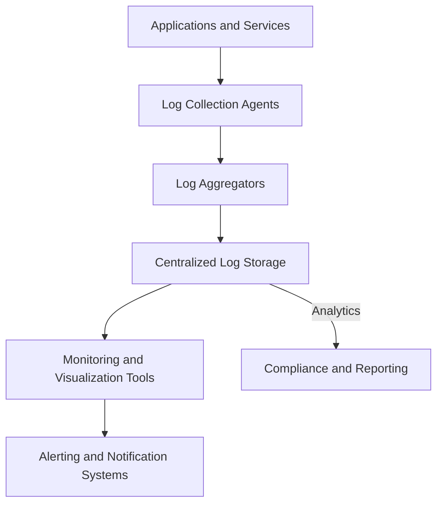

## Overview

Centralized Logging and Monitoring is a crucial pattern in hybrid cloud and multi-cloud strategies where logs and metrics from distributed environments are collected and analyzed in a single, unified platform. This pattern facilitates better operational visibility, efficient troubleshooting, data-driven decision-making, and compliance adherence.

## Problem

In hybrid and multi-cloud environments, applications often span multiple systems, services, and geographies, each generating logs. Managing logs and monitoring these disparate systems independently leads to several challenges:
- Lack of comprehensive visibility into system health.
- Delayed issue detection and resolution.
- Difficulties in ensuring compliance and security.
- Increased operational complexity and costs.

## Solution

Implement a Centralized Logging and Monitoring system to aggregate logs and metrics across all cloud providers and on-premise systems. This system normalizes and stores log data in a unified repository, enabling correlation and analysis through a single pane of glass. This improves system observability, supports real-time alerting, and aids in complex querying and visualization of log data.

### Architecture

1. **Log Collection Agents**: Deploy agents on each system to securely collect logs and metrics, supporting various formats like JSON, XML, and plain text.

2. **Log Aggregators**: Use dedicated services such as Fluentd, Logstash, or proprietary cloud solutions to centralize logs. Aggregators can filter, transform, and route logs to the centralized storage system.

3. **Centralized Log Storage**: Utilize scalable storage solutions such as Elasticsearch, Amazon S3, or Google Cloud Storage to hold logs. These systems should support efficient indexing and search capabilities.

4. **Monitoring and Visualization Tools**: Tools like Kibana, Grafana, or AWS CloudWatch can be employed to visualize and monitor logs, generate reports, and create alerts for specific events.

5. **Alerting and Notification Systems**: Integrate with services like PagerDuty, Slack, or email to notify teams of critical issues in real-time.

### Best Practices

- Ensure all collected logs are properly timestamped and include metadata such as hostname and application ID.
- Implement log retention policies to control costs and comply with regulatory requirements.
- Use encryption and access controls to protect log data.
- Periodically audit and refine monitoring rules and alerts based on operational feedback.

### Example Code

Here's a basic setup using Fluentd and Elasticsearch:

```yaml
<source>
  @type tail
  path /var/log/nginx/access.log
  pos_file /var/log/td-agent/nginx-access.log.pos
  tag nginx.access
  <parse>
    @type nginx
  </parse>
</source>

<match nginx.access>
  @type elasticsearch
  host elasticsearch.local
  port 9200
  logstash_format true
</match>
```

### Diagram



## Related Patterns

- **Event Sourcing**: Ensures all changes to application state are stored as a sequence of events.
- **Continuous Deployment**: Automate the deployment process and ensure the infrastructure can support rapid changes in log patterns.
- **Service Mesh**: Provides inherent observability features for microservices, complementing centralized logging.

## Additional Resources

- [ELK Stack: Elasticsearch, Logstash, and Kibana](https://www.elastic.co/what-is/elk-stack)
- [Prometheus: Monitoring System & Time Series Database](https://prometheus.io/)
- [Datadog: Monitoring and Security platform](https://www.datadoghq.com/)

## Summary

Centralized Logging and Monitoring is integral for maintaining operational excellence in hybrid and multi-cloud environments. By consolidating logs and metrics, organizations can enhance visibility, streamline troubleshooting, and ensure compliance. Leveraging the right tools and following best practices can significantly improve system reliability and performance.
