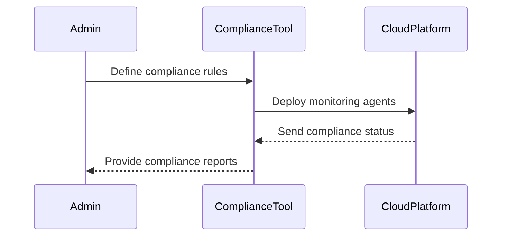

## Introduction

In the realm of hybrid and multi-cloud environments, managing compliance across various jurisdictions poses a significant challenge for enterprises. As regulatory requirements vary drastically across regions and industries, establishing a comprehensive compliance management strategy that caters to each jurisdiction is crucial. This pattern outlines the best practices, architectural approaches, and tools for managing compliance effectively across diverse cloud platforms, ensuring that data sovereignty and protection laws are adhered to.

## Design Pattern Description

**Compliance Management Across Clouds** encompasses strategies to maintain compliance with legal, regulatory, and organizational obligations when operating in a multi-cloud or hybrid cloud setting. It involves the identification of all applicable compliance requirements, implementation of necessary controls and continuous monitoring of cloud environments. This pattern requires a combination of strategies, tools, and governance models to ensure compliance.

### Key Components:
- **Compliance Requirement Identification**: Assess specific compliance requirements for each jurisdiction.
- **Automated Compliance Monitoring**: Implement tools for continuous monitoring and reporting of compliance status.
- **Data Sovereignty Management**: Ensure that data storage and processing comply with local data regulations.
- **Cross-Platform Governance**: Establish a centralized governance model to standardize compliance practices across clouds.

## Best Practices

1. **Centralize Policy Management**: Use a unified policy framework to manage and enforce compliance policies across all cloud platforms.
2. **Continuous Auditing**: Implement continuous auditing tools and techniques to ensure real-time compliance adherence.
3. **Data Localization Strategies**: Develop and enforce data localization strategies to comply with regional data protection mandates.
4. **Train and Educate Staff**: Regularly train staff on compliance requirements and the use of compliance management tools.
5. **Engage with Legal Experts**: Collaborate with legal experts to interpret complex compliance directives and integrate them into your cloud strategy.

## Example Code

To achieve automated compliance monitoring, consider using Infrastructure as Code (IaC) tools such as Terraform combined with compliance-focused modules:

```hcl
provider "aws" {
  region = "us-east-1"
}

module "compliance_checker" {
  source = "terraform-module-source"
  regions = ["us-east-1", "eu-west-1"]

  compliance_rules = [
    "ensure_s3_buckets_are_private",
    "ensure_rds_is_encrypted",
  ]
}
```

## Diagrams

### Compliance Management Sequence Diagram



## Related Patterns

- **Cloud Governance Framework**: Establishes standardized policies and regulations across cloud environments.
- **Data Residency Pattern**: Focuses on ensuring data storage and processing comply with local regulations.
- **Security Compliance as Code**: Implements security and compliance checks using code to ensure consistency across environments.

## Additional Resources

- [NIST Cloud Computing Standards](https://www.nist.gov/programs-projects/cloud-computing)
- [GDPR Compliance Checklist](https://gdpr.eu/)
- [Cloud Security Alliance](https://cloudsecurityalliance.org/)

## Summary

Compliance management across clouds is a complex but crucial undertaking for organizations leveraging multi-cloud and hybrid cloud strategies. By adopting best practices such as centralized policy management, continuous auditing, and engaging with legal experts, companies can effectively manage compliance. Deploying automated compliance tools facilitates real-time monitoring and reporting across cloud platforms, ensuring ongoing adherence to regional and international regulatory standards.
