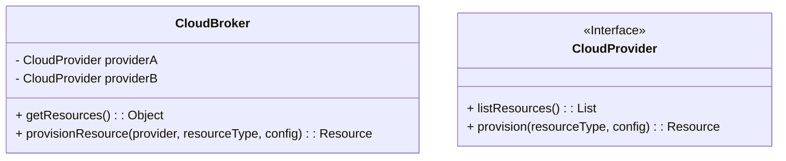
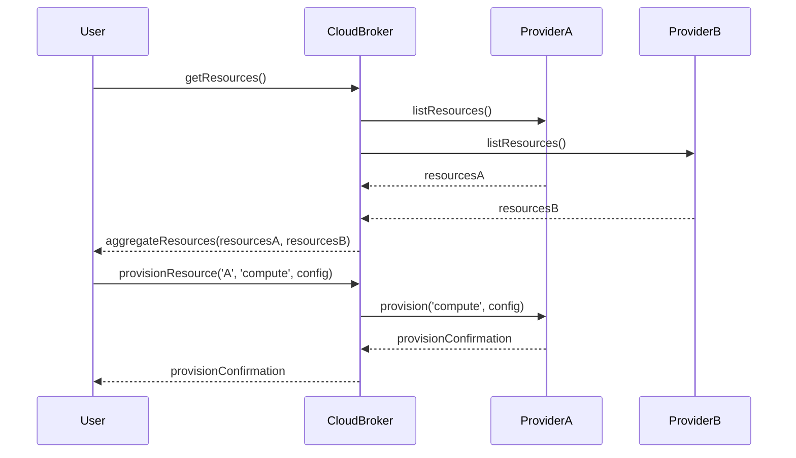

## Introduction

In the rapidly evolving landscape of cloud computing, businesses often leverage multiple cloud services to meet their unique needs. This approach, however, can lead to increased complexity in managing disparate cloud environments. **Cloud Broker Services** act as intermediaries, facilitating the management and orchestration of resources across different cloud providers. This design pattern helps organizations optimize resource allocation, enhance service delivery, and maintain compliance with business policies.

## Detailed Explanation

### Role of Cloud Broker Services

Cloud Broker Services are essentially middleware that manage the consumption, performance, and delivery of cloud services for businesses. They play several roles, including:

1. **Aggregation**: Combining services from different cloud providers to offer comprehensive solutions tailored to business needs.
2. **Customization**: Tailoring existing cloud services to fit specific organizational requirements.
3. **Intermediation**: Providing a consolidated interface for users to interact with multiple cloud services simultaneously.

### Architectural Approaches

1. **API Integration**: Cloud Broker Services integrate with various cloud provider APIs to gather data and manage services uniformly through a single interface.
   
2. **Service Abstraction**: They abstract services from multiple clouds, offering a single generic service layer to the users, which simplifies user interaction and management.

3. **Policy Enforcement**: Brokers enforce policies across different platforms, ensuring compliance with security, privacy, and governance standards.

### Paradigms and Best Practices

- **Centralized Management**: Utilize a centralized control panel to manage all cloud resources, providing better visibility and control.
  
- **Unified Billing and Reporting**: Consolidate billing and reporting to simplify cost management and tracking across various cloud ecosystems.
  
- **Service-Level Agreements (SLAs)**: Establish clear SLAs with both cloud providers and consumers to manage expectations and ensure quality services.
  
- **Automation**: Automate routine tasks such as scaling and resource provisioning to improve efficiency and reduce human error.

### Example Code

Here's a simple pseudo-code example demonstrating how a Cloud Broker Service might aggregate services from two different cloud providers:

```pseudo
class CloudBroker {
    constructor(cloudProviderA, cloudProviderB) {
        this.providerA = cloudProviderA;
        this.providerB = cloudProviderB;
    }
    
    getResources() {
        return {
            providerA_resources: this.providerA.listResources(),
            providerB_resources: this.providerB.listResources()
        };
    }
    
    provisionResource(provider, resourceType, config) {
        switch(provider) {
            case 'A':
                return this.providerA.provision(resourceType, config);
            case 'B':
                return this.providerB.provision(resourceType, config);
            default:
                throw new Error('Invalid provider');
        }
    }
}

// Usage
let broker = new CloudBroker(new CloudProviderA(), new CloudProviderB());
let allResources = broker.getResources();
broker.provisionResource('A', 'compute', { cpu: 4, memory: '16GB' });
```

### Diagrams

#### UML Class Diagram



#### Sequence Diagram



## Related Patterns

- **Service Orchestration**: Deals with coordinating multiple services to create complex workflows and end-to-end processes.
  
- **Cloud Service Measurement Index**: A method for evaluating and comparing cloud services to choose the best-fit providers.

- **Cloud Portability**: The ability to move services and applications between different cloud environments without significant integration effort.

## Additional Resources

- [NIST Cloud Computing Reference Architecture](https://www.nist.gov/publications/cloud-computing-reference-architecture)
- [Multi-Cloud Management Tools: A Guide](https://www.gartner.com/en/information-technology/glossary/multicloud-management)

## Summary

Cloud Broker Services offer a strategic advantage in the dynamic world of multi-cloud management. By acting as intermediaries between cloud customers and providers, these services streamline operations, improve resource utilization, and ensure compliance with organizational standards. As businesses continue to embrace hybrid and multi-cloud environments, leveraging Cloud Broker Services will be crucial in maintaining agility and competitiveness.
