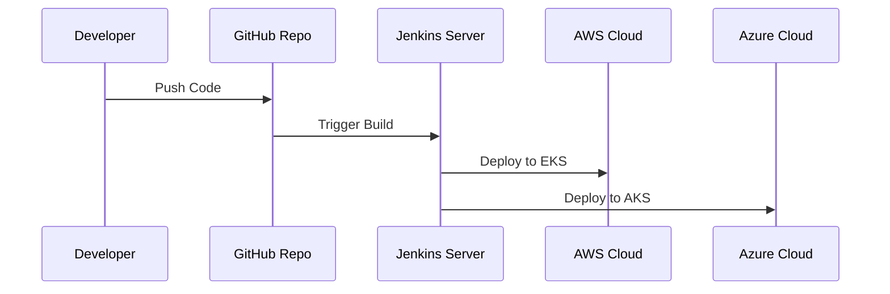

## Introduction to Multi-Cloud DevOps Pipelines

In today's cloud-centric technology landscape, the ability to deploy and manage applications across multiple cloud environments is crucial for businesses seeking to optimize resources, reduce vendor lock-in, and leverage the best services each cloud provider has to offer. Multi-cloud DevOps pipelines provide a solution by allowing seamless integration and deployment processes across diverse cloud platforms.

A multi-cloud DevOps pipeline involves implementing CI/CD (Continuous Integration and Continuous Deployment) practices that span multiple cloud environments. This enables development teams to automate and streamline their workflows while deploying changes across different cloud infrastructures. By employing this design pattern, organizations can achieve greater resilience, flexibility, and scalability.

## Key Architectural Approaches

1. **Infrastructure as Code (IAC):** Use tools like Terraform, AWS CloudFormation, or Azure Resource Manager to define cloud resources in a consistent, reproducible manner across cloud providers.
   
2. **Containerization:** Leverage Docker and Kubernetes to package and orchestrate applications, facilitating consistent deployments across cloud environments.

3. **Unified CI/CD Tools:** Utilize tools like Jenkins, GitLab CI, or CircleCI with plugins and integrations to support multi-cloud deployments.

4. **Service Mesh Architecture:** Incorporate service meshes like Istio or Linkerd for managing microservices communication, offering flexibility and control in multi-cloud scenarios.

5. **API Gateway & Management:** Use cloud-agnostic API gateway solutions to handle traffic across different clouds, ensuring seamless access and interaction with services.

## Best Practices

- **Standardization:** Establish standards for code, builds, and artifacts to ensure consistency across different clouds.
  
- **Granular Access Control:** Implement security best practices by controlling access to resources with identity and access management (IAM) tools.

- **Monitoring and Logging:** Implement centralized logging and monitoring solutions like Prometheus, ELK Stack, or AWS CloudWatch for observability across cloud environments.

- **Cross-Cloud Network Considerations:** Ensure low-latency and secure connectivity between services running on different cloud platforms.

- **Redundancy and Failover:** Architect systems to handle failover scenarios smoothly, leveraging traffic management and DNS services for intelligent routing.

## Example Code

Below is a simplified example of a GitHub Actions workflow used to deploy an application to both AWS and Azure:

```yaml
name: Deploy to Multi-Cloud

on:
  push:
    branches:
      - main

jobs:
  build:
    runs-on: ubuntu-latest
    steps:
    - uses: actions/checkout@v2

    - name: Build Docker Image
      run: docker build -t myapp:latest .

  deploy_aws:
    runs-on: ubuntu-latest
    needs: build
    steps:
    - uses: actions/checkout@v2

    - name: Deploy to AWS EKS
      run: |
        aws eks --region us-west-2 update-kubeconfig --name my-cluster
        kubectl apply -f k8s/aws-deployment.yaml

  deploy_azure:
    runs-on: ubuntu-latest
    needs: build
    steps:
    - uses: actions/checkout@v2

    - name: Deploy to Azure AKS
      run: |
        az aks get-credentials --resource-group myResourceGroup --name myAKSCluster
        kubectl apply -f k8s/azure-deployment.yaml
```

## Diagrams

Below is a simplified representation of a multi-cloud DevOps pipeline using UML sequence diagram:



## Related Patterns

- **Hybrid Cloud Patterns**: Strategies for integrating on-premises infrastructure with cloud resources.
- **Cross-Cloud Load Balancing**: Techniques to distribute traffic across services in multiple clouds.
- **Cloud-Agnostic Services**: Design methods to ensure applications are portable across cloud environments.

## Additional Resources

- [Terraform Multi-Cloud Infrastructure Guide](https://learn.hashicorp.com/tutorials/terraform/multicloud)
- [Docker and Kubernetes for Multi-Cloud Deployments](https://kubernetes.io/docs/concepts/services-networking/)
- [GitLab CI/CD for Multi-Cloud Strategies](https://docs.gitlab.com/ee/ci/)

## Summary

Multi-Cloud DevOps Pipelines empower organizations to deploy, manage, and scale applications across multiple cloud platforms concurrently. By adopting cloud-agnostic tools and practices, businesses can liberate themselves from vendor lock-in, optimize performance, and enhance fault tolerance. Successful implementation of this pattern requires careful planning, standardized practices, and robust security mechanisms to ensure seamless operation across diverse environments.
