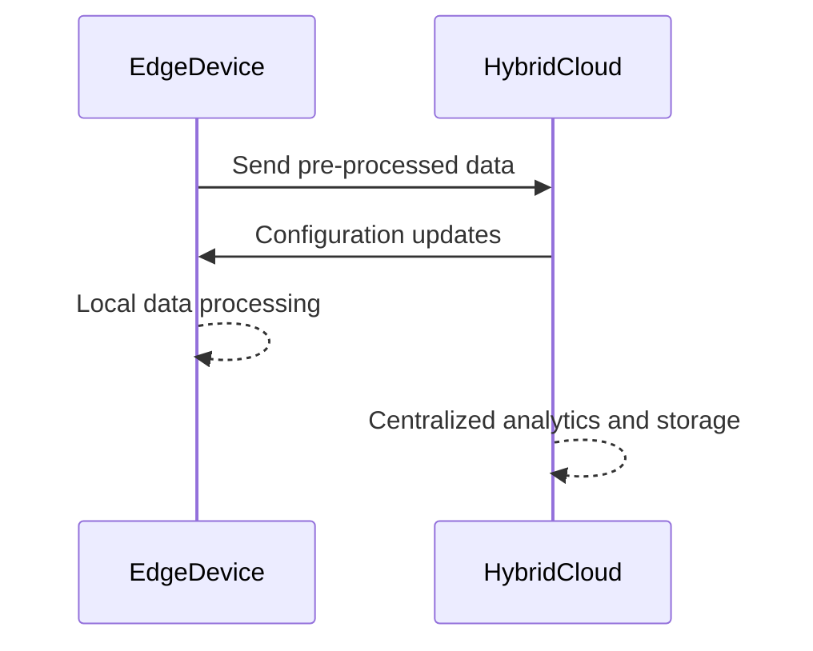

## Overview

The **Edge Integration with Hybrid Cloud** pattern involves extending cloud computing capabilities to edge devices, which are located closer to the data source. This approach is crucial for scenarios requiring low-latency processing and enables scalable and efficient data management and computing power distribution.

### Design Pattern Context

In a hybrid cloud environment, edge integration helps in managing the data flow between cloud services and edge devices. This pattern supports the deployment of applications where data processing needs to happen closer to the source, reducing latency and bandwidth usage.

### Key Benefits

- **Low Latency:** By processing data at the edge, applications can respond more quickly to real-time requirements.
- **Optimized Bandwidth:** Reduces load and dependency on central cloud services by filtering and aggregating data locally.
- **Improved Reliability:** Local processing enables systems to operate during connectivity losses to the cloud.
- **Scalable Architecture:** Facilitates a distributed model that can grow with the needs of an application or service.

### Architectural Approach

1. **Data Pre-Processing at Edge:** Leverage edge devices to preprocess data before sending it to the cloud, which can involve filtering, aggregation, or real-time analysis.
2. **Hybrid Cloud Connectivity:** Seamlessly integrate edge devices into a hybrid cloud to utilize both local and centralized computing services.
3. **Service Distribution:** Split application logic between cloud and edge to optimize performance and resource use.
4. **Monitoring and Management:** Implement robust monitoring solutions to ensure edge devices and cloud services work synergistically.

### Example Code

Below is a simplified example in GoLang to demonstrate edge data aggregation and less frequent uploads to the cloud:

```go
package main

import (
    "fmt"
    "time"
)

type SensorData struct {
    Temperature float64
    Timestamp   time.Time
}

func aggregateData(dataPoints []SensorData) SensorData {
    total := 0.0
    for _, data := range dataPoints {
        total += data.Temperature
    }
    avgTemp := total / float64(len(dataPoints))

    return SensorData{Temperature: avgTemp, Timestamp: time.Now()}
}

func main() {
    rawData := []SensorData{{23.5, time.Now()}, {24.0, time.Now()}, {22.1, time.Now()}}
    aggregatedData := aggregateData(rawData)

    fmt.Printf("Aggregated Sensor Data: %v°C at %v\n", aggregatedData.Temperature, aggregatedData.Timestamp)
}
```

### Diagram



### Related Patterns

- **Data Locality**: Focuses on ensuring data is processed close to where it is generated, minimizing latency and enhancing performance.
- **Cloud Bursting**: Dynamic scaling where local (edge) resources are augmented with cloud resources during periods of high demand.
- **Event-Driven Architecture**: Ensures systems are designed to respond to events in a decentralized and scalable manner.

### Additional Resources

- [AWS Greengrass](https://aws.amazon.com/greengrass/)
- [Azure IoT Edge](https://azure.microsoft.com/en-us/services/iot-edge/)
- [Google Cloud IoT](https://cloud.google.com/iot)

### Summary

The **Edge Integration with Hybrid Cloud** pattern offers a strategic approach to combine cloud services with distributed edge processing. This synergy provides the dual benefits of robust centralized power and nimble localized processing. The implementation can enhance the responsiveness and efficiency of applications requiring real-time processing, such as IoT and real-time monitoring. This makes it essential for organizations looking to leverage the best of cloud and edge computing technologies.
