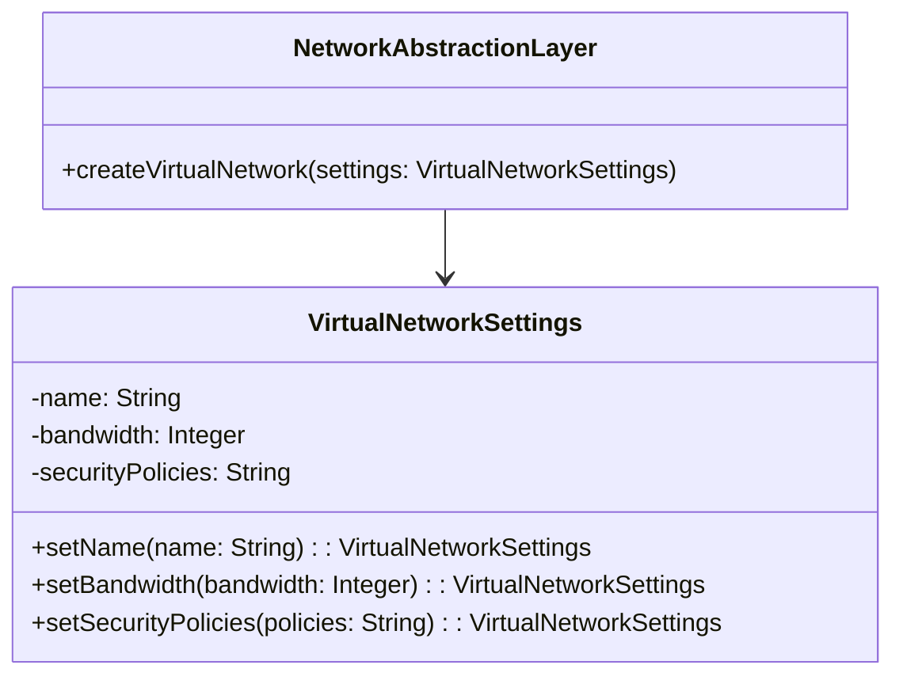
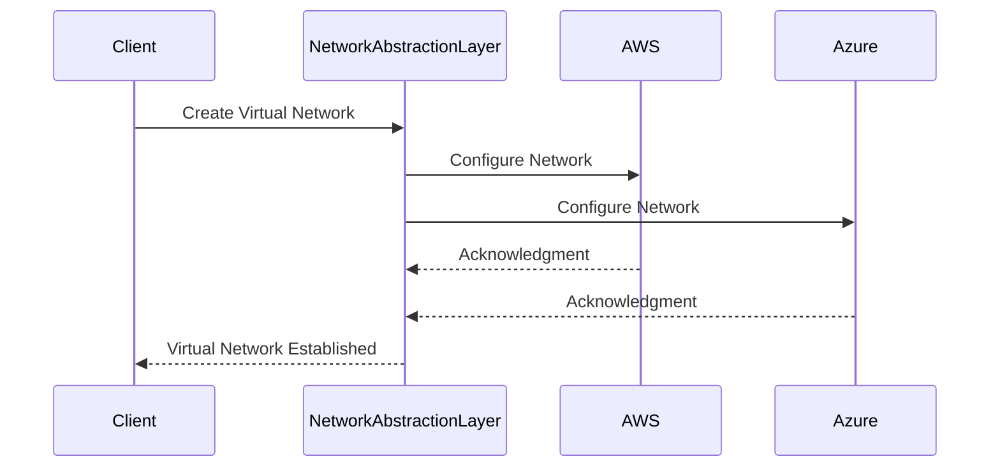

## Overview

Network Virtualization Across Clouds is a crucial design pattern for organizations leveraging hybrid or multi-cloud architectures. By abstracting the underlying complexity of different networking environments, this pattern enables seamless connectivity and consistent policy enforcement across disparate cloud platforms. This is essential for optimizing performance, enhancing security, and ensuring cohesive data management strategies.

## Design Pattern Overview

### Purpose

The primary aim of network virtualization across clouds is to abstract the underlying differences in networking capabilities between different cloud providers. This abstraction provides a unified network management layer, allowing for consistent configuration and operation across public, private, and hybrid cloud environments.

### How It Works

1. **Network Abstraction Layer**: Create a virtual network that abstracts the real network topologies of different cloud environments.
2. **Unified Network Policies**: Implement a single set of network policies that can be dynamically translated into cloud-specific configurations.
3. **Cross-Cloud Connectivity**: Establish secure, high-performance connections between different cloud environments using techniques such as VPN, Direct Connect, or SD-WAN.
4. **Centralized Management**: Utilize network management tools that allow centralized monitoring, configuration, and policy enforcement.

### Architectural Approach

To achieve network virtualization across clouds, consider adopting a layered architecture:

- **Application Layer**: Interacts with the network abstraction to leverage distributed resources seamlessly.
- **Network Abstraction Layer**: Provides logical units to manage and configure networks independent of their underlying physical reality.
- **Infrastructure Layer**: Consists of the actual networking infrastructure of each cloud service provider, managed using APIs by the Network Abstraction Layer.

### Best Practices

- **Standardization**: Use standardized protocols and practices across cloud environments to ensure interoperability.
- **Security**: Implement strong encryption and authentication mechanisms to secure data traveling across clouds.
- **Performance Monitoring**: Continuously monitor network performance to detect and mitigate bottlenecks or security threats.
- **Automation**: Automate policy enforcement and network configuration to reduce errors and improve response times.

## Example Code

Below is a simple example using a hypothetical Network Abstraction API that automates the process of creating a virtual network across AWS and Azure.

```java
// Example using a hypothetical Network Abstraction API

import com.cloud.network.abstraction.*;

public class NetworkSetup {
    public static void main(String[] args) {
        NetworkAbstractionLayer nal = new NetworkAbstractionLayer();

        // Define virtual network settings
        VirtualNetworkSettings settings = new VirtualNetworkSettings()
            .setName("CrossCloudNetwork")
            .setBandwidth(1000)
            .setSecurityPolicies("Strict");

        // Create virtual network across clouds
        nal.createVirtualNetwork(settings);

        System.out.println("Cross-Cloud Virtual Network established successfully.");
    }
}
```

## Diagrams

### Class Diagram



### Sequence Diagram



## Related Patterns

- **Cloud Network Pattern**: Focuses on establishing networks within a single cloud provider.
- **Service Mesh**: Manages service communications within and across cloud environments.
- **Hybrid Cloud Connectivity Pattern**: Provides guidelines for connecting on-premises infrastructure with cloud environments.

## Additional Resources

- [AWS Direct Connect](https://aws.amazon.com/directconnect/)
- [Azure Virtual Network](https://azure.microsoft.com/en-us/services/virtual-network/)
- [Google Cloud Interconnect](https://cloud.google.com/interconnect)
- [Multi-Cloud Architecture Resources](https://archunit.io/)
- [Best Practices for Secure Network Architecture in the Cloud](https://csrc.nist.gov/)

## Summary

Network Virtualization Across Clouds is a critical pattern for organizations seeking to maximize flexibility, performance, and security in hybrid and multi-cloud deployments. By providing an abstraction layer, it simplifies the management of complex networking environments, ensuring consistent performance and security across diverse platforms. With proper implementation of this pattern, organizations can achieve cohesive and seamless network strategies, harnessing the full potential of their cloud investments.
