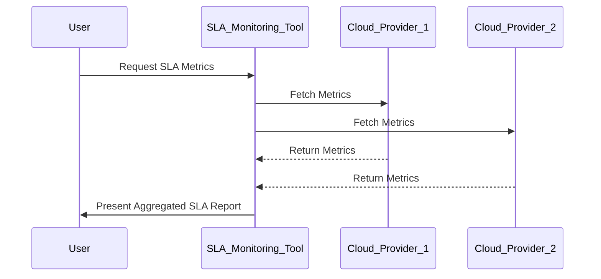

In the rapidly evolving landscape of cloud computing, organizations are increasingly leveraging multi-cloud strategies to harness the unique strengths of different cloud providers. However, this approach comes with its own set of challenges, particularly in terms of Service Level Agreement (SLA) management. SLA management in a multi-cloud environment involves monitoring, negotiating, and ensuring service levels across various cloud service providers to meet business expectations and deliver seamless user experiences.

## Detailed Explanation

### Design Pattern Overview

SLA (Service Level Agreement) Management in a multi-cloud environment is a critical architectural pattern designed to ensure effective service performance and reliability when using services from multiple cloud providers. This pattern involves:

- **Unified Monitoring**: Establishing a centralized platform or service to aggregate performance and uptime metrics from multiple cloud providers for comprehensive visibility.
- **Proactive Alerting**: Setting up robust alerting mechanisms to notify relevant stakeholders of any SLA deviation or potential service disruption.
- **Automated Compliance Verification**: Implementing automated tools to verify compliance with SLA terms and provide detailed reports for auditing purposes.
- **Policy-Driven Governance**: Defining and enforcing policies to align SLA management practices with business goals and strategic priorities.

### Architectural Approaches

1. **Centralized Monitoring System**: Utilize tools like Prometheus, Datadog, or Grafana to collect and visualize metrics across multiple cloud platforms. Ensure these tools have integration capabilities with all providers in use.

2. **Cross-Provider Data Collection**: Implement CI/CD pipelines and API-driven approaches to gather performance data using services like AWS CloudWatch, Azure Monitor, and Google Cloud's Operations Suite.

3. **Federated Monitoring and Management**: Adopt an architectural approach where each cloud is monitored independently, while results are aggregated through a federated dashboard, like using Prometheus Federation.

4. **Automated SLA Analysis**: Develop scripts or use existing SaaS solutions for real-time SLA analysis, prediction, and reporting to ensure timely corrective actions.

### Example Code

Here’s a basic example script using Python to pull metrics from AWS CloudWatch:

```python
import boto3

def get_cloudwatch_metrics():
    client = boto3.client('cloudwatch', region_name='us-west-2')
    
    response = client.get_metric_data(
        MetricDataQueries=[
            {
                'Id': 'm1',
                'MetricStat': {
                    'Metric': {
                        'Namespace': 'AWS/EC2',
                        'MetricName': 'CPUUtilization',
                        'Dimensions': [
                            {
                                'Name': 'InstanceId',
                                'Value': 'INSTANCE_ID'
                            },
                        ]
                    },
                    'Period': 300,
                    'Stat': 'Average',
                },
                'ReturnData': True,
            },
        ],
        StartTime=datetime.utcnow()-timedelta(minutes=10),
        EndTime=datetime.utcnow(),
    )
    
    return response['MetricDataResults']

cpu_metrics = get_cloudwatch_metrics()
print(cpu_metrics)
```

### Diagrams



### Related Patterns

- **Distributed Monitoring**: Involves setting up isolated monitoring for each provider, beneficial for compliance and redundancy.
- **Hybrid Cloud Management**: For organizations using a combination of on-premises and cloud services, extending SLA management to internal services.

### Additional Resources

- [AWS CloudWatch Documentation](https://docs.aws.amazon.com/AmazonCloudWatch/latest/monitoring/WhatIsCloudWatch.html)
- [Azure Monitor Overview](https://docs.microsoft.com/en-us/azure/azure-monitor/overview)
- [Google Cloud Operations Suite](https://cloud.google.com/products/operations)

## Summary

As organizations increasingly adopt multi-cloud strategies, SLA Management becomes a cornerstone for ensuring consistent service quality and compliance across diverse cloud platforms. By leveraging advanced monitoring tools, automated analysis, and strategic governance policies, businesses can effectively navigate the complexities of multi-cloud environments while maintaining their focus on delivering superior services to customers.
