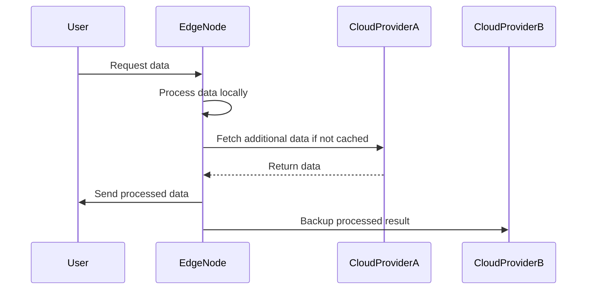

## Introduction to Latency Optimization Strategies

As cloud computing evolves, businesses increasingly rely on hybrid and multi-cloud architectures to leverage diverse services from different providers. However, with this architectural choice comes the challenge of maintaining low-latency communication across geographically distributed cloud services. Latency, the time delay in data communication, can be detrimental to application performance and user experience. This article delves into strategies for optimizing latency in cross-cloud communication, paving the way for seamless cloud interactions.

## Detailed Explanation

### Architectural Approaches

1. **Data Locality Optimization**:
   - Minimize data transfer distances by strategically placing data near consumption points.
   - Use geographical selection features provided by cloud providers for data storage.

2. **Edge Computing Utilization**:
   - Process data at the edge of the network to reduce round-trip time.
   - Deploy edge nodes close to user locations, thereby minimizing latency.

3. **Load Balancing and Routing**:
   - Implement intelligent load balancing to dynamically redirect traffic based on latency considerations.
   - Use Anycast routing to connect users to the nearest data center.

4. **Caching Strategies**:
   - Layer caching mechanisms at various network levels (e.g., CDN, application-level caches).
   - Employ cache invalidation techniques to ensure data consistency.

### Best Practices

- **Consistent Monitoring and Diagnostics**: Utilize monitoring tools to identify performance bottlenecks and adjust architecture accordingly.
- **Protocol Optimization**: Opt for protocols like QUIC or HTTP/3 that are designed for reduced latency.
- **Connection Management**: Keep connections alive and persistent to avoid the latency cost of establishing new connections repeatedly.

### Example Code

Incorporating caching with Redis for reduced latency in a multi-cloud setup:

```java
// Example using Jedis client for Redis
import redis.clients.jedis.Jedis;

public class RedisCacheExample {
    public static void main(String[] args) {
        // Connect to Redis server hosted in closer cloud region
        Jedis jedis = new Jedis("redis-server-region-close.cloudprovider.com");
        
        // Set a key-value pair with expiration time to ensure cache remains fresh
        jedis.setex("user:1001", 3600, "UserData");

        // Fetching cached data
        String userData = jedis.get("user:1001");
        System.out.println("Cached User Data: " + userData);
    }
}
```

## Diagrams

### Sequence Diagram



## Related Patterns

- **Geo-Distributed Deployment**: This pattern involves deploying replicas of services across different geographical locations to reduce latency.
- **Circuit Breaker**: Protects cross-cloud communication integrity by gracefully handling network failures and latency spikes.

## Additional Resources

- [Google Cloud Interconnect](https://cloud.google.com/interconnect/docs/concepts/overview)
- [AWS Global Accelerator](https://aws.amazon.com/global-accelerator/)
- [Best Practices for Cloud Network Performance Optimization](https://www.cloudperformancepartner.com/best-practices/)

## Summary

Efficient latency optimization is critical for applications leveraging hybrid and multi-cloud environments. By strategically employing data locality optimization, edge computing, and caching, businesses can deliver high-performance applications with minimal latency. These strategies, coupled with monitoring and intelligent routing, create a robust framework for seamless, low-latency cross-cloud communication. Implementing these approaches not only enhances performance but also improves overall user satisfaction in distributed cloud ecosystems.
