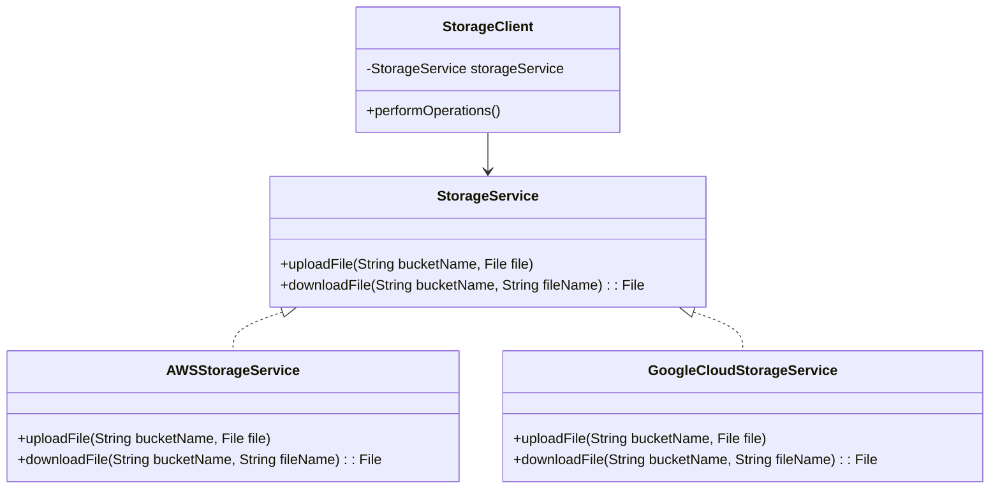

## Introduction to Abstracted Service Layers

In the realm of hybrid and multi-cloud strategies, the need for flexibility and interoperability across different cloud platforms is paramount. **Abstracted Service Layers** serve as a pivotal design pattern that facilitates this need by creating an abstraction layer that encapsulates provider-specific service implementations, offering a unified interface to consumers. This pattern not only simplifies service integration across diverse cloud environments but also promotes portability and reduces vendor lock-in.

## Core Concepts

1. **Abstraction Layer**: At the heart of this pattern is the abstraction layer that abstracts interactions with various cloud providers. This layer translates cloud-specific services into a common interface that can be consumed consistently across different platforms.

2. **Service Encapsulation**: Provider-specific services (e.g., AWS S3, Google Cloud Storage) are encapsulated within the abstraction layer, allowing consumers to interact with the layer rather than directly with individual services. This encapsulation helps in abstracting the complexities and variations in service implementations.

3. **Interoperability and Portability**: By providing a uniform interface, Abstracted Service Layers enhance the interoperability of applications across cloud platforms and enable seamless portability from one environment to another.

4. **Vendor Neutrality**: This pattern reduces dependency on a single cloud provider, mitigating the risks associated with vendor lock-in and fostering a more competitive and flexible cloud strategy.

## Best Practices

- **Use Standardized APIs**: Design the abstraction layer using standardized APIs to ensure compatibility and ease of integration across multiple cloud services.
  
- **Focus on Core Features**: Abstract common features and capabilities that are prevalent across cloud providers, minimizing the complexity of supporting disparate services.

- **Modular Design**: Implement the abstraction layer in a modular fashion to facilitate easier updates and maintenance.

- **Continuous Testing**: Regularly test the abstraction layer against provider-specific changes and updates to ensure ongoing compatibility and performance.

## Example Code: Abstracted Service Layer Implementation

```java
// Abstracted Storage Interface
public interface StorageService {
    void uploadFile(String bucketName, File file);
    File downloadFile(String bucketName, String fileName);
}

// AWS Storage Service Implementation
public class AWSStorageService implements StorageService {
    @Override
    public void uploadFile(String bucketName, File file) {
        // AWS-specific logic for file upload
    }

    @Override
    public File downloadFile(String bucketName, String fileName) {
        // AWS-specific logic for file download
        return null;
    }
}

// Google Cloud Storage Service Implementation
public class GoogleCloudStorageService implements StorageService {
    @Override
    public void uploadFile(String bucketName, File file) {
        // Google Cloud-specific logic for file upload
    }

    @Override
    public File downloadFile(String bucketName, String fileName) {
        // Google Cloud-specific logic for file download
        return null;
    }
}

// Usage
public class StorageClient {
    private StorageService storageService;

    public StorageClient(StorageService storageService) {
        this.storageService = storageService;
    }

    public void performOperations() {
        storageService.uploadFile("example-bucket", new File("document.pdf"));
        storageService.downloadFile("example-bucket", "document.pdf");
    }
}
```

## Architecture Diagram



## Related Patterns

- **Service Façade Pattern**: Similar in abstracting complexities but focuses on providing a simplified interface to a set of interfaces in a larger body of code.

- **Adapter Pattern**: Used to match different interfaces by acting as a bridge between compatible interfaces, useful when integrating with various third-party APIs.

- **Proxy Pattern**: Provides a representative that controls access to another object, useful for adding an abstraction layer with additional functionality like monitoring or caching.

## Additional Resources

- [AWS Multi-Cloud Strategies](https://aws.amazon.com/solutions/implementations/multi-cloud-strategies/)
- [Google Cloud Hybrid and Multi-Cloud Solutions](https://cloud.google.com/hybrid-multicloud)
- [Architecting Multi-Cloud Systems with Azure](https://learn.microsoft.com/en-us/azure/architecture/example-scenario/apps/multi-cloud)

## Summary

The **Abstracted Service Layers** design pattern is a strategic approach to building cloud-agnostic applications that leverage the strengths of multiple cloud platforms while minimizing dependencies on any single provider. By introducing a layer of abstraction, developers can enhance interoperability, ensure portability, and maintain flexibility in an ever-evolving cloud landscape. The use of standardized APIs and modular design principles ensures that applications remain resilient to changes in provider-specific services, making this pattern a cornerstone of effective hybrid and multi-cloud strategies.
