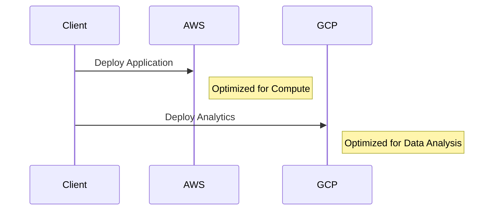
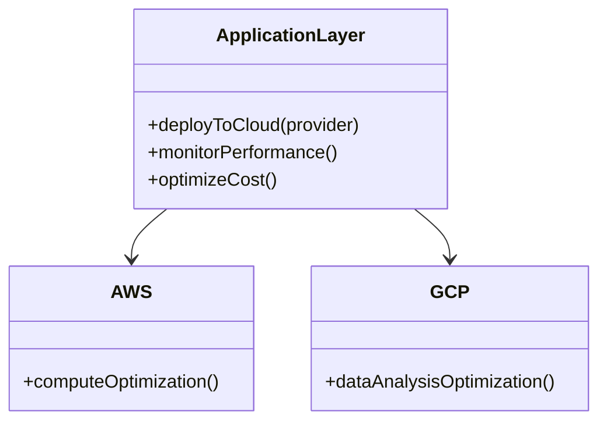

## Introduction to Cloud-Specific Optimization

As organizations increasingly adopt hybrid and multi-cloud strategies, it's crucial to optimize applications for the specific capabilities and services each cloud provider offers. Cloud-Specific Optimization involves tailoring applications to maximize the performance, cost-efficiency, and resilience by exploiting unique cloud features and services.

## Architectural Approaches

### 1. Understanding Provider Distinctiveness

To leverage cloud-specific advantages, it's essential to understand the distinctive offerings of the major cloud providers (AWS, GCP, Azure, etc.). This includes proprietary services, performance options, pricing models, and geographical data centers.

### 2. Designing Modular Architectures

Design applications with modular architectures to allow components to run in environments where they perform best or are most cost-effective. Microservices and containerization are key enablers in achieving modularity and flexibility in cloud-specific optimization.

### 3. Implementing Abstraction Layers

Utilize abstraction layers to manage interactions with cloud services, allowing for flexibility in switching providers or services with minimal disruption. Tools like HashiCorp’s Terraform or Crossplane facilitate this abstraction by managing infrastructure as code across multiple cloud platforms.

## Best Practices

- **Evaluate Performance and Cost**: Regularly assess the performance and cost metrics of cloud services to identify optimization opportunities.
- **Utilize Provider Tools**: Employ provider-specific tools for optimization, such as AWS Cost Explorer, Google Cloud's Operations Suite, or Azure’s Cost Management and Billing tool.
- **Monitor and Automate**: Implement monitoring tools and automation to continually optimize resource allocation and scaling based on usage patterns.

## Example Code

Here's an example of using Terraform to define an infrastructure that can be optimized across multiple cloud providers:

```hcl
provider "aws" {
  region = "us-west-2"
}

provider "google" {
  project = "my-gcp-project"
  region  = "us-central1"
}

resource "aws_instance" "web" {
  ami           = "ami-0c55b159cbfafe1f0"
  instance_type = "t2.micro"
}

resource "google_compute_instance" "vm_instance" {
  name         = "test-instance"
  machine_type = "f1-micro"
  zone         = "us-central1-a"
}
```

In the above Terraform script, both AWS and Google Cloud resources are defined, allowing you to optimize deployments based on real-time requirements or environmental advantages.

## Diagrams

### UML Sequence Diagram



### UML Class Diagram



## Related Patterns

- **Cloud Bursting**: Automatically extending computational workloads to public cloud resources during peak demand.
- **Service Mesh**: Managing microservices and improving their resilience and security across different cloud environments.

## Additional Resources

- [Multi-Cloud Strategy for Enterprises by Gartner](https://www.gartner.com/)
- [AWS Well-Architected Framework](https://aws.amazon.com/architecture/well-architected/)
- [Google Cloud Architecture Framework](https://cloud.google.com/architecture/framework)
- [Azure Well-Architected Framework](https://docs.microsoft.com/en-us/azure/architecture/framework/)

## Summary

Cloud-Specific Optimization is a strategic pattern that empowers organizations to capitalize on the unique strengths of various cloud providers. By designing modular architectures and utilizing provider-specific services while maintaining flexibility and cost-efficiency, businesses can enhance application performance and resilience in hybrid and multi-cloud environments.
