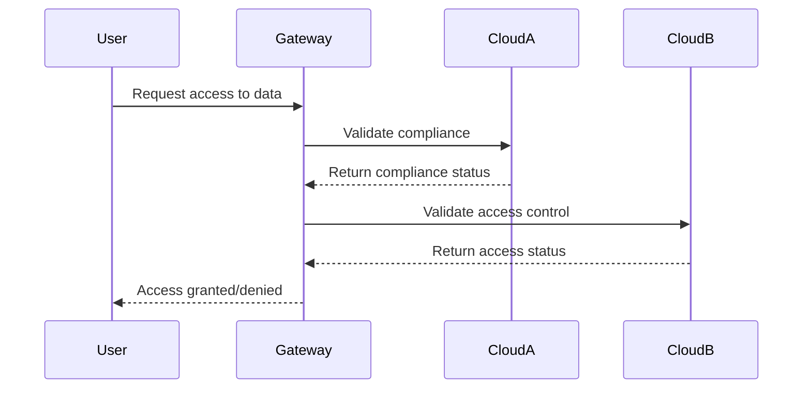

As organizations increasingly adopt multi-cloud strategies, ensuring effective data governance becomes a critical challenge. Multi-cloud environments involve operating across more than one cloud service provider, potentially leading to diverse data management policies, security practices, and compliance requirements. This article explores the design pattern of data governance in multi-cloud, offering strategies and practices to manage data seamlessly across different cloud platforms.

## Architectural Approaches

### Centralized vs. Decentralized Governance

- **Centralized Governance**: In a centralized approach, data governance policies are managed from a single point of control. This ensures uniformity and simplifies compliance management but might lead to bottlenecks and reduced flexibility.
- **Decentralized Governance**: Allows for policy management at various levels or regions, increasing flexibility but potentially creating inconsistencies. A hybrid model, combining both approaches, often provides the desired balance.

## Key Considerations

- **Data Cataloging and Classification**: Categorizing data according to its type, sensitivity, and compliance requirements can streamline policy application and auditing processes.
- **Identity and Access Management (IAM)**: Establish robust IAM policies to ensure only authorized users have access to data, thereby enhancing security across cloud environments.
- **Data Lineage and Auditing**: Tracking data movements and transformations across clouds is crucial for compliance and troubleshooting.

## Best Practices

1. **Unified Data Policy Framework**: Create a comprehensive framework that spans multiple clouds to maintain consistent data policies.
2. **Automation and CI/CD for Data Policies**: Employ automation tools to enforce data governance policies across development pipelines, ensuring adherence consistently.
3. **Cross-Cloud Data Encryption**: Ensure data is encrypted both at rest and in transit across clouds to maintain security and compliance.
4. **Cloud-Agnostic Monitoring Solutions**: Implement monitoring solutions that provide visibility across all cloud environments to detect and respond to potential policy violations promptly.

## Example Code

Here's a simple Java snippet demonstrating how automated policy checks can be integrated into a cloud application pipeline:

```java
public class DataPolicyEnforcer {
    public static void enforcePolicy(DataObject data) throws PolicyViolationException {
        if (!data.isEncrypted()) {
            throw new PolicyViolationException("Data is not encrypted!");
        }
        if (!hasValidAccessControl(data)) {
            throw new PolicyViolationException("Invalid access control detected!");
        }
    }

    private static boolean hasValidAccessControl(DataObject data) {
        // Implement access control validation logic
        return data.getAccessControlList().isCompliant();
    }
}
```

## Diagrams

Below is UML Sequence diagram illustrating data governance enforcement across multiple clouds:



## Related Patterns

- **Data Residency Pattern**: Deals with ensuring data stays within specified national or legal boundaries.
- **Service Level Agreement (SLA) Management**: Manages expectations and guarantees concerning cloud services' performance.

## Additional Resources

- *The Art of Data Usability: Centralizing Data Governance for Global Operations* - A comprehensive guide to mastering data governance in multi-cloud.
- *Data Management in Cloud Computing* by ABC Publishers - Details best practices in managing data life cycles across cloud platforms.

## Summary

Data governance in a multi-cloud environment presents unique challenges that require strategic approaches to policy implementation, identity management, and data monitoring. By employing a centralized framework with elements of automation and robust security practices, organizations can maintain data integrity, meet compliance requirements, and ensure efficient data operations across diverse cloud platforms.
