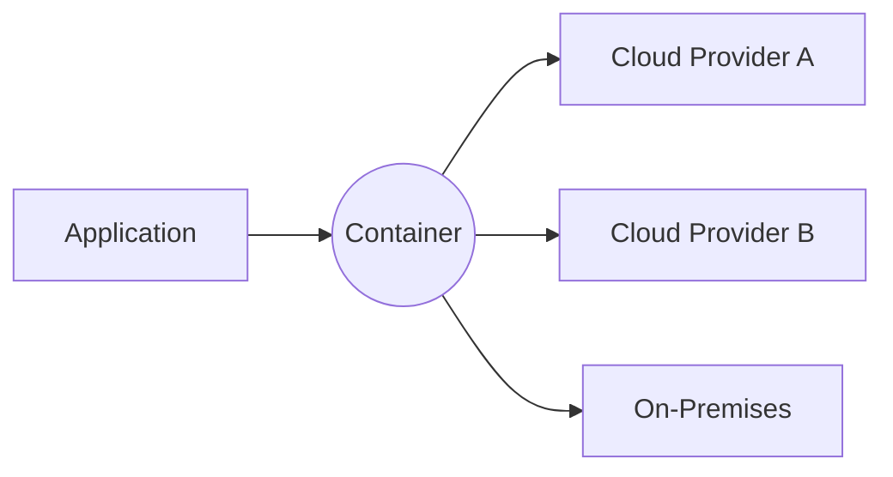

## Introduction

Exit strategies and portability in cloud computing are critical considerations for organizations looking to mitigate the risks associated with vendor lock-in. This pattern focuses on the best practices and methodologies to ensure that an organization's cloud infrastructure and applications remain flexible and portable. By carefully planning an exit or migration strategy from a cloud provider, organizations can secure their assets, data, and continuity of operations.

## Design Pattern Overview

The Exit Strategies and Portability design pattern involves the formulation of methods and techniques that facilitate the migration of workloads between cloud providers or back to on-premises data centers without significant disruption or loss of data. This flexibility is essential for organizations to avoid dependency on a single provider, ensuring competitive pricing, regulatory compliance, and resilience.

### Context

Organizations often face challenges when they need to switch cloud providers or migrate back to on-premises infrastructure. The proprietary nature of some cloud services can lead to vendor lock-in, making it difficult and costly to move assets elsewhere.

### Problem

Vendor lock-in can occur due to:
- Proprietary technologies or APIs.
- Data egress fees.
- Integrated services that complicate decoupling.
- Contracts with restrictive terms.

Failure to plan exit strategies can result in increased costs, technical debt, and lower flexibility to adopt innovative services or comply with regulatory changes.

### Solutions

1. **Adopt Open Standards**: Leverage open standards and technologies, such as Kubernetes, which are widely supported by multiple cloud vendors, to minimize dependence on proprietary services.

2. **Abstract Cloud Services**: Implement abstraction layers using platforms like Terraform or Ansible to decouple applications from the underlying cloud infrastructure.

3. **Data Portability**: Regularly export and backup data in interoperable formats to facilitate smoother transitions.

4. **Containerization and Microservices**: Use containerization technologies to package applications into self-contained units that can run consistently across various environments.

5. **Multi-Cloud and Hybrid Strategies**: Distribute workloads across multiple cloud providers or maintain a hybrid infrastructure to prevent reliance on a single provider.

6. **Contractual Clauses**: Negotiate exit-friendly terms in contracts, stipulating data transfer requirements and financial considerations.

### Best Practices

- Regularly audit and document your cloud architecture and resources.
- Develop runbooks or guides for cloud infrastructure re-creation in alternative environments.
- Automate deployments to ensure consistent environments across platforms.
- Continuously evaluate and adjust strategies based on changing technology landscapes or business requirements.

## Example Code

Below is a simplified example using Terraform to create resources that can be easily migrated between AWS and Azure:

```hcl
provider "aws" {
  region = "us-west-2"
}

provider "azurerm" {
  features = {}
}

resource "aws_s3_bucket" "example" {
  bucket = "my-migratable-bucket"
}

resource "azurerm_storage_account" "example" {
  name                     = "mystorageaccount"
  resource_group_name      = "myresourcegroup"
  location                 = "West US"
  account_tier             = "Standard"
  account_replication_type = "LRS"
}
```

## Diagrams

Here is a diagram illustrating how containerization can aid portability:



## Related Patterns

- **Multi-Cloud Architecture**: This pattern focuses on the strategic use of multiple cloud providers to enhance reliability and flexibility.
- **Hybrid Cloud Architecture**: Combines private and public cloud infrastructures for strategic benefits, allowing workload migration and data security.

## Additional Resources

- [Cloud Portability Best Practices](https://cloudproviderbestpractices.com)
- [Open Standards in Cloud Computing](https://openstandards.cloud)
- [Guide to Cloud Exit Strategies](https://cloudexitstrategies.com)

## Summary

Exit Strategies and Portability are essential considerations for organizations aiming to maintain flexibility, reduce costs, and safeguard against vendor lock-in. By adopting this design pattern, businesses can better manage dependencies, optimize their cloud strategy, and ensure seamless transitions between different cloud environments or on-premises infrastructure.
