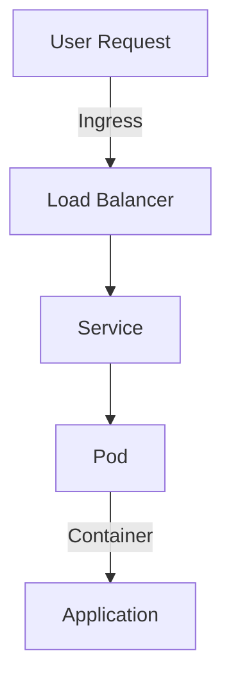

## Introduction

In the evolving landscape of cloud computing, organizations strive for flexibility and independence from single-vendor constraints. The **Vendor-Agnostic Container Orchestration** pattern provides an architectural approach to achieving this flexibility. By leveraging Kubernetes, the ubiquitous container orchestration platform, businesses can seamlessly manage and deploy their applications across various cloud platforms without becoming dependent on a single provider.

## Architectural Approach

The primary architectural approach behind Vendor-Agnostic Container Orchestration is the use of Kubernetes as the central component for managing containerized applications. This approach exploits Kubernetes' capabilities to abstract the underlying infrastructure, enabling applications to operate consistently regardless of the cloud environments they are running on. 

### Core Components
- **Kubernetes Cluster**: A robust and extensible open-source platform designed for automated deployment, scaling, and managing containerized applications.
- **Node & Pods**: Nodes are the worker machines in the Kubernetes architecture, while Pods are the smallest deployable units that can contain one or more containers.
- **Namespaces & Deployments**: Organizational units within Kubernetes that allow for efficient resource allocation and management; Deployments manage Pod creation and scaling.
- **Ingress Controllers and Load Balancers**: Facilitate routing and balancing traffic coming into the cluster.

### Key Considerations

- **Interoperability**: Design your services to be independent of proprietary cloud features. Stick to open standards and practices to ensure that your solution remains adaptable across platforms.
- **Federation**: Use Kubernetes federation to manage multiple clusters across different cloud providers effectively.
- **Consistency**: Develop unified CI/CD pipelines that can deploy workloads across different clouds using consistent configurations.

## Example Code

Here's a simple example of a multi-cloud compatible Kubernetes deployment YAML file:

```yaml
apiVersion: apps/v1
kind: Deployment
metadata:
  name: my-app
spec:
  replicas: 3
  selector:
    matchLabels:
      app: my-app
  template:
    metadata:
      labels:
        app: my-app
    spec:
      containers:
      - name: my-app-container
        image: my-app-image:v1
        ports:
        - containerPort: 8080
---
apiVersion: v1
kind: Service
metadata:
  name: my-app-service
spec:
  type: LoadBalancer
  ports:
  - port: 80
    targetPort: 8080
  selector:
    app: my-app
```

## Diagrams



## Best Practices

- **Security**: Implement role-based access control (RBAC) and encrypt sensitive data.
- **Monitoring**: Use tools like Prometheus and Grafana to monitor applications. Integrate logging and alerting for proactive management.
- **Scaling**: Leverage Kubernetes autoscaling capabilities to handle varying loads efficiently. Configure horizontal and vertical scaling according to application needs.
- **Network Configuration**: Optimize network settings to reduce latency and enhance data throughput.

## Related Patterns

- **Service Mesh Architecture**: Facilitates decentralized load balancing, encryption, and observability via service proxies.
- **Immutable Infrastructure**: Ensures that the infrastructure deployed is indelible and must be replaced rather than changed directly.
- **Edge Computing Patterns**: Distributes computing workloads closer to the data source for faster insights and better data sovereignty.

## Additional Resources

- [Kubernetes Documentation](https://kubernetes.io/docs/)
- [Cloud Native Computing Foundation (CNCF)](https://www.cncf.io/)
- [Kubernetes at Scale](https://kubernetes.io/docs/setup/production-environment/cluster-large/)

## Summary

The **Vendor-Agnostic Container Orchestration** pattern is a powerful strategy for maintaining flexibility and control over your cloud operations. By deploying applications on Kubernetes clusters across multiple cloud providers, organizations can reduce dependency on any single vendor while capitalizing on the varied strengths of different platforms. Dette pattern fosters a resilient, adaptable, and efficient infrastructure tailored for modern business needs in a dynamically changing technological landscape.
