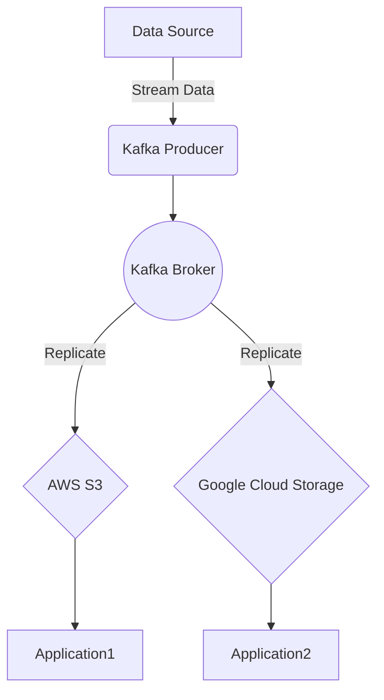

## Introduction

In today's multi-cloud environments, ensuring data availability and redundancy is critical for building resilient applications. This design pattern, **Data Replication Across Clouds**, addresses the challenges and opportunities of replicating data across different cloud providers to minimize downtime, prevent data loss, and enhance disaster recovery capabilities.

## Design Pattern Explanation

### Problem Statement
Organizations leverage multiple cloud providers to avoid vendor lock-in, optimize costs, and ensure high availability. However, replicating data across these providers presents challenges such as latency, consistency, data sovereignty, and maintaining redundancy.

### Solution
Data Replication Across Clouds involves setting up processes to synchronize data across cloud platforms to ensure that identical datasets exist in multiple locations. This synchronization can be achieved through various replication strategies:

1. **Active-Active Replication**: Data is actively written and read from multiple cloud providers, ensuring real-time consistency and availability.
2. **Active-Passive Replication**: Data is primarily written to one cloud (active) and asynchronously replicated to another (passive) for backup.
3. **Hybrid Approach**: Combines active-active and active-passive methods based on data types and application needs.

### Architectural Approaches

1. **Cross-Region Replication**: Use built-in services provided by cloud vendors to replicate data across different geographical regions. E.g., AWS Cross-Region Replication, Azure Geo-Replication.

2. **Third-Party Tools**: Utilize tools such as Apache Kafka, Confluent, or Datastax for real-time data streaming and replication across cloud environments.

3. **Custom Solutions**: Implement bespoke solutions using cloud-native services (e.g., AWS Lambda, Azure Functions) to control and orchestrate the replication processes.

### Best Practices

- **Consistency**: Choose between eventual and strong consistency models based on the application requirements.
- **Latency Optimization**: Minimize latency by selecting geographically aligned cloud regions.
- **Security and Compliance**: Encrypt data in transit and at rest, and ensure compliance with regional data laws.
- **Monitoring and Alerting**: Implement robust monitoring and error alerting to quickly identify and resolve replication issues.

## Example Code

Here is a simplified example using a Pub/Sub model for replicating data across AWS and GCP using Kafka:

```java
import org.apache.kafka.clients.producer.KafkaProducer;
import org.apache.kafka.clients.producer.ProducerRecord;

import java.util.Properties;

public class CrossCloudReplication {
    private static final String TOPIC = "cloud-replication-topic";

    public static void main(String[] args) {
        Properties props = new Properties();
        props.put("bootstrap.servers", "broker1:9092,broker2:9092");
        props.put("key.serializer", "org.apache.kafka.common.serialization.StringSerializer");
        props.put("value.serializer", "org.apache.kafka.common.serialization.StringSerializer");

        KafkaProducer<String, String> producer = new KafkaProducer<>(props);

        String key = "recordKey";
        String value = "Data to replicate";
        
        ProducerRecord<String, String> record = new ProducerRecord<>(TOPIC, key, value);
        producer.send(record);
        
        producer.close();
    }
}
```

## Diagrams

### Data Replication Architecture using Mermaid UML



## Related Patterns

- **Data Partitioning**: Distributes different pieces of data across multiple locations for scalability.
- **Backup and Restore**: Ensures that full backups of the data can be restored when needed.
- **Disaster Recovery**: Strategies for maintaining the continuity of IT services during a disaster.

## Additional Resources

- [AWS Multi-Region Application Architecture](https://aws.amazon.com/architecture/multiregion/)
- [Google Cloud Documentation on Replication](https://cloud.google.com/storage/docs/replication)
- [Confluent Cross-Cloud Replication Guide](https://www.confluent.io/whitepaper/cross-cloud-replication/)

## Summary

Data Replication Across Clouds is an essential pattern for organizations aiming to safeguard their data against outages and achieve high availability in a multi-cloud setup. By strategically employing replication techniques, businesses can benefit from increased redundancy, optimized performance, and improved disaster recovery capabilities. However, it is crucial to carefully evaluate consistency requirements, latency implications, and regional compliance to fully leverage the advantages of this pattern.
