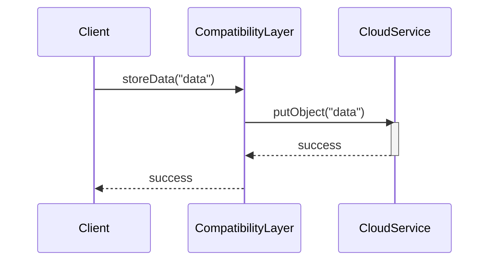

## Introduction

In hybrid and multi-cloud environments, applications often need to interact with services across different cloud platforms. However, discrepancies in API implementations and versions can lead to integration issues. The **API Compatibility Layers** design pattern addresses these challenges by providing a consistent interface that abstracts underlying platform differences. This pattern ensures applications can seamlessly communicate across diverse ecosystems without code alteration.

## Detailed Explanation

### Architectural Approach

The primary function of an API Compatibility Layer is to translate the interface calls made by an application into ones that are understood by the underlying cloud services. This layer intercepts API requests from applications and adapts them to match the specific requirements of the target cloud services, handling things such as:

- **Interface Adaptation**: Adjusting API calls to conform to the expected formats and protocols of different platforms.
- **Version Management**: Maintaining compatibility with various API versions across platforms.
- **Feature Parity**: Implementing missing features in one platform by mapping them to equivalent functionalities on another platform.
- **Security**: Ensuring that all API interactions adhere to security policies and access controls of the underlying cloud platform.

### Example Code

Below is an example demonstrating a simple implementation of an API Compatibility Layer in Java using a facade design pattern to encapsulate the complexities of different cloud APIs.

```java
public interface CloudAPI {
    void storeData(String data);
    String fetchData(String key);
}

public class AzureAdapter implements CloudAPI {
    private AzureService azureService;

    public AzureAdapter(AzureService azureService) {
        this.azureService = azureService;
    }

    @Override
    public void storeData(String data) {
        azureService.uploadBlob(data);
    }

    @Override
    public String fetchData(String key) {
        return azureService.downloadBlob(key);
    }
}

public class AWSAdapter implements CloudAPI {
    private AWSService awsService;

    public AWSAdapter(AWSService awsService) {
        this.awsService = awsService;
    }

    @Override
    public void storeData(String data) {
        awsService.putObject(data);
    }

    @Override
    public String fetchData(String key) {
        return awsService.getObject(key);
    }
}

public class CloudServiceClient {
    private CloudAPI cloudAPI;

    public CloudServiceClient(CloudAPI cloudAPI) {
        this.cloudAPI = cloudAPI;
    }

    public void performDataOperations() {
        cloudAPI.storeData("Sample Data");
        String data = cloudAPI.fetchData("SampleKey");
        System.out.println(data);
    }
}
```

### Diagram

Here's Sequence Diagram illustrating the interaction between a client application and cloud services through an API Compatibility Layer.



## Best Practices

- **Interface Consistency**: Design the compatibility layer interfaces to be consistent and intuitive for developers.
- **Performance Optimization**: Minimize overhead by optimizing the compatibility layer’s processing logic.
- **Extensible Framework**: Ensure the framework is extensible to easily support additional platforms and new API features.
- **Robust Error Handling**: Implement comprehensive error handling to gracefully manage failure scenarios across platforms.

## Related Patterns

- **Service Mesh**: Provides networking functionalities through proxies, enabling better management of service-to-service interactions, which complements the API Compatibility Layer.
- **Adapter Pattern**: A fundamental design pattern used to implement API Compatibility Layers by allowing incompatible interfaces to work together.

## Additional Resources

- [Cloud Native Development Patterns and Best Practices](https://www.oreilly.com/library/view/cloud-native-development/9781492076748/)
- [Multi-Cloud Management: A Framework for Success](https://www.gartner.com/smarterwithgartner/multi-cloud-strategy-a-framework-for-success)
- [Azure Architecture Center](https://docs.microsoft.com/en-us/azure/architecture/)

## Summary

API Compatibility Layers play a crucial role in ensuring seamless application interoperability across different cloud environments by standardizing API interactions. By abstracting differences between cloud service providers, they enable enterprises to leverage the best services from multiple vendors in hybrid and multi-cloud strategies. Implementing this design pattern can reduce integration complexity, improve development productivity, and increase application resilience to API changes.
