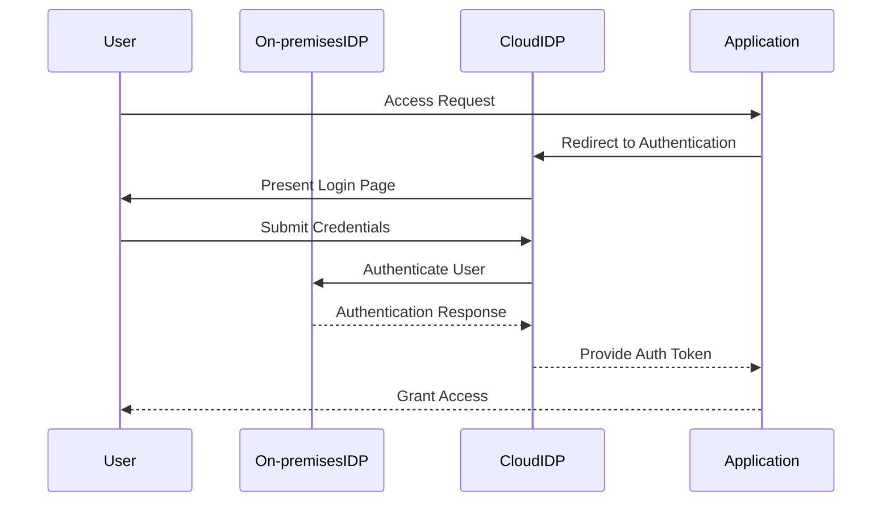

## Introduction

Hybrid Identity Management is a design pattern that seamlessly integrates on-premises identity management systems with cloud-based identity services. This pattern ensures a consistent, secure, and efficient authentication and authorization experience across both on-premises and cloud environments, which is critical in today's hybrid and multi-cloud strategies.

## Detailed Explanation

### Objectives

- **Seamless Integration**: Provide a unified approach to manage user identities across on-premises and cloud platforms.
- **Enhanced Security**: Leverage robust security mechanisms to protect user identities and access credentials.
- **Efficiency**: Optimize user and system interactions through streamlined authentication and authorization processes.

### Architectural Approaches

1. **Federated Identity Management**: Utilize protocols like SAML, OAuth, and OpenID Connect to federate identity between on-premises and cloud systems.
  
2. **Directory Synchronization**: Employ tools like Azure AD Connect to synchronize identity information from an on-premises Active Directory to a cloud-based directory service.
   
3. **Single Sign-On (SSO)**: Implement SSO solutions to allow users to access different applications and services with a single set of credentials.

4. **Role-based Access Control (RBAC)**: Define and enforce access policies based on user roles across hybrid environments.

## Best Practices

- **Consistent Policy Enforcement**: Ensure that security policies are consistently enforced across all platforms.
- **Regular Synchronization**: Schedule regular synchronization of identity data to maintain up-to-date user information.
- **Monitor and Audit**: Implement monitoring and logging to track access and changes in user identity data.
- **Zero Trust Model**: Follow a zero trust approach where user identities are verified continuously.

## Example Code

Below is a simplified example demonstrating how to set up a federated SSO using OAuth2 in a Spring Boot application:

```java
@EnableWebSecurity
public class SecurityConfig extends WebSecurityConfigurerAdapter {

    @Override
    protected void configure(HttpSecurity http) throws Exception {
        http
            .oauth2Login()
            .loginPage("/oauth2/authorization/login-client")
            .defaultSuccessURL("/home", true);
    }
}
```

## Diagrams

### UML Sequence Diagram for Federated Identity Authentication



## Related Patterns

- **Identity Federation**: Enables identity credentials exchange across different security domains.
- **Single Sign-On**: Allows users to authenticate once and gain access to multiple systems.
- **Passwordless Authentication**: Enforces authentication without the use of passwords for increased security.

## Additional Resources

- [Azure Active Directory](https://azure.microsoft.com/en-us/services/active-directory/)
- [AWS Identity and Access Management (IAM)](https://aws.amazon.com/iam/)
- [Google Cloud Identity](https://cloud.google.com/identity)

## Summary

Hybrid Identity Management is crucial for organizations leveraging both on-premises and cloud resources. By integrating identity services across environments, organizations can ensure secure and efficient user access while maintaining compliance and minimizing complexity. Through appropriate tools and best practices, businesses can manage identities effectively, safeguarding their systems from unauthorized access and potential breaches.
