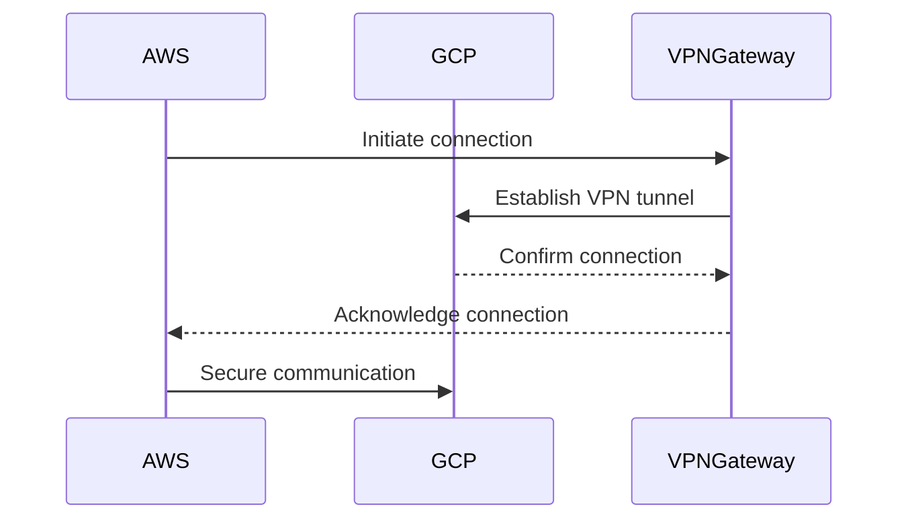

## Introduction

The **Cross-Cloud Networking Solutions** pattern addresses the growing need for secure, reliable, and efficient connectivity between different cloud service providers. This pattern is critical for enterprises that have adopted a hybrid or multi-cloud strategy to harness the unique benefits of several cloud environments.

## Design Pattern Overview

Cross-cloud networking solutions facilitate seamless communication and data exchange between isolated cloud networks, ensuring robust security measures and compliance with organizational policies. As multi-cloud strategies become increasingly prevalent, this pattern plays a crucial role in reducing data latency, enhancing service availability, and improving overall application performance across platforms.

## Architectural Approaches

1. **Virtual Private Network (VPN)**: A VPN can be established between different cloud environments to securely route network traffic. This approach allows for encrypted communications and can be configured relatively quickly.

2. **Software-Defined Networking (SDN)**: Implementing SDN enables programmatic control over the network to efficiently manage data flow between cloud providers. This can simplify network management and improve adaptability to changing workloads.

3. **Inter-Cloud Connect**: Direct inter-cloud connections enable private, high-speed communications between providers, often bypassing the public internet for enhanced security and performance.

4. **Cloud Hub-and-Spoke Model**: Establish a centralized cloud hub where spokes connect each cloud provider. This model allows for unified network policies and simplified controls.

## Best Practices

- **Unified Security Policies**: Implement consistent security policies across all cloud platforms to mitigate vulnerabilities.
- **Redundant Connections**: Ensure redundancy in network connections to prevent single points of failure.
- **Performance Monitoring**: Continuously monitor network performance to promptly address latency or bottleneck issues.
- **Compliance Management**: Regularly review compliance requirements relevant to data traffic across borders or regions.
- **Dynamic Scaling**: Leverage dynamic scaling capabilities to adjust resources based on network demand.

## Example Code Snippet

Below is a simplified example of automating the setup of a VPN connection between two cloud providers using Terraform, showcasing infrastructure as code (IaC) principles:

```hcl
provider "aws" {
  region = "us-west-1"
}

provider "google" {
  region = "us-central1"
}

resource "aws_vpn_gateway" "example" {
  ...
}

resource "google_compute_vpn_gateway" "example" {
  ...
}

resource "aws_vpn_connection" "example" {
  ...
}

resource "google_compute_vpn_tunnel" "example" {
  ...
}
```

## UML Diagrams

Here’s a basic sequence diagram illustrating cross-cloud network interaction:



## Related Patterns

- **Cloud Load Balancing**: Distributes incoming application or network traffic across multiple clouds to improve application availability.
- **Cloud Failover Solutions**: Enhances cloud resilience by automatically switching to backup systems in case of failure.

## Additional Resources

- [AWS Networking](https://aws.amazon.com/networking/)
- [Google Cloud Networking](https://cloud.google.com/products/networking/)
- [Azure Networking Solutions](https://azure.microsoft.com/en-us/services/networking/)

## Summary

In the dynamic landscape of cloud computing, cross-cloud networking solutions are indispensable for organizations leveraging multiple cloud services. This pattern provides a robust foundation for secure, high-performance network connectivity, facilitating seamless operations across diverse cloud environments. By understanding and implementing best practices, enterprises can optimize their hybrid and multi-cloud networking strategies effectively.
