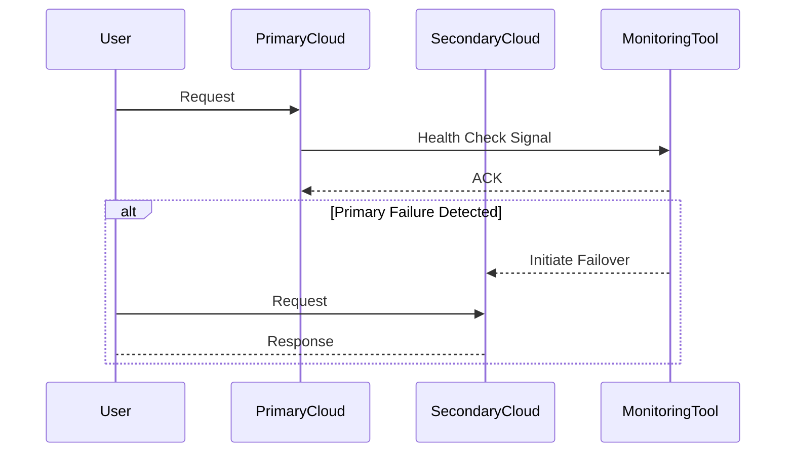

## Overview

**Multi-Cloud Disaster Recovery** is a design pattern that involves leveraging multiple cloud service providers to enhance the resilience, availability, and reliability of IT systems and applications. This pattern ensures that applications continue to function in the event of a failure in one cloud provider's infrastructure by failing over to a secondary provider. 

Utilizing multiple clouds helps mitigate vendor lock-in and geographical risk while offering diverse redundant options.

## Design Pattern Explanation

### Architectural Approach

Multi-Cloud Disaster Recovery involves the following key architectural components:

1. **Cross-Cloud Replication**: Data is continuously synchronized between primary and secondary clouds to ensure consistency and minimal data loss in the event of a failure.
   
2. **Automated Failover Mechanisms**: Employ automation tools that can detect failures in one cloud and seamlessly switch operations to another without manual intervention.

3. **Cloud-Agnostic Deployment**: Design applications using containerization or cloud-native technologies like Kubernetes to ensure they can run on any cloud provider seamlessly.

4. **Network Configuration**: Set up robust networking to manage security, latency, and connectivity between different cloud environments.

5. **Monitoring and Alerts**: Continuous monitoring across clouds to provide real-time alerts to ensure timely action and continuous operation.

### Best Practices

- **Regular Testing**: Frequently test failover and recovery processes to ensure they function as expected during an actual outage.
- **Data Consistency**: Implement strong consistency models and conflict resolution strategies to handle split-brain scenarios effectively.
- **Security Policies**: Synchronize security policies and IAM roles across clouds to maintain compliance and access control.
- **Cost Management**: Monitor costs associated with multi-cloud usage to avoid unnecessary expenditures.

## Example Code

Below is a simplified example using Kubernetes to manage a multi-cloud deployment with failover capabilities:

```yaml
apiVersion: v1
kind: Service
metadata:
  name: my-service
spec:
  selector:
    app: my-app
  ports:
  - protocol: TCP
    port: 80
    targetPort: 9376
  type: LoadBalancer
---
apiVersion: apps/v1
kind: Deployment
metadata:
  name: my-app
spec:
  replicas: 3
  selector:
    matchLabels:
      app: my-app
  template:
    metadata:
      labels:
        app: my-app
    spec:
      containers:
      - name: my-app
        image: nginx
```

In this scenario, Kubernetes can be deployed across multiple cloud environments, with failover strategies configured in the cloud load balancer settings.

## Diagrams

### Sequence Diagram



## Related Patterns

- **Cloud Bursting**: Dynamically extend the capacity of your data center to the cloud during peak demand periods.
- **Backup and Restore**: Implement storage solutions that can quickly recover data in case of a disaster.
- **Geo-Distribution**: Distribute applications and data geographically to enhance performance and resilience.

## Additional Resources

- [AWS Multi-Region Disaster Recovery](https://aws.amazon.com/architecture/multi-region/)
- [Microsoft Azure Disaster Recovery Solutions](https://azure.microsoft.com/en-us/solutions/disaster-recovery/)
- [Google Cloud Multi-Cloud](https://cloud.google.com/solutions/multi-cloud)

## Summary

Multi-Cloud Disaster Recovery is a vital pattern for businesses aiming to enhance their system resilience against failures and ensure business continuity. By orchestrating seamless failover processes and maintaining data consistency across multiple cloud environments, organizations can significantly reduce downtime and protect against data loss. Regular testing, cost management, and robust architecture are crucial to implementing this pattern effectively.
