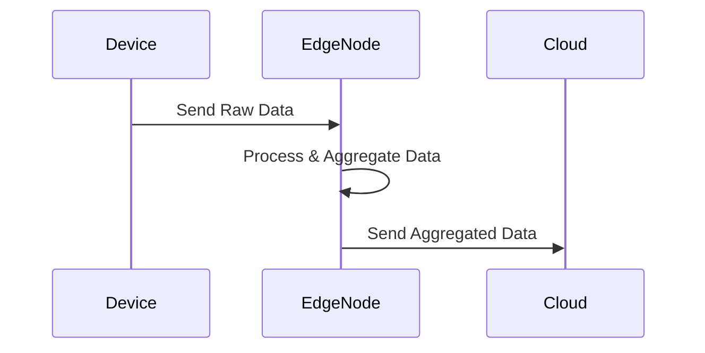

## Introduction

### Design Pattern Overview

The **Edge Data Aggregation** pattern involves processing data at the network's edge, closer to the source of data generation, rather than sending raw data to the cloud for processing. This approach reduces latency, decreases bandwidth usage, and provides real-time processing capabilities, making it particularly beneficial in Internet of Things (IoT) applications.

## Detailed Explanation

Edge Data Aggregation addresses several key challenges in cloud computing and IoT systems by shifting processing closer to data sources:

- **Reduced Latency**: Real-time processing becomes feasible as data doesn't need to travel to central servers for initial processing.
- **Bandwidth Efficiency**: Only aggregated or essential data is transmitted to the cloud, conserving bandwidth.
- **Scalability**: As IoT devices and data volumes increase, edge processing can scale independently of centralized cloud systems.
- **Reliability**: Local data processing ensures continued operation even if connectivity to the cloud is intermittent.

## Architectural Approaches

1. **Edge Nodes Utilization**
   - Deploy computing capabilities in devices or gateways. These nodes perform initial data processing, cleansing, and aggregation.
   
2. **Hierarchical Aggregation**
   - Implement a multi-tiered approach where data is processed at different layers or nodes, from individual devices up to larger aggregation points before reaching the cloud.

3. **Stream Processing Frameworks**
   - Use lightweight stream processing frameworks (e.g., Apache Kafka, Apache Flink) at the edge to handle data in real-time.

4. **Enabling Technologies**
   - Containers (e.g., Docker, Kubernetes) to deploy scalable and manageable edge applications.

## Example Code

```java
// Sample code for edge data aggregation using Java
import java.util.stream.Stream;

public class IoTAggregation {

    public static void main(String[] args) {
        Stream<String> dataStream = getDataStream();

        dataStream
            .filter(IoTAggregation::isSignificantData)
            .map(IoTAggregation::transformData)
            .forEach(IoTAggregation::aggregate);
    }

    private static Stream<String> getDataStream() {
        // Simulated data stream from sensors
        return Stream.of("temperature:25", "humidity:40", "temperature:30");
    }

    private static boolean isSignificantData(String data) {
        // Filtering significant data
        return data.startsWith("temperature");
    }

    private static String transformData(String data) {
        // Simple transformation
        return data.replace("temperature", "temp");
    }

    private static void aggregate(String data) {
        // Aggregating data 
        System.out.println("Aggregated Data: " + data);
    }
}
```

## Diagrams

Here's a simplified UML Sequence diagram showcasing the Edge Data Aggregation:



## Related Patterns

1. **Gateway Offloading**: Redirects complex computations to gateways closer to the data source.
2. **Data Locality**: Moves computation to the location where data resides, enhancing performance.
3. **Fog Computing**: Extends cloud services to the edge of the network, distributing processing tasks.

## Additional Resources

- *Book*: "Edge AI: Machine Learning on Edge Devices" – An in-depth look at AI processing at the network's edge.
- *Website*: [Edge Computing World](https://www.edgecomputingworld.com) – Latest trends and technologies in edge computing.

## Summary

Edge Data Aggregation offers significant advantages in IoT applications by transferring computing tasks closer to the source of data. This not only optimizes resource utilization but also provides real-time insights critical for decision-making processes in modern computing environments. By leveraging technology like containers and stream processing frameworks, organizations can deploy scalable and efficient systems capable of handling the demands of tomorrow's IoT infrastructure.
