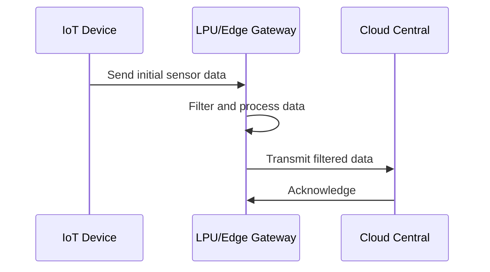

## Introduction

With the increasing proliferation of IoT devices, the volume of data generated at the edge of networks has exponentially grown. Transmitting all this data to centralized data centers for processing isn't always feasible due to bandwidth limitations, latency concerns, and costs. **Data Filtering at Edge** is a design pattern that addresses these challenges by processing and filtering data locally at or near the source before it enters the broader network.

## Detailed Explanation

### Functionality

Data Filtering at Edge involves pre-processing data streams to:
- Eliminate redundant or irrelevant data (noise reduction).
- Perform real-time analytics and decision-making to act upon critical data instantly.
- Compress data to efficiently use network resources.
- Include data aggregation where multiple data points are summarized into valuable insights.

By processing data closer to its origin, the pattern ensures the data reaching the central servers is thus not only reduced in volume but is also more relevant and readily actionable.

### Architectural Approaches

1. **Local Processing Units (LPUs):**
   - Deploy small-scale, powerful computing resources equipped with data processing capabilities directly within IoT devices or gateways.
   - Examples include using Raspberry Pi or Intel NUC devices with open-source platforms like Apache NiFi or EdgeX Foundry.

2. **Event-Driven Architectures:**
   - Implement event-driven frameworks such as Apache Kafka on smaller, edge-capable components, allowing real-time filtering and processing.

3. **Machine Learning Models at Edge:**
   - Incorporate lightweight machine learning models for anomaly detection or classification tasks installed directly onto edge devices.
   - Utilize frameworks like TensorFlow Lite or PyTorch Mobile for embedded machine learning.

### Sample Code

Below is a simplified example using Python with a library that emulates data filtering in IoT edge devices:

```python
import numpy as np

sensor_data = np.array([10, 200, 1000, 20, 15, 30, 100])

def filter_noise(data, threshold=50):
    return [d for d in data if d >= threshold]

filtered_data = filter_noise(sensor_data)
print("Filtered Data:", filtered_data)

```

### Diagrams



## Related Patterns

- **Gateway Offloading:** Similar to Data Filtering at Edge, this pattern uses gateways to offload heavy computational tasks from the cloud to the network’s edge.
- **Edge Data Aggregation:** Collects and processes data from multiple sources at the edge to provide a summarized view.

## Best Practices

- **Selectively Deploy Processing Capabilities:** Match processing capability to device needs to ensure energy efficiency.
- **Maintain Security:** Ensure local data filtering is compliant with security and privacy regulations.
- **Model Retraining and Updating:** Regularly update and retrain on-device ML models to improve accuracy and performance.

## Additional Resources

- **EdgeX Foundry**: An open-source project for IoT edge computing that provides a microservices architecture.
- **Apache NiFi**: A software project for data flow automation and management, suitable for edge data processing.

## Summary

Data Filtering at Edge is pivotal in efficiently managing the large data volumes generated by IoT devices. By processing data locally, this pattern reduces noise, minimizes latency, and optimizes bandwidth usage. It’s a cornerstone for developing responsive and scalable edge computing solutions that seamlessly integrate with centralized cloud systems.

