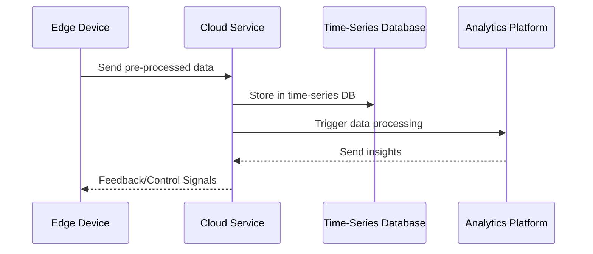

---

linkTitle: "Time-Series Data Handling"
title: "Time-Series Data Handling: Efficiently Managing Time-Stamped Data Streams"
category: "Edge Computing and IoT in Cloud"
series: "Cloud Computing: Essential Patterns & Practices"
description: "Learn how to efficiently manage and analyze time-series data streams using cloud computing patterns tailored for IoT and edge devices, focusing on data collection, processing, storage, and visualization strategies."
categories:
- edge-computing
- iot
- cloud-computing
tags:
- time-series
- data-handling
- stream-processing
- analytics
- cloud
date: 2024-07-07
type: docs

canonical: "https://softwarepatternslexicon.com/18/15/11"
license: "© 2024 Tokenizer Inc. CC BY-NC-SA 4.0"
---


## Introduction to Time-Series Data Handling

Time-series data fundamentally consists of sequences of time-stamped data points. This pattern is essential for various domains, including Internet of Things (IoT) applications, financial markets, and monitoring systems. Efficient management and processing of such data streams ensure timely insights and pave the way for complex analysis using cloud services.

## Core Concepts

### Characteristics of Time-Series Data:

- **Chronologically Ordered**: Each data point has a time stamp.
- **High Volume and Velocity**: Often generated in large volumes at high speed.
- **Periodic or Irregular Intervals**: Data points can have consistent or inconsistent intervals.

### Challenges:

- **Data Storage**: Needs to accommodate rapid growth and high volume.
- **Real-time Processing**: Analytics and insights generation must be timely.
- **Lossless Ingestion**: Ensuring all data is captured without loss.

## Architectural Approach

### Edge-Level Data Aggregation:

- **Data Buffers and Filters**: At the edge, use data buffers to store short-term data and filters to remove noise.
  
- **Pre-processing**: Implement lightweight data processing to reduce data transfer volumes to the cloud.

### Cloud-Level Processing and Storage:

- **Stream Processing Frameworks**: Use frameworks like Apache Kafka, Apache Flink, or AWS Kinesis.
  
- **Time-Series Databases**: Consider databases optimized for time-series data, such as InfluxDB, TimescaleDB, or AWS Timestream.

- **Batch and Stream Integration**: Incorporate both batch processing systems (e.g., Apache Spark) and real-time systems (Kafka streams) for a balanced architecture.

### Data Analysis and Visualization:

- **Data Analytics Platforms**: Use cloud analytics services like AWS QuickSight, Google Data Studio, or Grafana.
  
- **Machine Learning Models**: Leverage models to predict trends, anomalies, and future data patterns.

## Example Code

### Stream Processing using Kafka and Apache Flink

```scala
import org.apache.flink.streaming.api.scala._
import org.apache.flink.streaming.connectors.kafka.FlinkKafkaConsumer
import java.util.Properties

object TimeSeriesProcessingApp {

  def main(args: Array[String]): Unit = {

    val env = StreamExecutionEnvironment.getExecutionEnvironment
    val properties = new Properties()
    properties.setProperty("bootstrap.servers", "localhost:9092")
    properties.setProperty("group.id", "time-series-consumer")

    val kafkaConsumer = new FlinkKafkaConsumer[String]("time-series-topic", new SimpleStringSchema(), properties)
    val timeSeriesStream = env.addSource(kafkaConsumer)

    val processedStream = timeSeriesStream
      .map(value => processTimeSeriesData(value))

    processedStream.print()

    env.execute("Time Series Data Processing")
  }

  def processTimeSeriesData(data: String): String = {
    // Implement your processing logic here
    data.toUpperCase()
  }
}
```

## Diagram



## Related Patterns

- **Event Sourcing**: Maintaining a log of changes as time-stamped events can complement time-series data effectively.
- **CQRS (Command Query Responsibility Segregation)**: Separating reading and writing operations can optimize data access patterns.

## Additional Resources

- [Apache Flink Documentation](https://flink.apache.org/)
- [AWS Kinesis Documentation](https://aws.amazon.com/kinesis/)
- [InfluxDB Documentation](https://docs.influxdata.com/)

## Summary

Handling time-series data effectively requires leveraging cloud capabilities to ingest, process, and analyze high-velocity data streams. By integrating edge and cloud solutions, coupled with modern stream processing frameworks and databases, organizations can extract timely insights, enhancing decision-making and operational efficiency.


