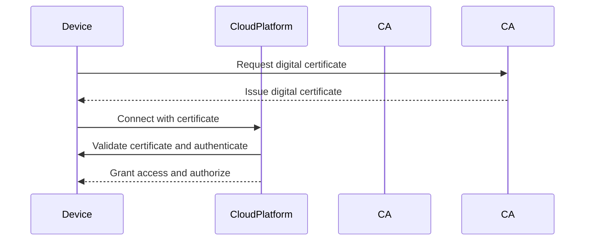

## Introduction

As the Internet of Things (IoT) continues to expand, secure onboarding of devices becomes a critical challenge. The Device Provisioning and Authentication pattern addresses the need to ensure that new devices can securely interact with cloud services. This pattern ensures devices are properly authenticated and authorized to perform their desired functions, protecting against unauthorized access and potential data breaches.

## Pattern: Device Provisioning and Authentication

Device Provisioning and Authentication involves several steps aimed at establishing trust between the IoT device and the cloud platform. These steps include:

1. **Device Identification:** Each device must have a unique identifier, often assigned at the manufacturing stage.
2. **Secure Communication Channel Establishment:** Use of protocols such as TLS/DTLS to establish a secure communication channel between the device and the cloud.
3. **Credential Distribution/Provisioning:** Securely distributing credentials, such as API keys or certificates, to the device.
4. **Authentication:** Verifying the device's identity using its credentials.
5. **Authorization:** Determining the device's permissions within the system.
6. **Audit Logging:** Maintaining logs of all provisioning and authentication events for monitoring and compliance.

## Architectural Approaches

### 1. Public Key Infrastructure (PKI)

Utilizing a PKI involves issuing digital certificates to devices, which can then be used for authentication purposes. Certificates are managed by a certificate authority (CA).

- **Pros:** Strong security assurances; widely used and standardized.
- **Cons:** Requires careful management of keys and certificates; can be complex and resource-intensive.

### 2. Pre-Shared Keys (PSK)

Devices are pre-configured with secret keys shared between them and the cloud platform.

- **Pros:** Simple implementation and low overhead.
- **Cons:** Less secure compared to PKI, especially if keys are not managed properly.

### 3. OAuth 2.0 for IoT

OAuth 2.0 can be adapted for IoT scenarios, providing token-based authentication and authorization.

- **Pros:** Proven solution in web authentication; scalable.
- **Cons:** May be complex in resource-constrained environments.

## Best Practices

- **Secure Manufacturing Processes:** Ensure devices are securely provisioned during manufacturing with integrated cryptographic elements.
- **Regular Credential Rotation:** Rotate credentials periodically to mitigate risks associated with key compromise.
- **Access Boundaries:** Implement strict access controls and permissions tailored to each device's needs.
- **Monitoring and Auditing:** Continuously monitor device communications and audit logs for suspicious activities.

## Example Code

Below is an example of a simple device provisioning and authentication workflow using an MQTT broker with TLS:

```python
import paho.mqtt.client as mqtt
import ssl

def on_connect(client, userdata, flags, rc):
    print(f"Connected with result code {rc}")
    # Once connected, subscribe to a topic
    client.subscribe("iot/device/heartbeat")

def on_message(client, userdata, msg):
    print(f"Received message: {msg.payload.decode()} from topic: {msg.topic}")

client = mqtt.Client()

client.tls_set(ca_certs="ca.crt",
               certfile="device.crt",
               keyfile="device.key",
               tls_version=ssl.PROTOCOL_TLSv1_2)

client.on_connect = on_connect
client.on_message = on_message

client.connect("broker.example.com", 8883, 60)

client.loop_forever()
```

## Diagrams



## Related Patterns

- **Policy-Based Access Control:** Use in conjunction with device provisioning to enforce security policies.
- **Secure Communication Patterns:** Ensure robust encryption and secure channel maintenance.

## Additional Resources

- [NIST Guidelines on IoT Device Security](https://www.nist.gov/news-events/news/2020/05/nist-releases-final-guidelines-iot-device-security)
- [Google Cloud IoT Core Documentation](https://cloud.google.com/iot-core/docs)
- [AWS IoT Core Documentation](https://docs.aws.amazon.com/iot/index.html)

## Summary

The Device Provisioning and Authentication pattern is essential for ensuring the security and integrity of IoT devices in a cloud environment. By following best practices and utilizing robust architectural approaches, organizations can secure their IoT networks against unauthorized access and potential cyber threats. This pattern is pivotal in creating resilient and trusted IoT infrastructure, empowering devices to securely perform their intended functionalities.
