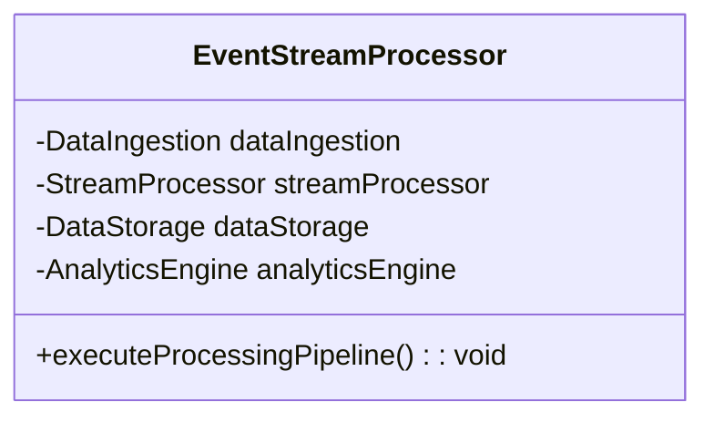
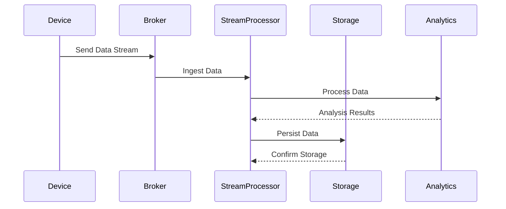

## Overview of Event Stream Processing

Event Stream Processing (ESP) is a design pattern crucial in handling real-time data streams emanating from IoT devices and edge computing environments. Its primary goal is to provide immediate insights and facilitate quick decision-making by processing continuous event data streams with minimal latency.

### Architectural Components

1. **Data Ingestion**: The gateway or broker receives data streams from IoT devices. Technologies used include Apache Kafka, Apache Pulsar, and AWS Kinesis.
2. **Stream Processing**: Real-time data processing using frameworks like Apache Flink, Apache Storm, and Spark Streaming. 
3. **Storage and Persistence**: Processes that store data for later analysis and reporting, usually in databases such as Apache Cassandra, Amazon DynamoDB, or Elasticsearch.
4. **Event Processing and Analytics**: Apply business logic to transform, filter, and analyze streams in real-time.
5. **Actionable Insights**: Automated triggers, notifications, or system actions based on processed data.

### Best Practices

- **Scalability**: Design systems that handle dynamic and potentially vast data streams without performance degradation.
- **Fault Tolerance**: Implement redundancy and failover mechanisms to prevent data loss.
- **Latency Sensitivity**: Optimize data processing pipelines to minimize end-to-end latency.
- **Data Security**: Ensure robust encryption and authentication protocols for safe data transfer.

### Example Code (Using Apache Flink)

```java
import org.apache.flink.streaming.api.environment.StreamExecutionEnvironment;
import org.apache.flink.streaming.api.datastream.DataStream;
import org.apache.flink.api.common.functions.MapFunction;

public class EventStreamProcessingExample {
    public static void main(String[] args) throws Exception {
        StreamExecutionEnvironment env = StreamExecutionEnvironment.getExecutionEnvironment();
        
        DataStream<String> dataStream = env.socketTextStream("localhost", 9999);
        
        DataStream<String> processedStream = dataStream.map(new MapFunction<String, String>() {
            @Override
            public String map(String value) {
                return value.toUpperCase();
            }
        });
        
        processedStream.print();
        env.execute("Event Stream Processing");
    }
}
```

### Diagrams

#### UML Class Diagram



#### Sequence Diagram



### Related Patterns

- **CQRS (Command Query Responsibility Segregation)**: Ensures scalability and accuracy in event-driven systems by separating read and write operations.
- **Event Sourcing**: Captures all changes to an application state as a sequence of events, enhancing traceability.

### Additional Resources

- [Apache Flink Documentation](https://flink.apache.org/)
- [Confluent's Apache Kafka Resources](https://www.confluent.io/resources/)
- [AWS Kinesis Data Streams](https://aws.amazon.com/kinesis/data-streams/)

### Summary

Event Stream Processing is essential for edge computing and IoT environments, offering capabilities to process, analyze, and respond to real-time data efficiently. By harnessing stream processing technologies and best practices, it turns continuous data flows into valuable insights, providing organizations with the agility needed in today's fast-paced tech landscape.
