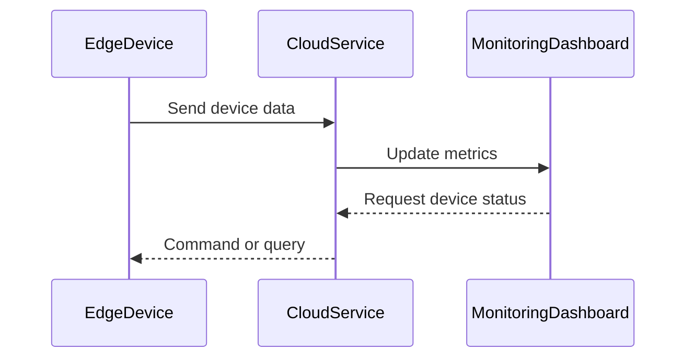

## Overview

**Remote Monitoring and Diagnostics** is a design pattern that focuses on the real-time tracking of the health and status of distributed devices, such as IoT sensors and edge devices, from a centralized cloud system. This pattern is crucial for identifying issues, ensuring uptime, and optimizing the performance of IoT networks.

## Detailed Explanation

The Remote Monitoring and Diagnostics pattern involves the integration of distributed devices with a centralized cloud-based system that can monitor their operation and diagnose potential faults. The approach ensures:

- **Real-time Data Collection**: Devices push operational data to the cloud for analysis.
- **Centralized Dashboard**: Provides aggregated views of device health and operational metrics.
- **Alerts and Notifications**: Automated alerts and notifications for anomalies.
- **Predictive Maintenance**: Uses analytics to predict device failures before they occur.

## Architectural Approaches

1. **Data Collection Layer**: Edge devices equipped with sensors collect data and send it to the cloud.
2. **Data Pipeline**: Secure data transmission using protocols like MQTT or HTTP to transfer device metrics.
3. **Processing and Storage**: Cloud platforms, such as AWS IoT Core or Azure IoT Hub, store and process the incoming data.
4. **Analytics and Visualization**: Use tools such as AWS CloudWatch, Azure Monitor, or Grafana to visualize data and generate insights.
5. **Alerting System**: Integration with alerting tools for proactive notifications.

## Best Practices

- **Secure Communication**: Ensure data integrity and confidentiality through encryption and VPN.
- **Edge Processing**: Some computations can be done at the edge to reduce latency and bandwidth usage.
- **Scalable Architecture**: Design the system to handle growth in the number of devices effortlessly.
- **Redundancy and Fault Tolerance**: Implement failover strategies to enhance system reliability.

## Example Code

Here's a simple example using AWS IoT Core and Lambda to monitor device data:

```javascript
const AWS = require('aws-sdk');
const iotData = new AWS.IotData({ endpoint: 'your-iot-endpoint' });

exports.handler = async (event) => {
    const params = {
        topic: 'device/+/data',
        qos: 1
    };

    try {
        const data = await iotData.publish(params).promise();
        console.log('Message sent', data);
        return { status: 'success' };
    } catch (err) {
        console.error('Error publishing message', err);
        return { status: 'error', error: err };
    }
};
```

## Diagrams

### UML Sequence Diagram



## Related Patterns

- **Edge Gateway Pattern**: Optimizes data transfer by pre-processing data at the edge.
- **Event Sourcing Pattern**: Captures all device events in an immutable sequence.
- **Circuit Breaker Pattern**: Manages failures and prevents cascading failures in networked systems.

## Additional Resources

- [AWS IoT Documentation](https://docs.aws.amazon.com/iot)
- [Azure IoT Hub Documentation](https://learn.microsoft.com/en-us/azure/iot-hub/)
- [Google Cloud IoT](https://cloud.google.com/solutions/iot)

## Summary

The Remote Monitoring and Diagnostics pattern is essential for managing and maintaining large networks of IoT and edge devices. By centralizing monitoring and diagnostics, organizations can ensure device reliability, perform predictive maintenance, and respond quickly to operational changes. Implementing this pattern in conjunction with other design patterns can help build robust, scalable IoT solutions.
